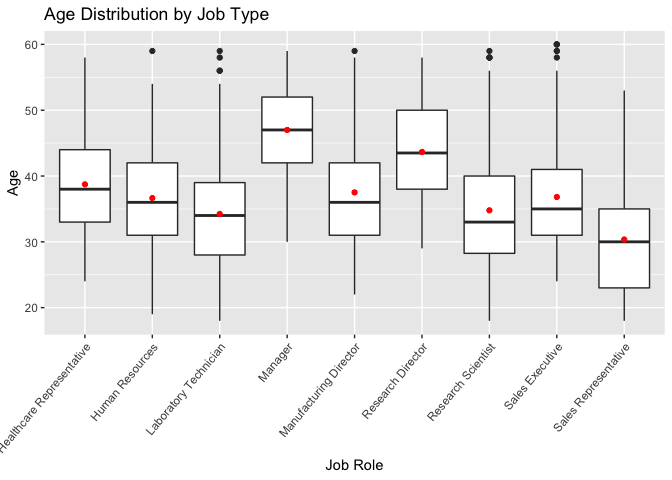

# Summary

TODO 

# Introduction

The purpose of this analysis is to explore what variables are most associated with attrition levels in Fotune 1000 companies. Exploratory analytics will be used to determine these variables as well as other general trends associated with specific jobs. Finally, we will create a model that will predict whether or not an employee will leave the company voluntarily.
TODO (Kristen)

# Analysis

### Exploratory Data Analysis


```r
# Read in training data
dfTrain <- read.csv("CaseStudy2-data.csv")

# TODO maybe make categories for numeric vars like age, income, etc
```

If a variable did not have a significant impact on turnover, we would expect that the attrition percentage within a group is the same as the attrition percentage in the entire dataset. As we see below, in the whole training set 83.9% of employees stayed while 16.1% left. So, as we view the relative percentages for turnover for each categorical variable, those groups with high attrition percentages appear to have a strong impact on turnover. 


```r
# Percentage of retained/lost employees
kable(table(dfTrain$Attrition) / nrow(dfTrain))
```


Var1         Freq
-----  ----------
No      0.8393162
Yes     0.1606838

```r
table(dfTrain$Attrition) / nrow(dfTrain)
```

```
## 
##        No       Yes 
## 0.8393162 0.1606838
```

```r
# Define categorical variables
cat_vars <- c("BusinessTravel", "Department", "Education", 
              "EducationField", "EnvironmentSatisfaction",
              "Gender", "JobInvolvement", "JobLevel",
              "JobRole", "JobSatisfaction", "MaritalStatus",
              "Over18", "OverTime", "PerformanceRating", 
              "RelationshipSatisfaction", "StockOptionLevel", 
              "WorkLifeBalance")

# Define numerical variables
num_vars <- c("Age", "DailyRate", "DistanceFromHome", "Education", "EnvironmentSatisfaction", "HourlyRate", "JobInvolvement", "JobLevel", "JobSatisfaction", "MonthlyIncome", "MonthlyRate", "NumCompaniesWorked", "PercentSalaryHike", "PerformanceRating", "RelationshipSatisfaction", "StandardHours", "StockOptionLevel", "TotalWorkingYears", "TrainingTimesLastYear", "WorkLifeBalance", "YearsAtCompany", "YearsInCurrentRole", "YearsSinceLastPromotion", "YearsWithCurrManager", "Rand")

# TODO make tables look nicer ## I was trying to use kable like above to make these look nice but it wasn't working. When I put it on the table function it errors out when you divide it by cout$freq

# Make relative frequency tables for categorical variables
for (var in cat_vars) {
  print(var)
  freqtable <- table(dfTrain[[var]], dfTrain$Attrition)
  count <- plyr::count(dfTrain[[var]])
  print(freqtable / count$freq)
}
```

```
## [1] "BusinessTravel"
##                    
##                             No        Yes
##   Non-Travel        0.90909091 0.09090909
##   Travel_Frequently 0.75111111 0.24888889
##   Travel_Rarely     0.85389222 0.14610778
## [1] "Department"
##                         
##                                 No       Yes
##   Human Resources        0.8695652 0.1304348
##   Research & Development 0.8602846 0.1397154
##   Sales                  0.7891738 0.2108262
## [1] "Education"
##    
##            No       Yes
##   1 0.8129496 0.1870504
##   2 0.8468085 0.1531915
##   3 0.8337079 0.1662921
##   4 0.8512658 0.1487342
##   5 0.8571429 0.1428571
## [1] "EducationField"
##                   
##                           No       Yes
##   Human Resources  0.8750000 0.1250000
##   Life Sciences    0.8456914 0.1543086
##   Marketing        0.7851240 0.2148760
##   Medical          0.8633880 0.1366120
##   Other            0.8888889 0.1111111
##   Technical Degree 0.7523810 0.2476190
## [1] "EnvironmentSatisfaction"
##    
##            No       Yes
##   1 0.7389381 0.2610619
##   2 0.8441558 0.1558442
##   3 0.8583106 0.1416894
##   4 0.8815029 0.1184971
## [1] "Gender"
##         
##                 No       Yes
##   Female 0.8639309 0.1360691
##   Male   0.8231966 0.1768034
## [1] "JobInvolvement"
##    
##             No        Yes
##   1 0.63076923 0.36923077
##   2 0.80479452 0.19520548
##   3 0.86086957 0.13913043
##   4 0.91056911 0.08943089
## [1] "JobLevel"
##    
##             No        Yes
##   1 0.74885845 0.25114155
##   2 0.90307329 0.09692671
##   3 0.83040936 0.16959064
##   4 0.94252874 0.05747126
##   5 0.94117647 0.05882353
## [1] "JobRole"
##                            
##                                     No        Yes
##   Healthcare Representative 0.91089109 0.08910891
##   Human Resources           0.83783784 0.16216216
##   Laboratory Technician     0.75586854 0.24413146
##   Manager                   0.94871795 0.05128205
##   Manufacturing Director    0.93103448 0.06896552
##   Research Director         0.98437500 0.01562500
##   Research Scientist        0.85294118 0.14705882
##   Sales Executive           0.81782946 0.18217054
##   Sales Representative      0.60000000 0.40000000
## [1] "JobSatisfaction"
##    
##            No       Yes
##   1 0.7672414 0.2327586
##   2 0.8425926 0.1574074
##   3 0.8510029 0.1489971
##   4 0.8713137 0.1286863
## [1] "MaritalStatus"
##           
##                    No        Yes
##   Divorced 0.92045455 0.07954545
##   Married  0.86629002 0.13370998
##   Single   0.74400000 0.25600000
## [1] "Over18"
##    
##            No       Yes
##   Y 0.8393162 0.1606838
## [1] "OverTime"
##      
##              No       Yes
##   No  0.8946108 0.1053892
##   Yes 0.7014925 0.2985075
## [1] "PerformanceRating"
##    
##            No       Yes
##   3 0.8405651 0.1594349
##   4 0.8324022 0.1675978
## [1] "RelationshipSatisfaction"
##    
##            No       Yes
##   1 0.8090909 0.1909091
##   2 0.8410042 0.1589958
##   3 0.8457300 0.1542700
##   4 0.8505747 0.1494253
## [1] "StockOptionLevel"
##    
##             No        Yes
##   0 0.75247525 0.24752475
##   1 0.91220557 0.08779443
##   2 0.92800000 0.07200000
##   3 0.82191781 0.17808219
## [1] "WorkLifeBalance"
##    
##            No       Yes
##   1 0.6406250 0.3593750
##   2 0.8284672 0.1715328
##   3 0.8628006 0.1371994
##   4 0.8320000 0.1680000
```


```r
# TODO look at other variables
```

### Employee Trends


```r
# Job satisfaction by group
Jobs <- group_by(dfTrain, JobRole) %>% summarise(Avg=mean(JobSatisfaction, na.rm=TRUE))
print(Jobs)
```

```
## # A tibble: 9 x 2
##   JobRole                     Avg
##   <fct>                     <dbl>
## 1 Healthcare Representative  2.80
## 2 Human Resources            2.57
## 3 Laboratory Technician      2.69
## 4 Manager                    2.69
## 5 Manufacturing Director     2.75
## 6 Research Director          2.62
## 7 Research Scientist         2.80
## 8 Sales Executive            2.76
## 9 Sales Representative       2.74
```

```r
ggplot(data=Jobs, aes(x=JobRole, y=Avg, fill=JobRole)) + geom_bar(stat='identity', colour = 'black') + coord_flip() + theme(legend.position="none") + theme(plot.title = element_text(hjust = 0.5))
```

<!-- -->

We wanted to see how various factors would effect job satisfaction. The average job satisfaction for each posistion is fairly close together. The lowest is Human Resources at 2.57 and the highest is Research Scientist and Healthcare Representative at 2.80. 


```r
ggplot(dfTrain, aes(x=JobSatisfaction, y=MonthlyIncome)) + 
  geom_point(pch = 21, size = 2, color="green") +
  theme(plot.title = element_text(hjust = 0.5))
```

<!-- -->

Income does not appear to have an effect on job satisfaction, as every level of satisfaction has a similar distribution of income.


### KNN Classification


```r
# Read in validation data
dfVal <- read.csv("CaseStudy2Validation.csv")

# I selected Business Travel, JobInvolvement, JobLevel, JobRole, and MAritalStatus because they looked the most different from the attrition percentages of the group as a whole. We can come up with a better justificcation later?

# Convert wanted factors into integers.
dfTrain$BusinessTravel <- as.integer(dfTrain$BusinessTravel)
dfTrain$JobRole <- as.integer(dfTrain$JobRole)
dfTrain$MaritalStatus <- as.integer(dfTrain$MaritalStatus)
dfVal$MaritalStatus <- as.integer(dfVal$MaritalStatus)
dfVal$JobRole <- as.integer(dfVal$JobRole)
dfVal$BusinessTravel <- as.integer(dfVal$BusinessTravel)

# Generate attrition predictions based on training data
dfPreds <- class::knn(dfTrain[,c(4,15,16,17,21)], dfVal[,c(4,15,16,17,21)], dfTrain$Attrition, k=3)

# Get accuracy of predictions
confusionMatrix(table(dfVal$Attrition, dfPreds))
```

```
## Confusion Matrix and Statistics
## 
##      dfPreds
##        No Yes
##   No  237  14
##   Yes  45   4
##                                           
##                Accuracy : 0.8033          
##                  95% CI : (0.7538, 0.8468)
##     No Information Rate : 0.94            
##     P-Value [Acc > NIR] : 1               
##                                           
##                   Kappa : 0.0347          
##  Mcnemar's Test P-Value : 9.397e-05       
##                                           
##             Sensitivity : 0.84043         
##             Specificity : 0.22222         
##          Pos Pred Value : 0.94422         
##          Neg Pred Value : 0.08163         
##              Prevalence : 0.94000         
##          Detection Rate : 0.79000         
##    Detection Prevalence : 0.83667         
##       Balanced Accuracy : 0.53132         
##                                           
##        'Positive' Class : No              
## 
```

```r
# Write predictions to csv file
#write.csv(dfPreds, "CaseStudy2Predictions_Ludlow_Rollins.csv")
```

# Conclusion

TODO

# Presentation

This write-up is supplemented by video presentations from both Meredith and Kristen. The links are provided below.

Meredith: 

Kristen: 
