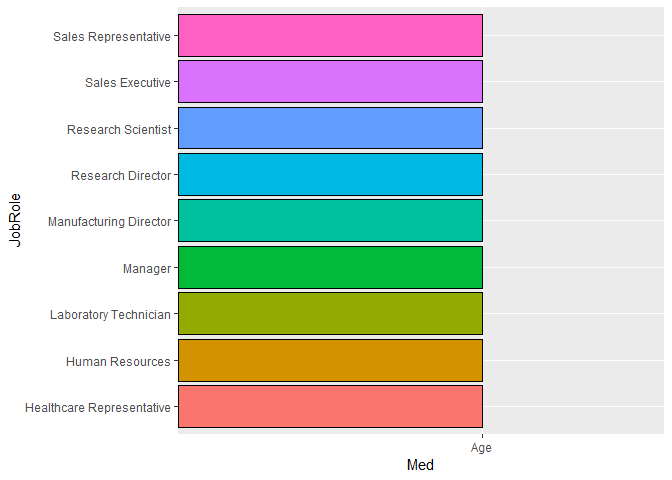
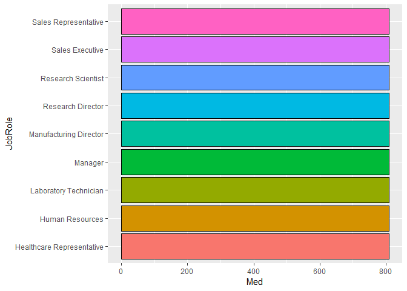
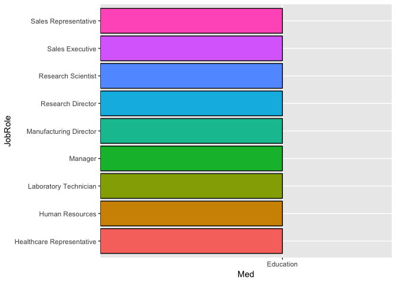
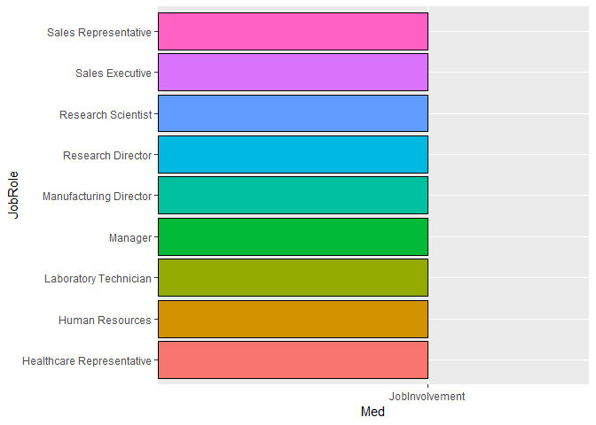
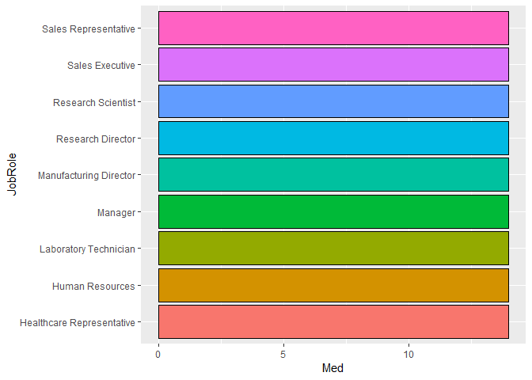
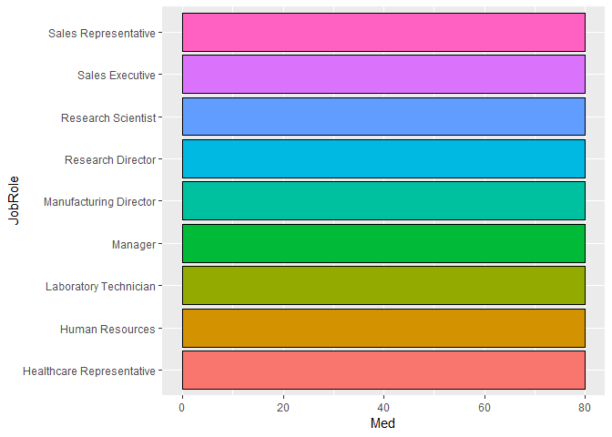
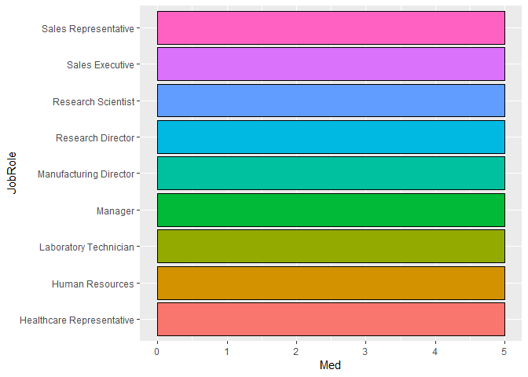
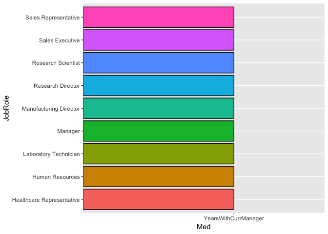

# Summary

TODO 

# Introduction

The purpose of this analysis is to explore what variables are most associated with attrition levels in Fotune 1000 companies. Exploratory analytics will be used to determine these variables as well as other general trends associated with specific jobs. Finally, we will create a model that will predict whether or not an employee will leave the company voluntarily.
TODO (Kristen)

# Analysis

### Exploratory Data Analysis


```r
# Read in training data
dfTrain <- read.csv("CaseStudy2-data.csv")

# TODO maybe make categories for numeric vars like age, income, etc
```

If a variable did not have a significant impact on turnover, we would expect that the attrition percentage within a group is the same as the attrition percentage in the entire dataset. As we see below, in the whole training set 83.9% of employees stayed while 16.1% left. So, as we view the relative percentages for turnover for each categorical variable, those groups with high attrition percentages appear to have a strong impact on turnover. 


```r
# Percentage of retained/lost employees
kable(table(dfTrain$Attrition) / nrow(dfTrain))
```


Var1         Freq
-----  ----------
No      0.8393162
Yes     0.1606838

```r
table(dfTrain$Attrition) / nrow(dfTrain)
```

```
## 
##        No       Yes 
## 0.8393162 0.1606838
```

```r
# Define categorical variables
cat_vars <- c("BusinessTravel", "Department", "Education", 
              "EducationField", "EnvironmentSatisfaction",
              "Gender", "JobInvolvement", "JobLevel",
              "JobRole", "JobSatisfaction", "MaritalStatus",
              "Over18", "OverTime", "PerformanceRating", 
              "RelationshipSatisfaction", "StockOptionLevel", 
              "WorkLifeBalance")

# Define numerical variables
num_vars <- c("Age", "DailyRate", "DistanceFromHome", "Education", "EnvironmentSatisfaction", "HourlyRate", "JobInvolvement", "JobLevel", "JobSatisfaction", "MonthlyIncome", "MonthlyRate", "NumCompaniesWorked", "PercentSalaryHike", "PerformanceRating", "RelationshipSatisfaction", "StandardHours", "StockOptionLevel", "TotalWorkingYears", "TrainingTimesLastYear", "WorkLifeBalance", "YearsAtCompany", "YearsInCurrentRole", "YearsSinceLastPromotion", "YearsWithCurrManager", "Rand")

# TODO make tables look nicer ## I was trying to use kable like above to make these look nice but it wasn't working. When I put it on the table function it errors out when you divide it by cout$freq

# Make relative frequency tables for categorical variables
for (var in cat_vars) {
  print(var)
  freqtable <- table(dfTrain[[var]], dfTrain$Attrition)
  count <- plyr::count(dfTrain[[var]])
  print(freqtable / count$freq)
}
```

```
## [1] "BusinessTravel"
##                    
##                             No        Yes
##   Non-Travel        0.90909091 0.09090909
##   Travel_Frequently 0.75111111 0.24888889
##   Travel_Rarely     0.85389222 0.14610778
## [1] "Department"
##                         
##                                 No       Yes
##   Human Resources        0.8695652 0.1304348
##   Research & Development 0.8602846 0.1397154
##   Sales                  0.7891738 0.2108262
## [1] "Education"
##    
##            No       Yes
##   1 0.8129496 0.1870504
##   2 0.8468085 0.1531915
##   3 0.8337079 0.1662921
##   4 0.8512658 0.1487342
##   5 0.8571429 0.1428571
## [1] "EducationField"
##                   
##                           No       Yes
##   Human Resources  0.8750000 0.1250000
##   Life Sciences    0.8456914 0.1543086
##   Marketing        0.7851240 0.2148760
##   Medical          0.8633880 0.1366120
##   Other            0.8888889 0.1111111
##   Technical Degree 0.7523810 0.2476190
## [1] "EnvironmentSatisfaction"
##    
##            No       Yes
##   1 0.7389381 0.2610619
##   2 0.8441558 0.1558442
##   3 0.8583106 0.1416894
##   4 0.8815029 0.1184971
## [1] "Gender"
##         
##                 No       Yes
##   Female 0.8639309 0.1360691
##   Male   0.8231966 0.1768034
## [1] "JobInvolvement"
##    
##             No        Yes
##   1 0.63076923 0.36923077
##   2 0.80479452 0.19520548
##   3 0.86086957 0.13913043
##   4 0.91056911 0.08943089
## [1] "JobLevel"
##    
##             No        Yes
##   1 0.74885845 0.25114155
##   2 0.90307329 0.09692671
##   3 0.83040936 0.16959064
##   4 0.94252874 0.05747126
##   5 0.94117647 0.05882353
## [1] "JobRole"
##                            
##                                     No        Yes
##   Healthcare Representative 0.91089109 0.08910891
##   Human Resources           0.83783784 0.16216216
##   Laboratory Technician     0.75586854 0.24413146
##   Manager                   0.94871795 0.05128205
##   Manufacturing Director    0.93103448 0.06896552
##   Research Director         0.98437500 0.01562500
##   Research Scientist        0.85294118 0.14705882
##   Sales Executive           0.81782946 0.18217054
##   Sales Representative      0.60000000 0.40000000
## [1] "JobSatisfaction"
##    
##            No       Yes
##   1 0.7672414 0.2327586
##   2 0.8425926 0.1574074
##   3 0.8510029 0.1489971
##   4 0.8713137 0.1286863
## [1] "MaritalStatus"
##           
##                    No        Yes
##   Divorced 0.92045455 0.07954545
##   Married  0.86629002 0.13370998
##   Single   0.74400000 0.25600000
## [1] "Over18"
##    
##            No       Yes
##   Y 0.8393162 0.1606838
## [1] "OverTime"
##      
##              No       Yes
##   No  0.8946108 0.1053892
##   Yes 0.7014925 0.2985075
## [1] "PerformanceRating"
##    
##            No       Yes
##   3 0.8405651 0.1594349
##   4 0.8324022 0.1675978
## [1] "RelationshipSatisfaction"
##    
##            No       Yes
##   1 0.8090909 0.1909091
##   2 0.8410042 0.1589958
##   3 0.8457300 0.1542700
##   4 0.8505747 0.1494253
## [1] "StockOptionLevel"
##    
##             No        Yes
##   0 0.75247525 0.24752475
##   1 0.91220557 0.08779443
##   2 0.92800000 0.07200000
##   3 0.82191781 0.17808219
## [1] "WorkLifeBalance"
##    
##            No       Yes
##   1 0.6406250 0.3593750
##   2 0.8284672 0.1715328
##   3 0.8628006 0.1371994
##   4 0.8320000 0.1680000
```


```r
# TODO look at other variables
```

### Employee Trends


```r
for (var in num_vars) {
  print(var)
  Jobs <- group_by(dfTrain, JobRole) %>% summarise(Med=median(var, na.rm=TRUE))
  graph <- ggplot(data=Jobs, aes(x=JobRole, y=Med, fill=JobRole)) + geom_bar(stat='identity', colour = 'black') + coord_flip() + theme(legend.position="none") + theme(plot.title = element_text(hjust = 0.5))
  print(graph)
}
```

```
## [1] "Age"
```

<!-- -->

```
## [1] "DailyRate"
```

<!-- -->

```
## [1] "DistanceFromHome"
```

<!-- -->

```
## [1] "Education"
```

<!-- -->

```
## [1] "EnvironmentSatisfaction"
```

<!-- -->

```
## [1] "HourlyRate"
```

<!-- -->

```
## [1] "JobInvolvement"
```

<!-- -->

```
## [1] "JobLevel"
```

<!-- -->

```
## [1] "JobSatisfaction"
```

<!-- -->

```
## [1] "MonthlyIncome"
```

<!-- -->

```
## [1] "MonthlyRate"
```

<!-- -->

```
## [1] "NumCompaniesWorked"
```

<!-- -->

```
## [1] "PercentSalaryHike"
```

<!-- -->

```
## [1] "PerformanceRating"
```

<!-- -->

```
## [1] "RelationshipSatisfaction"
```

<!-- -->

```
## [1] "StandardHours"
```

<!-- -->

```
## [1] "StockOptionLevel"
```

<!-- -->

```
## [1] "TotalWorkingYears"
```

<!-- -->

```
## [1] "TrainingTimesLastYear"
```

<!-- -->

```
## [1] "WorkLifeBalance"
```

<!-- -->

```
## [1] "YearsAtCompany"
```

<!-- -->

```
## [1] "YearsInCurrentRole"
```

<!-- -->

```
## [1] "YearsSinceLastPromotion"
```

<!-- -->

```
## [1] "YearsWithCurrManager"
```

<!-- -->

```
## [1] "Rand"
```

<!-- -->

```r
# I wanted to generate graphs for evey numerical variable to look for trends and such. When I take this code out of the for loop and replace the var with the actual variable name it works fine. In the for loop all the graphs are messed up. Can you see anything wrong? I figure once we get a look at all of them we can specify whch ones to actually show.
```

### KNN Classification


```r
# Read in validation data
dfVal <- read.csv("CaseStudy2Validation.csv")

# Generate attrition predictions based on training data
#dfPreds <- ?

# Get accuracy of predictions
#confusionMatrix(table(dfVal$Attrition, dfPreds$Attrition))

# Write predictions to csv file
#write.csv(dfPreds, "CaseStudy2Predictions_Ludlow_Rollins.csv")
```

# Conclusion

TODO

# Presentation

This write-up is supplemented by video presentations from both Meredith and Kristen. The links are provided below.

Meredith: 

Kristen: 
