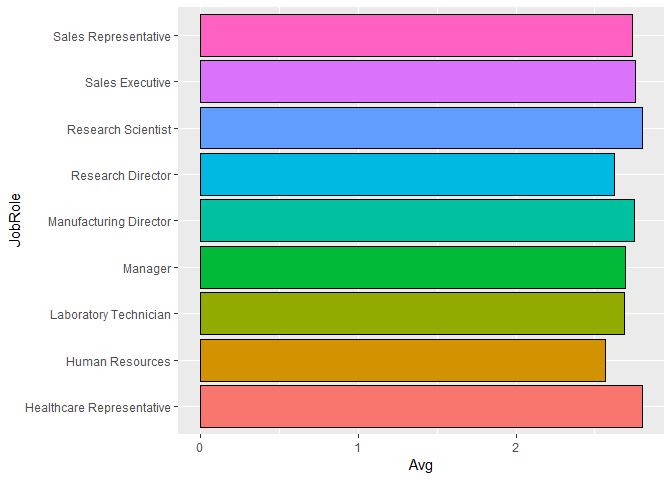
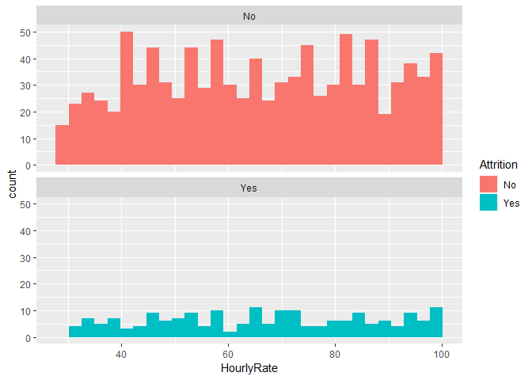

# Summary

TODO 

# Introduction

The purpose of this analysis is to explore what variables are most associated with attrition levels in Fortune 1000 companies. Exploratory analytics will be used to determine these variables as well as other general trends associated with specific jobs. Finally, we will create a model that will predict whether or not an employee will leave the company voluntarily.

# Analysis

### Exploratory Data Analysis


```r
# Read in training data
dfTrain <- read.csv("CaseStudy2-data.csv")

# Separate retained/lost employees for EDA
emp_kept <- subset(dfTrain, Attrition=="No")
emp_lost <- subset(dfTrain, Attrition=="Yes")

# TODO maybe make categories for numeric vars like age, income, etc
```

If a variable did not have a significant impact on turnover, we would expect that the attrition percentage within a group is the same as the attrition percentage in the entire dataset. As we see below, in the whole training set 83.9% of employees stayed while 16.1% left. So, as we view the relative percentages for turnover for each categorical variable, those groups with high attrition percentages appear to have a strong impact on turnover. 
Explanation of our varaible selection and which ones we left out.


```r
# Percentage of retained/lost employees
kable(table(dfTrain$Attrition) / nrow(dfTrain), 
      col.names=c("Attrition", "Percent")) %>% 
      kable_styling(full_width=F)
```

<table class="table" style="width: auto !important; margin-left: auto; margin-right: auto;">
 <thead>
  <tr>
   <th style="text-align:left;"> Attrition </th>
   <th style="text-align:right;"> Percent </th>
  </tr>
 </thead>
<tbody>
  <tr>
   <td style="text-align:left;"> No </td>
   <td style="text-align:right;"> 0.8393162 </td>
  </tr>
  <tr>
   <td style="text-align:left;"> Yes </td>
   <td style="text-align:right;"> 0.1606838 </td>
  </tr>
</tbody>
</table>

```r
# Define variables for analysis
variables <- c("BusinessTravel", "Department", "Education", 
              "EducationField", "EnvironmentSatisfaction",
              "Gender", "JobInvolvement", "JobLevel",
              "JobRole", "JobSatisfaction", "MaritalStatus",
              "OverTime", "PerformanceRating", 
              "RelationshipSatisfaction", "StockOptionLevel", 
              "WorkLifeBalance", "Age", "DailyRate", "DistanceFromHome", "HourlyRate",
              "MonthlyIncome", "MonthlyRate", "NumCompaniesWorked", "PercentSalaryHike",
              "TotalWorkingYears", "TrainingTimesLastYear", "YearsAtCompany",
              "YearsInCurrentRole", "YearsSinceLastPromotion", "YearsWithCurrManager")

# Turn numerical values into categorical
dfTrain$PercentSalaryHike <- cut(dfTrain$PercentSalaryHike, breaks=c(-Inf, 13, 17, Inf), labels=c(1, 2, 3))
dfTrain$TotalWorkingYears <- cut(dfTrain$TotalWorkingYears, breaks=c(-Inf, 10, 20, Inf), labels=c(1, 2, 3))
dfTrain$TrainingTimesLastYear <- cut(dfTrain$TrainingTimesLastYear, breaks=c(-Inf, 1, 4, Inf), labels=c(1, 2, 3))
dfTrain$YearsAtCompany <- cut(dfTrain$YearsAtCompany, breaks=c(-Inf, 5, 15, 25, Inf), labels=c(1, 2, 3, 4))
dfTrain$YearsInCurrentRole <- cut(dfTrain$YearsInCurrentRole, breaks=c(-Inf, 5, 10, Inf), labels=c(1, 2, 3))
dfTrain$YearsSinceLastPromotion <- cut(dfTrain$YearsSinceLastPromotion, breaks=c(-Inf, 2, 7, Inf), labels=c(1, 2, 3))
dfTrain$YearsWithCurrManager <- cut(dfTrain$YearsWithCurrManager, breaks=c(-Inf, 5, 10, Inf), labels=c(1, 2, 3))

# TODO make tables look nicer 

# Make relative frequency tables for categorical variables
AbsDiff <- data.frame(Variable=character(), AvgDistance=numeric())
for (var in variables) {
  print(var)
  freqtable <- table(dfTrain[[var]], dfTrain$Attrition)
  count <- plyr::count(dfTrain[[var]])
  RelFreq <- freqtable / count$freq
  print(RelFreq)
  Sum <- sum(abs(RelFreq[,2]-0.1606838))
  print(Sum)
  AbsDiff <- rbind(AbsDiff, data.frame(Variable=var, AverageDistance=Sum))
}
```

```
## [1] "BusinessTravel"
##                    
##                             No        Yes
##   Non-Travel        0.90909091 0.09090909
##   Travel_Frequently 0.75111111 0.24888889
##   Travel_Rarely     0.85389222 0.14610778
## [1] 0.1725558
## [1] "Department"
##                         
##                                 No       Yes
##   Human Resources        0.8695652 0.1304348
##   Research & Development 0.8602846 0.1397154
##   Sales                  0.7891738 0.2108262
## [1] 0.1013598
## [1] "Education"
##    
##            No       Yes
##   1 0.8129496 0.1870504
##   2 0.8468085 0.1531915
##   3 0.8337079 0.1662921
##   4 0.8512658 0.1487342
##   5 0.8571429 0.1428571
## [1] 0.06924349
## [1] "EducationField"
##                   
##                           No       Yes
##   Human Resources  0.8750000 0.1250000
##   Life Sciences    0.8456914 0.1543086
##   Marketing        0.7851240 0.2148760
##   Medical          0.8633880 0.1366120
##   Other            0.8888889 0.1111111
##   Technical Degree 0.7523810 0.2476190
## [1] 0.2568309
## [1] "EnvironmentSatisfaction"
##    
##            No       Yes
##   1 0.7389381 0.2610619
##   2 0.8441558 0.1558442
##   3 0.8583106 0.1416894
##   4 0.8815029 0.1184971
## [1] 0.1663989
## [1] "Gender"
##         
##                 No       Yes
##   Female 0.8639309 0.1360691
##   Male   0.8231966 0.1768034
## [1] 0.04073428
## [1] "JobInvolvement"
##    
##             No        Yes
##   1 0.63076923 0.36923077
##   2 0.80479452 0.19520548
##   3 0.86086957 0.13913043
##   4 0.91056911 0.08943089
## [1] 0.3358749
## [1] "JobLevel"
##    
##             No        Yes
##   1 0.74885845 0.25114155
##   2 0.90307329 0.09692671
##   3 0.83040936 0.16959064
##   4 0.94252874 0.05747126
##   5 0.94117647 0.05882353
## [1] 0.3681945
## [1] "JobRole"
##                            
##                                     No        Yes
##   Healthcare Representative 0.91089109 0.08910891
##   Human Resources           0.83783784 0.16216216
##   Laboratory Technician     0.75586854 0.24413146
##   Manager                   0.94871795 0.05128205
##   Manufacturing Director    0.93103448 0.06896552
##   Research Director         0.98437500 0.01562500
##   Research Scientist        0.85294118 0.14705882
##   Sales Executive           0.81782946 0.18217054
##   Sales Representative      0.60000000 0.40000000
## [1] 0.7771077
## [1] "JobSatisfaction"
##    
##            No       Yes
##   1 0.7672414 0.2327586
##   2 0.8425926 0.1574074
##   3 0.8510029 0.1489971
##   4 0.8713137 0.1286863
## [1] 0.1190354
## [1] "MaritalStatus"
##           
##                    No        Yes
##   Divorced 0.92045455 0.07954545
##   Married  0.86629002 0.13370998
##   Single   0.74400000 0.25600000
## [1] 0.2034284
## [1] "OverTime"
##      
##              No       Yes
##   No  0.8946108 0.1053892
##   Yes 0.7014925 0.2985075
## [1] 0.1931182
## [1] "PerformanceRating"
##    
##            No       Yes
##   3 0.8405651 0.1594349
##   4 0.8324022 0.1675978
## [1] 0.008162851
## [1] "RelationshipSatisfaction"
##    
##            No       Yes
##   1 0.8090909 0.1909091
##   2 0.8410042 0.1589958
##   3 0.8457300 0.1542700
##   4 0.8505747 0.1494253
## [1] 0.04958562
## [1] "StockOptionLevel"
##    
##             No        Yes
##   0 0.75247525 0.24752475
##   1 0.91220557 0.08779443
##   2 0.92800000 0.07200000
##   3 0.82191781 0.17808219
## [1] 0.2658125
## [1] "WorkLifeBalance"
##    
##            No       Yes
##   1 0.6406250 0.3593750
##   2 0.8284672 0.1715328
##   3 0.8628006 0.1371994
##   4 0.8320000 0.1680000
## [1] 0.2403408
## [1] "Age"
##     
##              No        Yes
##   18 0.50000000 0.50000000
##   19 0.33333333 0.66666667
##   20 0.50000000 0.50000000
##   21 0.54545455 0.45454545
##   22 0.66666667 0.33333333
##   23 0.71428571 0.28571429
##   24 0.78947368 0.21052632
##   25 0.68421053 0.31578947
##   26 0.72413793 0.27586207
##   27 1.00000000 0.00000000
##   28 0.70000000 0.30000000
##   29 0.76785714 0.23214286
##   30 0.89130435 0.10869565
##   31 0.72131148 0.27868852
##   32 0.81132075 0.18867925
##   33 0.75555556 0.24444444
##   34 0.87301587 0.12698413
##   35 0.87878788 0.12121212
##   36 0.92592593 0.07407407
##   37 0.88571429 0.11428571
##   38 0.95652174 0.04347826
##   39 0.88461538 0.11538462
##   40 0.91489362 0.08510638
##   41 0.85294118 0.14705882
##   42 0.95348837 0.04651163
##   43 0.91666667 0.08333333
##   44 0.76923077 0.23076923
##   45 0.96969697 0.03030303
##   46 0.83333333 0.16666667
##   47 0.89473684 0.10526316
##   48 0.84615385 0.15384615
##   49 0.93750000 0.06250000
##   50 0.85714286 0.14285714
##   51 0.88235294 0.11764706
##   52 0.81250000 0.18750000
##   53 0.87500000 0.12500000
##   54 1.00000000 0.00000000
##   55 0.83333333 0.16666667
##   56 0.75000000 0.25000000
##   57 1.00000000 0.00000000
##   58 0.63636364 0.36363636
##   59 1.00000000 0.00000000
##   60 1.00000000 0.00000000
## [1] 4.830142
## [1] "DailyRate"
##       
##               No       Yes
##   103  0.0000000 1.0000000
##   104  0.0000000 1.0000000
##   106  1.0000000 0.0000000
##   107  1.0000000 0.0000000
##   111  1.0000000 0.0000000
##   115  0.0000000 1.0000000
##   116  1.0000000 0.0000000
##   117  1.0000000 0.0000000
##   118  1.0000000 0.0000000
##   119  1.0000000 0.0000000
##   120  1.0000000 0.0000000
##   121  0.5000000 0.5000000
##   124  1.0000000 0.0000000
##   128  1.0000000 0.0000000
##   129  0.0000000 1.0000000
##   130  1.0000000 0.0000000
##   131  1.0000000 0.0000000
##   132  1.0000000 0.0000000
##   135  1.0000000 0.0000000
##   136  1.0000000 0.0000000
##   138  0.0000000 1.0000000
##   140  1.0000000 0.0000000
##   141  1.0000000 0.0000000
##   142  1.0000000 0.0000000
##   143  0.0000000 1.0000000
##   144  1.0000000 0.0000000
##   147  0.5000000 0.5000000
##   148  1.0000000 0.0000000
##   153  1.0000000 0.0000000
##   154  1.0000000 0.0000000
##   155  1.0000000 0.0000000
##   156  0.0000000 1.0000000
##   157  1.0000000 0.0000000
##   160  1.0000000 0.0000000
##   161  1.0000000 0.0000000
##   163  1.0000000 0.0000000
##   164  1.0000000 0.0000000
##   167  1.0000000 0.0000000
##   168  1.0000000 0.0000000
##   170  1.0000000 0.0000000
##   172  1.0000000 0.0000000
##   174  1.0000000 0.0000000
##   176  1.0000000 0.0000000
##   177  1.0000000 0.0000000
##   179  1.0000000 0.0000000
##   180  1.0000000 0.0000000
##   181  1.0000000 0.0000000
##   182  1.0000000 0.0000000
##   185  1.0000000 0.0000000
##   188  1.0000000 0.0000000
##   189  1.0000000 0.0000000
##   192  1.0000000 0.0000000
##   193  1.0000000 0.0000000
##   194  1.0000000 0.0000000
##   195  1.0000000 0.0000000
##   196  1.0000000 0.0000000
##   199  1.0000000 0.0000000
##   200  1.0000000 0.0000000
##   201  1.0000000 0.0000000
##   202  1.0000000 0.0000000
##   203  0.0000000 1.0000000
##   206  1.0000000 0.0000000
##   207  1.0000000 0.0000000
##   210  1.0000000 0.0000000
##   211  0.0000000 1.0000000
##   216  1.0000000 0.0000000
##   217  1.0000000 0.0000000
##   218  1.0000000 0.0000000
##   219  1.0000000 0.0000000
##   224  0.0000000 1.0000000
##   228  1.0000000 0.0000000
##   231  1.0000000 0.0000000
##   232  1.0000000 0.0000000
##   234  0.5000000 0.5000000
##   237  1.0000000 0.0000000
##   238  0.5000000 0.5000000
##   240  0.5000000 0.5000000
##   241  1.0000000 0.0000000
##   243  1.0000000 0.0000000
##   244  1.0000000 0.0000000
##   247  0.5000000 0.5000000
##   248  1.0000000 0.0000000
##   249  0.5000000 0.5000000
##   252  1.0000000 0.0000000
##   253  1.0000000 0.0000000
##   254  1.0000000 0.0000000
##   256  1.0000000 0.0000000
##   258  1.0000000 0.0000000
##   261  0.0000000 1.0000000
##   263  1.0000000 0.0000000
##   265  0.6666667 0.3333333
##   266  0.5000000 0.5000000
##   267  0.7500000 0.2500000
##   268  1.0000000 0.0000000
##   269  1.0000000 0.0000000
##   277  1.0000000 0.0000000
##   279  1.0000000 0.0000000
##   280  1.0000000 0.0000000
##   282  1.0000000 0.0000000
##   285  1.0000000 0.0000000
##   288  1.0000000 0.0000000
##   289  0.0000000 1.0000000
##   290  1.0000000 0.0000000
##   294  1.0000000 0.0000000
##   296  0.0000000 1.0000000
##   299  0.0000000 1.0000000
##   300  1.0000000 0.0000000
##   301  1.0000000 0.0000000
##   302  1.0000000 0.0000000
##   303  0.3333333 0.6666667
##   304  1.0000000 0.0000000
##   305  1.0000000 0.0000000
##   306  0.0000000 1.0000000
##   307  0.0000000 1.0000000
##   309  1.0000000 0.0000000
##   310  0.5000000 0.5000000
##   311  1.0000000 0.0000000
##   313  1.0000000 0.0000000
##   314  1.0000000 0.0000000
##   316  1.0000000 0.0000000
##   317  1.0000000 0.0000000
##   318  0.0000000 1.0000000
##   319  1.0000000 0.0000000
##   325  1.0000000 0.0000000
##   326  1.0000000 0.0000000
##   328  1.0000000 0.0000000
##   329  0.6666667 0.3333333
##   330  0.6666667 0.3333333
##   332  1.0000000 0.0000000
##   333  1.0000000 0.0000000
##   334  1.0000000 0.0000000
##   335  0.5000000 0.5000000
##   336  1.0000000 0.0000000
##   337  0.3333333 0.6666667
##   342  0.5000000 0.5000000
##   343  1.0000000 0.0000000
##   345  1.0000000 0.0000000
##   346  1.0000000 0.0000000
##   350  0.6666667 0.3333333
##   355  1.0000000 0.0000000
##   359  0.5000000 0.5000000
##   362  1.0000000 0.0000000
##   363  1.0000000 0.0000000
##   364  1.0000000 0.0000000
##   369  1.0000000 0.0000000
##   370  0.0000000 1.0000000
##   371  1.0000000 0.0000000
##   373  1.0000000 0.0000000
##   374  0.0000000 1.0000000
##   377  0.0000000 1.0000000
##   379  1.0000000 0.0000000
##   381  0.0000000 1.0000000
##   383  0.0000000 1.0000000
##   384  1.0000000 0.0000000
##   391  0.5000000 0.5000000
##   392  1.0000000 0.0000000
##   394  1.0000000 0.0000000
##   397  1.0000000 0.0000000
##   401  1.0000000 0.0000000
##   404  1.0000000 0.0000000
##   406  1.0000000 0.0000000
##   408  0.5000000 0.5000000
##   410  1.0000000 0.0000000
##   413  1.0000000 0.0000000
##   414  0.0000000 1.0000000
##   415  1.0000000 0.0000000
##   419  1.0000000 0.0000000
##   426  0.5000000 0.5000000
##   427  0.7500000 0.2500000
##   429  0.5000000 0.5000000
##   430  1.0000000 0.0000000
##   431  1.0000000 0.0000000
##   432  1.0000000 0.0000000
##   433  1.0000000 0.0000000
##   436  0.0000000 1.0000000
##   437  1.0000000 0.0000000
##   438  1.0000000 0.0000000
##   439  1.0000000 0.0000000
##   440  1.0000000 0.0000000
##   441  0.5000000 0.5000000
##   442  1.0000000 0.0000000
##   443  1.0000000 0.0000000
##   444  1.0000000 0.0000000
##   447  1.0000000 0.0000000
##   448  0.5000000 0.5000000
##   452  1.0000000 0.0000000
##   457  1.0000000 0.0000000
##   458  1.0000000 0.0000000
##   459  0.0000000 1.0000000
##   461  1.0000000 0.0000000
##   462  1.0000000 0.0000000
##   464  0.6666667 0.3333333
##   465  0.7500000 0.2500000
##   466  1.0000000 0.0000000
##   468  1.0000000 0.0000000
##   469  1.0000000 0.0000000
##   470  1.0000000 0.0000000
##   471  0.5000000 0.5000000
##   472  1.0000000 0.0000000
##   474  1.0000000 0.0000000
##   477  1.0000000 0.0000000
##   481  0.0000000 1.0000000
##   482  1.0000000 0.0000000
##   486  1.0000000 0.0000000
##   488  1.0000000 0.0000000
##   489  0.0000000 1.0000000
##   490  1.0000000 0.0000000
##   492  1.0000000 0.0000000
##   495  1.0000000 0.0000000
##   496  1.0000000 0.0000000
##   498  1.0000000 0.0000000
##   499  1.0000000 0.0000000
##   500  0.0000000 1.0000000
##   501  1.0000000 0.0000000
##   504  0.0000000 1.0000000
##   505  1.0000000 0.0000000
##   506  1.0000000 0.0000000
##   507  1.0000000 0.0000000
##   508  1.0000000 0.0000000
##   509  1.0000000 0.0000000
##   511  1.0000000 0.0000000
##   515  0.5000000 0.5000000
##   523  0.5000000 0.5000000
##   524  1.0000000 0.0000000
##   525  1.0000000 0.0000000
##   527  0.5000000 0.5000000
##   528  1.0000000 0.0000000
##   529  0.5000000 0.5000000
##   530  0.7500000 0.2500000
##   532  1.0000000 0.0000000
##   534  0.5000000 0.5000000
##   535  1.0000000 0.0000000
##   536  1.0000000 0.0000000
##   538  1.0000000 0.0000000
##   541  1.0000000 0.0000000
##   542  0.0000000 1.0000000
##   544  0.5000000 0.5000000
##   546  1.0000000 0.0000000
##   548  1.0000000 0.0000000
##   549  1.0000000 0.0000000
##   552  1.0000000 0.0000000
##   556  0.5000000 0.5000000
##   557  1.0000000 0.0000000
##   558  1.0000000 0.0000000
##   559  1.0000000 0.0000000
##   560  1.0000000 0.0000000
##   561  0.0000000 1.0000000
##   563  1.0000000 0.0000000
##   566  1.0000000 0.0000000
##   567  1.0000000 0.0000000
##   570  1.0000000 0.0000000
##   571  1.0000000 0.0000000
##   574  1.0000000 0.0000000
##   575  0.3333333 0.6666667
##   580  1.0000000 0.0000000
##   581  1.0000000 0.0000000
##   582  1.0000000 0.0000000
##   583  1.0000000 0.0000000
##   584  1.0000000 0.0000000
##   585  1.0000000 0.0000000
##   586  1.0000000 0.0000000
##   587  0.5000000 0.5000000
##   588  1.0000000 0.0000000
##   589  1.0000000 0.0000000
##   590  1.0000000 0.0000000
##   591  1.0000000 0.0000000
##   592  0.5000000 0.5000000
##   593  1.0000000 0.0000000
##   594  1.0000000 0.0000000
##   598  1.0000000 0.0000000
##   599  0.0000000 1.0000000
##   601  0.0000000 1.0000000
##   602  0.0000000 1.0000000
##   603  0.5000000 0.5000000
##   604  1.0000000 0.0000000
##   605  1.0000000 0.0000000
##   607  0.5000000 0.5000000
##   608  1.0000000 0.0000000
##   611  1.0000000 0.0000000
##   613  1.0000000 0.0000000
##   616  1.0000000 0.0000000
##   618  1.0000000 0.0000000
##   621  0.5000000 0.5000000
##   622  0.6666667 0.3333333
##   625  0.5000000 0.5000000
##   626  0.0000000 1.0000000
##   632  1.0000000 0.0000000
##   634  1.0000000 0.0000000
##   635  1.0000000 0.0000000
##   636  1.0000000 0.0000000
##   638  0.5000000 0.5000000
##   640  1.0000000 0.0000000
##   641  1.0000000 0.0000000
##   642  1.0000000 0.0000000
##   644  1.0000000 0.0000000
##   646  1.0000000 0.0000000
##   647  1.0000000 0.0000000
##   650  1.0000000 0.0000000
##   652  1.0000000 0.0000000
##   653  1.0000000 0.0000000
##   654  0.6666667 0.3333333
##   655  1.0000000 0.0000000
##   658  0.5000000 0.5000000
##   660  1.0000000 0.0000000
##   661  1.0000000 0.0000000
##   662  0.0000000 1.0000000
##   663  1.0000000 0.0000000
##   664  1.0000000 0.0000000
##   666  0.0000000 1.0000000
##   667  0.5000000 0.5000000
##   669  0.5000000 0.5000000
##   670  1.0000000 0.0000000
##   671  1.0000000 0.0000000
##   672  1.0000000 0.0000000
##   673  1.0000000 0.0000000
##   674  1.0000000 0.0000000
##   675  1.0000000 0.0000000
##   678  1.0000000 0.0000000
##   682  1.0000000 0.0000000
##   683  1.0000000 0.0000000
##   684  1.0000000 0.0000000
##   685  1.0000000 0.0000000
##   688  0.5000000 0.5000000
##   689  1.0000000 0.0000000
##   691  1.0000000 0.0000000
##   692  1.0000000 0.0000000
##   693  1.0000000 0.0000000
##   694  1.0000000 0.0000000
##   696  1.0000000 0.0000000
##   697  1.0000000 0.0000000
##   699  0.5000000 0.5000000
##   702  1.0000000 0.0000000
##   703  0.6666667 0.3333333
##   704  1.0000000 0.0000000
##   705  1.0000000 0.0000000
##   706  1.0000000 0.0000000
##   708  0.0000000 1.0000000
##   711  1.0000000 0.0000000
##   713  1.0000000 0.0000000
##   715  1.0000000 0.0000000
##   718  1.0000000 0.0000000
##   720  1.0000000 0.0000000
##   721  1.0000000 0.0000000
##   722  1.0000000 0.0000000
##   723  0.5000000 0.5000000
##   725  0.0000000 1.0000000
##   726  1.0000000 0.0000000
##   727  1.0000000 0.0000000
##   728  1.0000000 0.0000000
##   734  1.0000000 0.0000000
##   735  1.0000000 0.0000000
##   736  1.0000000 0.0000000
##   737  0.0000000 1.0000000
##   738  1.0000000 0.0000000
##   740  0.0000000 1.0000000
##   746  0.6666667 0.3333333
##   748  1.0000000 0.0000000
##   750  1.0000000 0.0000000
##   754  0.0000000 1.0000000
##   755  1.0000000 0.0000000
##   756  0.0000000 1.0000000
##   759  1.0000000 0.0000000
##   760  1.0000000 0.0000000
##   763  0.0000000 1.0000000
##   766  1.0000000 0.0000000
##   769  0.0000000 1.0000000
##   770  1.0000000 0.0000000
##   771  1.0000000 0.0000000
##   772  1.0000000 0.0000000
##   773  1.0000000 0.0000000
##   775  1.0000000 0.0000000
##   776  1.0000000 0.0000000
##   781  0.0000000 1.0000000
##   782  1.0000000 0.0000000
##   783  1.0000000 0.0000000
##   788  1.0000000 0.0000000
##   790  0.0000000 1.0000000
##   791  1.0000000 0.0000000
##   793  1.0000000 0.0000000
##   796  1.0000000 0.0000000
##   797  1.0000000 0.0000000
##   798  1.0000000 0.0000000
##   801  1.0000000 0.0000000
##   802  1.0000000 0.0000000
##   804  1.0000000 0.0000000
##   805  0.6666667 0.3333333
##   806  0.5000000 0.5000000
##   807  0.0000000 1.0000000
##   809  1.0000000 0.0000000
##   810  1.0000000 0.0000000
##   812  1.0000000 0.0000000
##   813  0.3333333 0.6666667
##   817  1.0000000 0.0000000
##   818  1.0000000 0.0000000
##   819  1.0000000 0.0000000
##   821  1.0000000 0.0000000
##   823  1.0000000 0.0000000
##   824  1.0000000 0.0000000
##   827  0.7500000 0.2500000
##   829  1.0000000 0.0000000
##   832  1.0000000 0.0000000
##   833  1.0000000 0.0000000
##   836  1.0000000 0.0000000
##   840  1.0000000 0.0000000
##   841  1.0000000 0.0000000
##   848  1.0000000 0.0000000
##   849  1.0000000 0.0000000
##   852  1.0000000 0.0000000
##   853  1.0000000 0.0000000
##   854  1.0000000 0.0000000
##   855  1.0000000 0.0000000
##   857  1.0000000 0.0000000
##   859  1.0000000 0.0000000
##   862  1.0000000 0.0000000
##   866  1.0000000 0.0000000
##   867  0.5000000 0.5000000
##   869  0.0000000 1.0000000
##   871  0.0000000 1.0000000
##   874  0.0000000 1.0000000
##   878  0.5000000 0.5000000
##   879  1.0000000 0.0000000
##   881  1.0000000 0.0000000
##   882  1.0000000 0.0000000
##   884  1.0000000 0.0000000
##   885  0.5000000 0.5000000
##   888  1.0000000 0.0000000
##   889  1.0000000 0.0000000
##   890  0.6666667 0.3333333
##   894  1.0000000 0.0000000
##   895  1.0000000 0.0000000
##   896  0.6666667 0.3333333
##   898  1.0000000 0.0000000
##   902  1.0000000 0.0000000
##   903  0.5000000 0.5000000
##   905  1.0000000 0.0000000
##   906  0.6666667 0.3333333
##   911  1.0000000 0.0000000
##   913  1.0000000 0.0000000
##   916  1.0000000 0.0000000
##   917  1.0000000 0.0000000
##   918  1.0000000 0.0000000
##   920  0.0000000 1.0000000
##   921  1.0000000 0.0000000
##   922  1.0000000 0.0000000
##   924  1.0000000 0.0000000
##   926  1.0000000 0.0000000
##   928  1.0000000 0.0000000
##   929  1.0000000 0.0000000
##   930  1.0000000 0.0000000
##   931  1.0000000 0.0000000
##   932  1.0000000 0.0000000
##   933  0.6666667 0.3333333
##   935  0.0000000 1.0000000
##   937  1.0000000 0.0000000
##   938  1.0000000 0.0000000
##   939  1.0000000 0.0000000
##   942  1.0000000 0.0000000
##   943  1.0000000 0.0000000
##   944  1.0000000 0.0000000
##   945  0.0000000 1.0000000
##   946  1.0000000 0.0000000
##   950  0.7500000 0.2500000
##   953  1.0000000 0.0000000
##   954  1.0000000 0.0000000
##   955  1.0000000 0.0000000
##   956  1.0000000 0.0000000
##   957  1.0000000 0.0000000
##   959  0.6666667 0.3333333
##   964  0.0000000 1.0000000
##   966  1.0000000 0.0000000
##   967  1.0000000 0.0000000
##   969  1.0000000 0.0000000
##   970  1.0000000 0.0000000
##   971  1.0000000 0.0000000
##   974  1.0000000 0.0000000
##   975  1.0000000 0.0000000
##   976  1.0000000 0.0000000
##   977  1.0000000 0.0000000
##   979  1.0000000 0.0000000
##   981  1.0000000 0.0000000
##   982  1.0000000 0.0000000
##   983  1.0000000 0.0000000
##   984  0.5000000 0.5000000
##   986  1.0000000 0.0000000
##   988  0.0000000 1.0000000
##   989  1.0000000 0.0000000
##   990  1.0000000 0.0000000
##   991  1.0000000 0.0000000
##   992  1.0000000 0.0000000
##   994  1.0000000 0.0000000
##   995  1.0000000 0.0000000
##   996  1.0000000 0.0000000
##   999  1.0000000 0.0000000
##   1001 1.0000000 0.0000000
##   1003 1.0000000 0.0000000
##   1005 1.0000000 0.0000000
##   1009 1.0000000 0.0000000
##   1010 1.0000000 0.0000000
##   1012 1.0000000 0.0000000
##   1017 0.5000000 0.5000000
##   1018 1.0000000 0.0000000
##   1023 1.0000000 0.0000000
##   1029 1.0000000 0.0000000
##   1030 0.0000000 1.0000000
##   1033 0.0000000 1.0000000
##   1034 1.0000000 0.0000000
##   1035 1.0000000 0.0000000
##   1037 1.0000000 0.0000000
##   1040 1.0000000 0.0000000
##   1041 1.0000000 0.0000000
##   1045 0.0000000 1.0000000
##   1046 1.0000000 0.0000000
##   1050 1.0000000 0.0000000
##   1052 1.0000000 0.0000000
##   1053 1.0000000 0.0000000
##   1054 1.0000000 0.0000000
##   1055 1.0000000 0.0000000
##   1059 1.0000000 0.0000000
##   1060 0.0000000 1.0000000
##   1062 1.0000000 0.0000000
##   1063 1.0000000 0.0000000
##   1066 1.0000000 0.0000000
##   1069 1.0000000 0.0000000
##   1070 1.0000000 0.0000000
##   1075 1.0000000 0.0000000
##   1076 0.0000000 1.0000000
##   1079 0.5000000 0.5000000
##   1082 1.0000000 0.0000000
##   1083 1.0000000 0.0000000
##   1084 1.0000000 0.0000000
##   1085 0.0000000 1.0000000
##   1086 1.0000000 0.0000000
##   1089 0.6666667 0.3333333
##   1090 1.0000000 0.0000000
##   1091 1.0000000 0.0000000
##   1092 0.5000000 0.5000000
##   1093 0.5000000 0.5000000
##   1094 1.0000000 0.0000000
##   1096 1.0000000 0.0000000
##   1097 0.5000000 0.5000000
##   1098 1.0000000 0.0000000
##   1099 1.0000000 0.0000000
##   1102 0.0000000 1.0000000
##   1103 1.0000000 0.0000000
##   1105 1.0000000 0.0000000
##   1107 0.6666667 0.3333333
##   1111 1.0000000 0.0000000
##   1112 1.0000000 0.0000000
##   1115 1.0000000 0.0000000
##   1116 1.0000000 0.0000000
##   1117 1.0000000 0.0000000
##   1120 1.0000000 0.0000000
##   1122 0.0000000 1.0000000
##   1124 1.0000000 0.0000000
##   1125 0.5000000 0.5000000
##   1127 1.0000000 0.0000000
##   1128 1.0000000 0.0000000
##   1130 1.0000000 0.0000000
##   1132 1.0000000 0.0000000
##   1134 1.0000000 0.0000000
##   1136 1.0000000 0.0000000
##   1137 1.0000000 0.0000000
##   1138 1.0000000 0.0000000
##   1141 0.5000000 0.5000000
##   1142 1.0000000 0.0000000
##   1144 1.0000000 0.0000000
##   1145 1.0000000 0.0000000
##   1146 0.7500000 0.2500000
##   1147 1.0000000 0.0000000
##   1150 0.0000000 1.0000000
##   1151 1.0000000 0.0000000
##   1153 1.0000000 0.0000000
##   1154 1.0000000 0.0000000
##   1157 0.7500000 0.2500000
##   1158 1.0000000 0.0000000
##   1162 0.5000000 0.5000000
##   1168 0.0000000 1.0000000
##   1169 1.0000000 0.0000000
##   1171 1.0000000 0.0000000
##   1174 1.0000000 0.0000000
##   1176 1.0000000 0.0000000
##   1178 1.0000000 0.0000000
##   1179 1.0000000 0.0000000
##   1180 0.5000000 0.5000000
##   1181 1.0000000 0.0000000
##   1182 1.0000000 0.0000000
##   1184 1.0000000 0.0000000
##   1186 1.0000000 0.0000000
##   1188 1.0000000 0.0000000
##   1189 1.0000000 0.0000000
##   1192 1.0000000 0.0000000
##   1193 1.0000000 0.0000000
##   1194 1.0000000 0.0000000
##   1195 1.0000000 0.0000000
##   1198 1.0000000 0.0000000
##   1199 1.0000000 0.0000000
##   1200 1.0000000 0.0000000
##   1202 1.0000000 0.0000000
##   1204 0.0000000 1.0000000
##   1206 1.0000000 0.0000000
##   1207 1.0000000 0.0000000
##   1210 1.0000000 0.0000000
##   1211 1.0000000 0.0000000
##   1213 1.0000000 0.0000000
##   1214 1.0000000 0.0000000
##   1216 1.0000000 0.0000000
##   1217 1.0000000 0.0000000
##   1218 0.0000000 1.0000000
##   1219 0.6666667 0.3333333
##   1220 1.0000000 0.0000000
##   1221 1.0000000 0.0000000
##   1222 1.0000000 0.0000000
##   1223 1.0000000 0.0000000
##   1224 1.0000000 0.0000000
##   1225 1.0000000 0.0000000
##   1229 1.0000000 0.0000000
##   1230 1.0000000 0.0000000
##   1232 1.0000000 0.0000000
##   1236 1.0000000 0.0000000
##   1239 1.0000000 0.0000000
##   1240 1.0000000 0.0000000
##   1242 1.0000000 0.0000000
##   1243 0.0000000 1.0000000
##   1245 1.0000000 0.0000000
##   1247 1.0000000 0.0000000
##   1249 1.0000000 0.0000000
##   1251 1.0000000 0.0000000
##   1252 1.0000000 0.0000000
##   1253 1.0000000 0.0000000
##   1254 0.0000000 1.0000000
##   1255 1.0000000 0.0000000
##   1256 0.5000000 0.5000000
##   1258 1.0000000 0.0000000
##   1259 0.0000000 1.0000000
##   1261 1.0000000 0.0000000
##   1265 1.0000000 0.0000000
##   1266 1.0000000 0.0000000
##   1268 1.0000000 0.0000000
##   1269 1.0000000 0.0000000
##   1271 1.0000000 0.0000000
##   1273 1.0000000 0.0000000
##   1274 1.0000000 0.0000000
##   1275 1.0000000 0.0000000
##   1276 1.0000000 0.0000000
##   1277 0.6666667 0.3333333
##   1278 1.0000000 0.0000000
##   1283 1.0000000 0.0000000
##   1288 1.0000000 0.0000000
##   1291 1.0000000 0.0000000
##   1294 0.0000000 1.0000000
##   1296 1.0000000 0.0000000
##   1297 1.0000000 0.0000000
##   1299 1.0000000 0.0000000
##   1300 1.0000000 0.0000000
##   1302 1.0000000 0.0000000
##   1303 1.0000000 0.0000000
##   1306 0.0000000 1.0000000
##   1308 1.0000000 0.0000000
##   1309 1.0000000 0.0000000
##   1311 1.0000000 0.0000000
##   1312 1.0000000 0.0000000
##   1313 1.0000000 0.0000000
##   1315 1.0000000 0.0000000
##   1316 1.0000000 0.0000000
##   1318 1.0000000 0.0000000
##   1319 1.0000000 0.0000000
##   1320 0.0000000 1.0000000
##   1322 1.0000000 0.0000000
##   1323 0.5000000 0.5000000
##   1324 1.0000000 0.0000000
##   1325 1.0000000 0.0000000
##   1326 1.0000000 0.0000000
##   1327 1.0000000 0.0000000
##   1328 1.0000000 0.0000000
##   1329 0.7500000 0.2500000
##   1332 1.0000000 0.0000000
##   1333 1.0000000 0.0000000
##   1334 0.5000000 0.5000000
##   1339 1.0000000 0.0000000
##   1342 1.0000000 0.0000000
##   1343 1.0000000 0.0000000
##   1344 1.0000000 0.0000000
##   1346 1.0000000 0.0000000
##   1349 1.0000000 0.0000000
##   1351 1.0000000 0.0000000
##   1353 1.0000000 0.0000000
##   1354 1.0000000 0.0000000
##   1355 1.0000000 0.0000000
##   1356 1.0000000 0.0000000
##   1357 0.0000000 1.0000000
##   1358 1.0000000 0.0000000
##   1360 0.0000000 1.0000000
##   1361 1.0000000 0.0000000
##   1362 0.0000000 1.0000000
##   1365 0.0000000 1.0000000
##   1366 0.0000000 1.0000000
##   1368 0.5000000 0.5000000
##   1369 1.0000000 0.0000000
##   1370 1.0000000 0.0000000
##   1371 1.0000000 0.0000000
##   1372 0.6666667 0.3333333
##   1373 0.5000000 0.5000000
##   1375 1.0000000 0.0000000
##   1376 0.5000000 0.5000000
##   1377 1.0000000 0.0000000
##   1378 1.0000000 0.0000000
##   1379 1.0000000 0.0000000
##   1380 1.0000000 0.0000000
##   1381 1.0000000 0.0000000
##   1383 1.0000000 0.0000000
##   1384 1.0000000 0.0000000
##   1385 1.0000000 0.0000000
##   1387 1.0000000 0.0000000
##   1389 1.0000000 0.0000000
##   1391 1.0000000 0.0000000
##   1394 1.0000000 0.0000000
##   1395 1.0000000 0.0000000
##   1396 1.0000000 0.0000000
##   1397 1.0000000 0.0000000
##   1398 1.0000000 0.0000000
##   1400 1.0000000 0.0000000
##   1401 1.0000000 0.0000000
##   1402 1.0000000 0.0000000
##   1403 1.0000000 0.0000000
##   1404 0.6666667 0.3333333
##   1405 1.0000000 0.0000000
##   1410 1.0000000 0.0000000
##   1411 1.0000000 0.0000000
##   1413 1.0000000 0.0000000
##   1416 1.0000000 0.0000000
##   1418 1.0000000 0.0000000
##   1420 1.0000000 0.0000000
##   1421 1.0000000 0.0000000
##   1422 1.0000000 0.0000000
##   1423 1.0000000 0.0000000
##   1425 1.0000000 0.0000000
##   1427 0.0000000 1.0000000
##   1431 1.0000000 0.0000000
##   1435 1.0000000 0.0000000
##   1436 1.0000000 0.0000000
##   1439 1.0000000 0.0000000
##   1440 1.0000000 0.0000000
##   1441 1.0000000 0.0000000
##   1442 1.0000000 0.0000000
##   1443 1.0000000 0.0000000
##   1444 1.0000000 0.0000000
##   1445 0.0000000 1.0000000
##   1448 0.6666667 0.3333333
##   1450 1.0000000 0.0000000
##   1452 1.0000000 0.0000000
##   1456 0.5000000 0.5000000
##   1457 1.0000000 0.0000000
##   1459 1.0000000 0.0000000
##   1462 1.0000000 0.0000000
##   1463 1.0000000 0.0000000
##   1464 1.0000000 0.0000000
##   1467 1.0000000 0.0000000
##   1469 1.0000000 0.0000000
##   1470 1.0000000 0.0000000
##   1473 1.0000000 0.0000000
##   1474 1.0000000 0.0000000
##   1475 0.0000000 1.0000000
##   1476 1.0000000 0.0000000
##   1479 0.5000000 0.5000000
##   1480 1.0000000 0.0000000
##   1482 1.0000000 0.0000000
##   1485 0.6666667 0.3333333
##   1490 1.0000000 0.0000000
##   1495 1.0000000 0.0000000
##   1496 0.5000000 0.5000000
##   1498 1.0000000 0.0000000
##   1499 1.0000000 0.0000000
## [1] 191.9637
## [1] "DistanceFromHome"
##     
##              No        Yes
##   1  0.86144578 0.13855422
##   2  0.85714286 0.14285714
##   3  0.86363636 0.13636364
##   4  0.82692308 0.17307692
##   5  0.87500000 0.12500000
##   6  0.87755102 0.12244898
##   7  0.84375000 0.15625000
##   8  0.89062500 0.10937500
##   9  0.77611940 0.22388060
##   10 0.89230769 0.10769231
##   11 0.95454545 0.04545455
##   12 0.68750000 0.31250000
##   13 0.61538462 0.38461538
##   14 0.80000000 0.20000000
##   15 0.77777778 0.22222222
##   16 0.85185185 0.14814815
##   17 0.76470588 0.23529412
##   18 0.81818182 0.18181818
##   19 0.84210526 0.15789474
##   20 0.86666667 0.13333333
##   21 0.93333333 0.06666667
##   22 0.80000000 0.20000000
##   23 0.80952381 0.19047619
##   24 0.52000000 0.48000000
##   25 0.75000000 0.25000000
##   26 0.88888889 0.11111111
##   27 0.75000000 0.25000000
##   28 0.95238095 0.04761905
##   29 0.77272727 0.22727273
## [1] 1.943071
## [1] "HourlyRate"
##      
##               No        Yes
##   30  1.00000000 0.00000000
##   31  0.90000000 0.10000000
##   32  0.82352941 0.17647059
##   33  0.80000000 0.20000000
##   34  0.66666667 0.33333333
##   35  0.90000000 0.10000000
##   36  0.76470588 0.23529412
##   37  0.91666667 0.08333333
##   38  0.66666667 0.33333333
##   39  0.80000000 0.20000000
##   40  0.83333333 0.16666667
##   41  0.93750000 0.06250000
##   42  1.00000000 0.00000000
##   43  0.85000000 0.15000000
##   44  0.92857143 0.07142857
##   45  0.88235294 0.11764706
##   46  0.78260870 0.21739130
##   47  0.84615385 0.15384615
##   48  0.84000000 0.16000000
##   49  0.83333333 0.16666667
##   50  0.72727273 0.27272727
##   51  0.80952381 0.19047619
##   52  0.84210526 0.15789474
##   53  0.83333333 0.16666667
##   54  0.81818182 0.18181818
##   55  0.84615385 0.15384615
##   56  0.90000000 0.10000000
##   57  0.76923077 0.23076923
##   58  0.78571429 0.21428571
##   59  0.94117647 0.05882353
##   60  1.00000000 0.00000000
##   61  0.88235294 0.11764706
##   62  0.87500000 0.12500000
##   63  0.78571429 0.21428571
##   64  0.77777778 0.22222222
##   65  0.91666667 0.08333333
##   66  0.71428571 0.28571429
##   67  0.80000000 0.20000000
##   68  0.85714286 0.14285714
##   69  0.77777778 0.22222222
##   70  0.66666667 0.33333333
##   71  0.82352941 0.17647059
##   72  0.77272727 0.22727273
##   73  0.76190476 0.23809524
##   74  0.87500000 0.12500000
##   75  0.94736842 0.05263158
##   76  0.92857143 0.07142857
##   77  0.85714286 0.14285714
##   78  0.87500000 0.12500000
##   79  0.73684211 0.26315789
##   80  0.94117647 0.05882353
##   81  0.89473684 0.10526316
##   82  0.84210526 0.15789474
##   83  0.94117647 0.05882353
##   84  0.77777778 0.22222222
##   85  0.75000000 0.25000000
##   86  0.84210526 0.15789474
##   87  0.94736842 0.05263158
##   88  0.92857143 0.07142857
##   89  0.63636364 0.36363636
##   90  0.85714286 0.14285714
##   91  0.86666667 0.13333333
##   92  0.90000000 0.10000000
##   93  0.85714286 0.14285714
##   94  0.73333333 0.26666667
##   95  0.83333333 0.16666667
##   96  0.85000000 0.15000000
##   97  0.84210526 0.15789474
##   98  0.91304348 0.08695652
##   99  0.71428571 0.28571429
##   100 0.68750000 0.31250000
## [1] 4.629133
## [1] "MonthlyIncome"
##        
##                No       Yes
##   1081  0.0000000 1.0000000
##   1091  0.0000000 1.0000000
##   1102  0.0000000 1.0000000
##   1118  0.0000000 1.0000000
##   1129  1.0000000 0.0000000
##   1200  1.0000000 0.0000000
##   1223  1.0000000 0.0000000
##   1232  1.0000000 0.0000000
##   1274  1.0000000 0.0000000
##   1281  1.0000000 0.0000000
##   1359  0.0000000 1.0000000
##   1393  0.0000000 1.0000000
##   1416  0.0000000 1.0000000
##   1483  1.0000000 0.0000000
##   1514  1.0000000 0.0000000
##   1563  1.0000000 0.0000000
##   1569  0.0000000 1.0000000
##   1601  0.0000000 1.0000000
##   1611  1.0000000 0.0000000
##   1702  1.0000000 0.0000000
##   1706  1.0000000 0.0000000
##   1790  0.0000000 1.0000000
##   1859  0.0000000 1.0000000
##   1878  0.0000000 1.0000000
##   1904  0.0000000 1.0000000
##   1951  1.0000000 0.0000000
##   2001  1.0000000 0.0000000
##   2008  1.0000000 0.0000000
##   2011  1.0000000 0.0000000
##   2013  1.0000000 0.0000000
##   2014  1.0000000 0.0000000
##   2024  1.0000000 0.0000000
##   2028  0.5000000 0.5000000
##   2029  1.0000000 0.0000000
##   2033  0.0000000 1.0000000
##   2042  0.0000000 1.0000000
##   2044  0.5000000 0.5000000
##   2045  1.0000000 0.0000000
##   2061  1.0000000 0.0000000
##   2062  1.0000000 0.0000000
##   2064  1.0000000 0.0000000
##   2066  1.0000000 0.0000000
##   2070  1.0000000 0.0000000
##   2073  1.0000000 0.0000000
##   2074  0.0000000 1.0000000
##   2075  1.0000000 0.0000000
##   2080  1.0000000 0.0000000
##   2083  1.0000000 0.0000000
##   2088  1.0000000 0.0000000
##   2089  1.0000000 0.0000000
##   2090  0.0000000 1.0000000
##   2093  1.0000000 0.0000000
##   2096  1.0000000 0.0000000
##   2099  1.0000000 0.0000000
##   2105  1.0000000 0.0000000
##   2107  0.0000000 1.0000000
##   2109  1.0000000 0.0000000
##   2115  1.0000000 0.0000000
##   2119  0.0000000 1.0000000
##   2127  1.0000000 0.0000000
##   2132  0.5000000 0.5000000
##   2133  1.0000000 0.0000000
##   2141  1.0000000 0.0000000
##   2143  1.0000000 0.0000000
##   2153  1.0000000 0.0000000
##   2154  1.0000000 0.0000000
##   2157  1.0000000 0.0000000
##   2166  0.0000000 1.0000000
##   2168  1.0000000 0.0000000
##   2174  0.0000000 1.0000000
##   2176  1.0000000 0.0000000
##   2177  1.0000000 0.0000000
##   2187  1.0000000 0.0000000
##   2194  1.0000000 0.0000000
##   2201  1.0000000 0.0000000
##   2207  1.0000000 0.0000000
##   2210  0.0000000 1.0000000
##   2213  1.0000000 0.0000000
##   2216  0.0000000 1.0000000
##   2218  1.0000000 0.0000000
##   2220  1.0000000 0.0000000
##   2226  1.0000000 0.0000000
##   2231  1.0000000 0.0000000
##   2232  1.0000000 0.0000000
##   2235  1.0000000 0.0000000
##   2244  1.0000000 0.0000000
##   2258  1.0000000 0.0000000
##   2259  1.0000000 0.0000000
##   2267  1.0000000 0.0000000
##   2269  1.0000000 0.0000000
##   2270  1.0000000 0.0000000
##   2272  1.0000000 0.0000000
##   2274  1.0000000 0.0000000
##   2275  0.0000000 1.0000000
##   2277  1.0000000 0.0000000
##   2279  1.0000000 0.0000000
##   2285  0.0000000 1.0000000
##   2288  1.0000000 0.0000000
##   2289  1.0000000 0.0000000
##   2290  1.0000000 0.0000000
##   2293  0.0000000 1.0000000
##   2296  1.0000000 0.0000000
##   2297  1.0000000 0.0000000
##   2302  0.0000000 1.0000000
##   2306  1.0000000 0.0000000
##   2308  1.0000000 0.0000000
##   2313  0.0000000 1.0000000
##   2314  1.0000000 0.0000000
##   2318  1.0000000 0.0000000
##   2319  0.0000000 1.0000000
##   2321  0.0000000 1.0000000
##   2322  1.0000000 0.0000000
##   2323  0.5000000 0.5000000
##   2325  0.0000000 1.0000000
##   2326  1.0000000 0.0000000
##   2328  1.0000000 0.0000000
##   2329  1.0000000 0.0000000
##   2332  1.0000000 0.0000000
##   2339  0.0000000 1.0000000
##   2340  0.0000000 1.0000000
##   2341  1.0000000 0.0000000
##   2342  0.6666667 0.3333333
##   2345  1.0000000 0.0000000
##   2348  1.0000000 0.0000000
##   2351  0.0000000 1.0000000
##   2356  1.0000000 0.0000000
##   2362  0.0000000 1.0000000
##   2367  0.0000000 1.0000000
##   2368  1.0000000 0.0000000
##   2370  1.0000000 0.0000000
##   2372  1.0000000 0.0000000
##   2376  1.0000000 0.0000000
##   2377  1.0000000 0.0000000
##   2379  1.0000000 0.0000000
##   2380  0.6666667 0.3333333
##   2389  0.0000000 1.0000000
##   2398  0.0000000 1.0000000
##   2400  1.0000000 0.0000000
##   2404  0.5000000 0.5000000
##   2406  1.0000000 0.0000000
##   2408  0.0000000 1.0000000
##   2413  0.0000000 1.0000000
##   2426  1.0000000 0.0000000
##   2430  1.0000000 0.0000000
##   2432  0.0000000 1.0000000
##   2436  0.5000000 0.5000000
##   2437  0.0000000 1.0000000
##   2438  1.0000000 0.0000000
##   2439  0.5000000 0.5000000
##   2440  1.0000000 0.0000000
##   2450  1.0000000 0.0000000
##   2451  1.0000000 0.0000000
##   2455  1.0000000 0.0000000
##   2461  0.0000000 1.0000000
##   2468  1.0000000 0.0000000
##   2472  0.0000000 1.0000000
##   2476  1.0000000 0.0000000
##   2478  1.0000000 0.0000000
##   2479  0.0000000 1.0000000
##   2496  1.0000000 0.0000000
##   2500  1.0000000 0.0000000
##   2506  1.0000000 0.0000000
##   2514  1.0000000 0.0000000
##   2515  0.5000000 0.5000000
##   2519  1.0000000 0.0000000
##   2532  1.0000000 0.0000000
##   2534  1.0000000 0.0000000
##   2539  1.0000000 0.0000000
##   2544  1.0000000 0.0000000
##   2546  0.0000000 1.0000000
##   2553  1.0000000 0.0000000
##   2559  1.0000000 0.0000000
##   2561  0.0000000 1.0000000
##   2564  0.5000000 0.5000000
##   2566  1.0000000 0.0000000
##   2571  1.0000000 0.0000000
##   2572  1.0000000 0.0000000
##   2576  1.0000000 0.0000000
##   2580  1.0000000 0.0000000
##   2587  0.5000000 0.5000000
##   2593  1.0000000 0.0000000
##   2610  0.6666667 0.3333333
##   2613  1.0000000 0.0000000
##   2619  1.0000000 0.0000000
##   2622  1.0000000 0.0000000
##   2632  1.0000000 0.0000000
##   2644  1.0000000 0.0000000
##   2645  1.0000000 0.0000000
##   2647  1.0000000 0.0000000
##   2654  1.0000000 0.0000000
##   2655  0.0000000 1.0000000
##   2657  1.0000000 0.0000000
##   2659  1.0000000 0.0000000
##   2660  1.0000000 0.0000000
##   2661  1.0000000 0.0000000
##   2662  1.0000000 0.0000000
##   2670  1.0000000 0.0000000
##   2678  1.0000000 0.0000000
##   2679  0.0000000 1.0000000
##   2683  0.0000000 1.0000000
##   2684  1.0000000 0.0000000
##   2686  0.0000000 1.0000000
##   2690  1.0000000 0.0000000
##   2691  1.0000000 0.0000000
##   2693  0.5000000 0.5000000
##   2695  1.0000000 0.0000000
##   2696  1.0000000 0.0000000
##   2700  1.0000000 0.0000000
##   2703  1.0000000 0.0000000
##   2705  1.0000000 0.0000000
##   2706  1.0000000 0.0000000
##   2707  0.0000000 1.0000000
##   2713  1.0000000 0.0000000
##   2716  0.0000000 1.0000000
##   2718  1.0000000 0.0000000
##   2720  1.0000000 0.0000000
##   2723  1.0000000 0.0000000
##   2725  1.0000000 0.0000000
##   2728  1.0000000 0.0000000
##   2741  0.6666667 0.3333333
##   2742  0.0000000 1.0000000
##   2743  0.5000000 0.5000000
##   2756  1.0000000 0.0000000
##   2759  0.0000000 1.0000000
##   2766  1.0000000 0.0000000
##   2773  1.0000000 0.0000000
##   2774  1.0000000 0.0000000
##   2778  0.0000000 1.0000000
##   2781  1.0000000 0.0000000
##   2782  1.0000000 0.0000000
##   2785  0.0000000 1.0000000
##   2789  1.0000000 0.0000000
##   2791  1.0000000 0.0000000
##   2793  1.0000000 0.0000000
##   2794  1.0000000 0.0000000
##   2795  0.0000000 1.0000000
##   2799  1.0000000 0.0000000
##   2811  1.0000000 0.0000000
##   2814  1.0000000 0.0000000
##   2818  1.0000000 0.0000000
##   2819  1.0000000 0.0000000
##   2821  1.0000000 0.0000000
##   2827  1.0000000 0.0000000
##   2835  1.0000000 0.0000000
##   2836  1.0000000 0.0000000
##   2837  1.0000000 0.0000000
##   2844  1.0000000 0.0000000
##   2851  0.0000000 1.0000000
##   2853  0.0000000 1.0000000
##   2858  1.0000000 0.0000000
##   2859  1.0000000 0.0000000
##   2862  1.0000000 0.0000000
##   2867  1.0000000 0.0000000
##   2871  1.0000000 0.0000000
##   2875  1.0000000 0.0000000
##   2897  1.0000000 0.0000000
##   2904  1.0000000 0.0000000
##   2909  0.0000000 1.0000000
##   2911  1.0000000 0.0000000
##   2926  0.0000000 1.0000000
##   2929  1.0000000 0.0000000
##   2932  1.0000000 0.0000000
##   2933  1.0000000 0.0000000
##   2936  0.5000000 0.5000000
##   2942  1.0000000 0.0000000
##   2950  1.0000000 0.0000000
##   2956  0.5000000 0.5000000
##   2960  0.0000000 1.0000000
##   2973  0.0000000 1.0000000
##   2974  1.0000000 0.0000000
##   2976  1.0000000 0.0000000
##   2979  1.0000000 0.0000000
##   2983  1.0000000 0.0000000
##   2991  1.0000000 0.0000000
##   2994  1.0000000 0.0000000
##   2996  1.0000000 0.0000000
##   3022  1.0000000 0.0000000
##   3033  1.0000000 0.0000000
##   3034  1.0000000 0.0000000
##   3038  1.0000000 0.0000000
##   3057  1.0000000 0.0000000
##   3058  1.0000000 0.0000000
##   3065  1.0000000 0.0000000
##   3067  1.0000000 0.0000000
##   3069  1.0000000 0.0000000
##   3072  1.0000000 0.0000000
##   3102  0.0000000 1.0000000
##   3131  1.0000000 0.0000000
##   3143  1.0000000 0.0000000
##   3149  1.0000000 0.0000000
##   3161  0.0000000 1.0000000
##   3162  1.0000000 0.0000000
##   3172  0.0000000 1.0000000
##   3180  1.0000000 0.0000000
##   3195  1.0000000 0.0000000
##   3196  1.0000000 0.0000000
##   3202  0.0000000 1.0000000
##   3204  1.0000000 0.0000000
##   3210  1.0000000 0.0000000
##   3211  1.0000000 0.0000000
##   3212  1.0000000 0.0000000
##   3221  1.0000000 0.0000000
##   3230  1.0000000 0.0000000
##   3280  1.0000000 0.0000000
##   3291  1.0000000 0.0000000
##   3294  1.0000000 0.0000000
##   3295  1.0000000 0.0000000
##   3298  1.0000000 0.0000000
##   3306  1.0000000 0.0000000
##   3310  1.0000000 0.0000000
##   3319  1.0000000 0.0000000
##   3339  0.0000000 1.0000000
##   3346  1.0000000 0.0000000
##   3348  0.0000000 1.0000000
##   3375  1.0000000 0.0000000
##   3376  1.0000000 0.0000000
##   3407  0.5000000 0.5000000
##   3408  0.0000000 1.0000000
##   3419  1.0000000 0.0000000
##   3420  1.0000000 0.0000000
##   3423  1.0000000 0.0000000
##   3424  1.0000000 0.0000000
##   3433  1.0000000 0.0000000
##   3445  1.0000000 0.0000000
##   3447  1.0000000 0.0000000
##   3452  1.0000000 0.0000000
##   3464  0.0000000 1.0000000
##   3468  1.0000000 0.0000000
##   3479  0.0000000 1.0000000
##   3482  1.0000000 0.0000000
##   3485  0.0000000 1.0000000
##   3491  1.0000000 0.0000000
##   3500  1.0000000 0.0000000
##   3505  1.0000000 0.0000000
##   3506  1.0000000 0.0000000
##   3517  1.0000000 0.0000000
##   3537  1.0000000 0.0000000
##   3539  1.0000000 0.0000000
##   3540  1.0000000 0.0000000
##   3544  1.0000000 0.0000000
##   3564  1.0000000 0.0000000
##   3578  1.0000000 0.0000000
##   3580  1.0000000 0.0000000
##   3591  1.0000000 0.0000000
##   3597  1.0000000 0.0000000
##   3617  1.0000000 0.0000000
##   3622  1.0000000 0.0000000
##   3629  1.0000000 0.0000000
##   3633  1.0000000 0.0000000
##   3646  0.0000000 1.0000000
##   3660  1.0000000 0.0000000
##   3669  1.0000000 0.0000000
##   3673  1.0000000 0.0000000
##   3681  1.0000000 0.0000000
##   3688  1.0000000 0.0000000
##   3690  1.0000000 0.0000000
##   3691  0.0000000 1.0000000
##   3692  1.0000000 0.0000000
##   3697  1.0000000 0.0000000
##   3722  0.0000000 1.0000000
##   3730  0.0000000 1.0000000
##   3737  1.0000000 0.0000000
##   3743  0.0000000 1.0000000
##   3748  1.0000000 0.0000000
##   3755  1.0000000 0.0000000
##   3760  1.0000000 0.0000000
##   3761  1.0000000 0.0000000
##   3780  1.0000000 0.0000000
##   3785  1.0000000 0.0000000
##   3815  1.0000000 0.0000000
##   3816  1.0000000 0.0000000
##   3833  1.0000000 0.0000000
##   3867  1.0000000 0.0000000
##   3875  1.0000000 0.0000000
##   3886  1.0000000 0.0000000
##   3894  0.0000000 1.0000000
##   3904  1.0000000 0.0000000
##   3907  1.0000000 0.0000000
##   3919  0.0000000 1.0000000
##   3929  1.0000000 0.0000000
##   3931  1.0000000 0.0000000
##   3936  1.0000000 0.0000000
##   3944  1.0000000 0.0000000
##   3955  1.0000000 0.0000000
##   3968  1.0000000 0.0000000
##   3975  1.0000000 0.0000000
##   3977  1.0000000 0.0000000
##   3978  1.0000000 0.0000000
##   3983  1.0000000 0.0000000
##   3986  1.0000000 0.0000000
##   3989  0.0000000 1.0000000
##   4000  1.0000000 0.0000000
##   4001  1.0000000 0.0000000
##   4011  1.0000000 0.0000000
##   4014  1.0000000 0.0000000
##   4025  1.0000000 0.0000000
##   4028  1.0000000 0.0000000
##   4031  0.0000000 1.0000000
##   4033  1.0000000 0.0000000
##   4035  1.0000000 0.0000000
##   4037  1.0000000 0.0000000
##   4051  1.0000000 0.0000000
##   4066  1.0000000 0.0000000
##   4069  1.0000000 0.0000000
##   4071  1.0000000 0.0000000
##   4078  1.0000000 0.0000000
##   4081  1.0000000 0.0000000
##   4084  0.0000000 1.0000000
##   4089  1.0000000 0.0000000
##   4103  1.0000000 0.0000000
##   4105  1.0000000 0.0000000
##   4108  1.0000000 0.0000000
##   4115  1.0000000 0.0000000
##   4127  1.0000000 0.0000000
##   4148  1.0000000 0.0000000
##   4152  1.0000000 0.0000000
##   4157  1.0000000 0.0000000
##   4162  1.0000000 0.0000000
##   4163  1.0000000 0.0000000
##   4187  1.0000000 0.0000000
##   4193  1.0000000 0.0000000
##   4194  1.0000000 0.0000000
##   4197  1.0000000 0.0000000
##   4198  1.0000000 0.0000000
##   4200  0.0000000 1.0000000
##   4213  0.0000000 1.0000000
##   4221  1.0000000 0.0000000
##   4227  1.0000000 0.0000000
##   4230  1.0000000 0.0000000
##   4233  0.0000000 1.0000000
##   4240  1.0000000 0.0000000
##   4244  1.0000000 0.0000000
##   4249  1.0000000 0.0000000
##   4257  1.0000000 0.0000000
##   4258  1.0000000 0.0000000
##   4260  1.0000000 0.0000000
##   4262  1.0000000 0.0000000
##   4272  1.0000000 0.0000000
##   4284  0.0000000 1.0000000
##   4285  1.0000000 0.0000000
##   4286  0.0000000 1.0000000
##   4294  1.0000000 0.0000000
##   4298  1.0000000 0.0000000
##   4306  1.0000000 0.0000000
##   4312  1.0000000 0.0000000
##   4319  1.0000000 0.0000000
##   4323  1.0000000 0.0000000
##   4325  1.0000000 0.0000000
##   4327  1.0000000 0.0000000
##   4332  1.0000000 0.0000000
##   4342  1.0000000 0.0000000
##   4345  1.0000000 0.0000000
##   4364  1.0000000 0.0000000
##   4373  1.0000000 0.0000000
##   4374  1.0000000 0.0000000
##   4377  1.0000000 0.0000000
##   4381  1.0000000 0.0000000
##   4382  0.0000000 1.0000000
##   4385  1.0000000 0.0000000
##   4393  1.0000000 0.0000000
##   4400  0.0000000 1.0000000
##   4403  1.0000000 0.0000000
##   4420  1.0000000 0.0000000
##   4422  1.0000000 0.0000000
##   4424  1.0000000 0.0000000
##   4434  1.0000000 0.0000000
##   4444  1.0000000 0.0000000
##   4447  1.0000000 0.0000000
##   4448  1.0000000 0.0000000
##   4449  1.0000000 0.0000000
##   4450  1.0000000 0.0000000
##   4477  1.0000000 0.0000000
##   4478  1.0000000 0.0000000
##   4485  1.0000000 0.0000000
##   4502  1.0000000 0.0000000
##   4507  1.0000000 0.0000000
##   4508  0.0000000 1.0000000
##   4522  1.0000000 0.0000000
##   4523  1.0000000 0.0000000
##   4534  1.0000000 0.0000000
##   4537  1.0000000 0.0000000
##   4538  1.0000000 0.0000000
##   4539  1.0000000 0.0000000
##   4554  1.0000000 0.0000000
##   4556  1.0000000 0.0000000
##   4558  1.0000000 0.0000000
##   4559  0.0000000 1.0000000
##   4591  1.0000000 0.0000000
##   4599  0.0000000 1.0000000
##   4601  1.0000000 0.0000000
##   4614  0.0000000 1.0000000
##   4615  1.0000000 0.0000000
##   4617  1.0000000 0.0000000
##   4621  1.0000000 0.0000000
##   4627  1.0000000 0.0000000
##   4639  1.0000000 0.0000000
##   4647  1.0000000 0.0000000
##   4648  1.0000000 0.0000000
##   4649  1.0000000 0.0000000
##   4661  1.0000000 0.0000000
##   4668  1.0000000 0.0000000
##   4678  1.0000000 0.0000000
##   4680  1.0000000 0.0000000
##   4682  1.0000000 0.0000000
##   4695  1.0000000 0.0000000
##   4721  1.0000000 0.0000000
##   4723  1.0000000 0.0000000
##   4724  1.0000000 0.0000000
##   4728  0.0000000 1.0000000
##   4735  1.0000000 0.0000000
##   4736  1.0000000 0.0000000
##   4739  1.0000000 0.0000000
##   4741  1.0000000 0.0000000
##   4759  1.0000000 0.0000000
##   4766  1.0000000 0.0000000
##   4771  1.0000000 0.0000000
##   4775  1.0000000 0.0000000
##   4777  0.0000000 1.0000000
##   4779  1.0000000 0.0000000
##   4787  0.0000000 1.0000000
##   4788  1.0000000 0.0000000
##   4810  1.0000000 0.0000000
##   4841  1.0000000 0.0000000
##   4851  1.0000000 0.0000000
##   4855  0.0000000 1.0000000
##   4859  1.0000000 0.0000000
##   4869  1.0000000 0.0000000
##   4876  1.0000000 0.0000000
##   4877  1.0000000 0.0000000
##   4878  1.0000000 0.0000000
##   4883  0.0000000 1.0000000
##   4907  1.0000000 0.0000000
##   4936  1.0000000 0.0000000
##   4941  0.5000000 0.5000000
##   4950  1.0000000 0.0000000
##   4960  1.0000000 0.0000000
##   4963  0.0000000 1.0000000
##   4968  1.0000000 0.0000000
##   4969  0.0000000 1.0000000
##   4998  1.0000000 0.0000000
##   4999  1.0000000 0.0000000
##   5006  1.0000000 0.0000000
##   5010  1.0000000 0.0000000
##   5033  1.0000000 0.0000000
##   5042  1.0000000 0.0000000
##   5055  1.0000000 0.0000000
##   5056  1.0000000 0.0000000
##   5063  1.0000000 0.0000000
##   5067  1.0000000 0.0000000
##   5070  1.0000000 0.0000000
##   5079  1.0000000 0.0000000
##   5087  1.0000000 0.0000000
##   5093  1.0000000 0.0000000
##   5094  1.0000000 0.0000000
##   5098  1.0000000 0.0000000
##   5126  1.0000000 0.0000000
##   5130  1.0000000 0.0000000
##   5131  1.0000000 0.0000000
##   5147  1.0000000 0.0000000
##   5154  1.0000000 0.0000000
##   5155  1.0000000 0.0000000
##   5160  0.0000000 1.0000000
##   5163  1.0000000 0.0000000
##   5171  1.0000000 0.0000000
##   5175  1.0000000 0.0000000
##   5204  1.0000000 0.0000000
##   5206  1.0000000 0.0000000
##   5207  1.0000000 0.0000000
##   5208  1.0000000 0.0000000
##   5209  1.0000000 0.0000000
##   5210  1.0000000 0.0000000
##   5220  1.0000000 0.0000000
##   5228  1.0000000 0.0000000
##   5231  1.0000000 0.0000000
##   5237  1.0000000 0.0000000
##   5238  1.0000000 0.0000000
##   5249  1.0000000 0.0000000
##   5253  1.0000000 0.0000000
##   5257  1.0000000 0.0000000
##   5258  1.0000000 0.0000000
##   5265  1.0000000 0.0000000
##   5294  1.0000000 0.0000000
##   5295  1.0000000 0.0000000
##   5296  1.0000000 0.0000000
##   5301  1.0000000 0.0000000
##   5304  0.5000000 0.5000000
##   5321  1.0000000 0.0000000
##   5326  0.0000000 1.0000000
##   5332  1.0000000 0.0000000
##   5337  1.0000000 0.0000000
##   5343  1.0000000 0.0000000
##   5346  0.0000000 1.0000000
##   5363  1.0000000 0.0000000
##   5368  1.0000000 0.0000000
##   5373  1.0000000 0.0000000
##   5376  1.0000000 0.0000000
##   5377  1.0000000 0.0000000
##   5381  0.0000000 1.0000000
##   5390  1.0000000 0.0000000
##   5396  1.0000000 0.0000000
##   5399  1.0000000 0.0000000
##   5405  1.0000000 0.0000000
##   5406  1.0000000 0.0000000
##   5410  1.0000000 0.0000000
##   5429  1.0000000 0.0000000
##   5433  1.0000000 0.0000000
##   5440  0.0000000 1.0000000
##   5441  1.0000000 0.0000000
##   5460  1.0000000 0.0000000
##   5467  1.0000000 0.0000000
##   5468  1.0000000 0.0000000
##   5470  1.0000000 0.0000000
##   5472  1.0000000 0.0000000
##   5473  1.0000000 0.0000000
##   5476  1.0000000 0.0000000
##   5482  1.0000000 0.0000000
##   5484  1.0000000 0.0000000
##   5486  1.0000000 0.0000000
##   5487  1.0000000 0.0000000
##   5488  1.0000000 0.0000000
##   5505  1.0000000 0.0000000
##   5538  1.0000000 0.0000000
##   5562  1.0000000 0.0000000
##   5577  1.0000000 0.0000000
##   5582  1.0000000 0.0000000
##   5605  1.0000000 0.0000000
##   5617  0.0000000 1.0000000
##   5647  1.0000000 0.0000000
##   5661  1.0000000 0.0000000
##   5673  1.0000000 0.0000000
##   5674  1.0000000 0.0000000
##   5675  1.0000000 0.0000000
##   5677  1.0000000 0.0000000
##   5679  1.0000000 0.0000000
##   5689  1.0000000 0.0000000
##   5714  1.0000000 0.0000000
##   5715  1.0000000 0.0000000
##   5736  1.0000000 0.0000000
##   5744  0.0000000 1.0000000
##   5747  1.0000000 0.0000000
##   5762  1.0000000 0.0000000
##   5765  0.0000000 1.0000000
##   5768  1.0000000 0.0000000
##   5770  1.0000000 0.0000000
##   5772  1.0000000 0.0000000
##   5775  1.0000000 0.0000000
##   5810  1.0000000 0.0000000
##   5813  0.0000000 1.0000000
##   5828  0.0000000 1.0000000
##   5855  1.0000000 0.0000000
##   5869  1.0000000 0.0000000
##   5878  1.0000000 0.0000000
##   5906  1.0000000 0.0000000
##   5914  1.0000000 0.0000000
##   5915  1.0000000 0.0000000
##   5916  0.0000000 1.0000000
##   5933  1.0000000 0.0000000
##   5940  1.0000000 0.0000000
##   5957  1.0000000 0.0000000
##   5968  1.0000000 0.0000000
##   5974  1.0000000 0.0000000
##   5980  1.0000000 0.0000000
##   5985  1.0000000 0.0000000
##   5993  0.5000000 0.5000000
##   6029  1.0000000 0.0000000
##   6062  1.0000000 0.0000000
##   6074  0.0000000 1.0000000
##   6077  1.0000000 0.0000000
##   6091  1.0000000 0.0000000
##   6118  1.0000000 0.0000000
##   6120  1.0000000 0.0000000
##   6132  1.0000000 0.0000000
##   6134  0.0000000 1.0000000
##   6142  1.0000000 0.0000000
##   6146  1.0000000 0.0000000
##   6151  1.0000000 0.0000000
##   6162  1.0000000 0.0000000
##   6172  0.0000000 1.0000000
##   6179  0.0000000 1.0000000
##   6201  1.0000000 0.0000000
##   6209  1.0000000 0.0000000
##   6214  1.0000000 0.0000000
##   6220  1.0000000 0.0000000
##   6230  1.0000000 0.0000000
##   6232  1.0000000 0.0000000
##   6244  1.0000000 0.0000000
##   6261  1.0000000 0.0000000
##   6272  1.0000000 0.0000000
##   6274  1.0000000 0.0000000
##   6294  1.0000000 0.0000000
##   6306  1.0000000 0.0000000
##   6322  1.0000000 0.0000000
##   6323  1.0000000 0.0000000
##   6334  1.0000000 0.0000000
##   6347  1.0000000 0.0000000
##   6349  1.0000000 0.0000000
##   6377  1.0000000 0.0000000
##   6380  0.0000000 1.0000000
##   6384  1.0000000 0.0000000
##   6385  1.0000000 0.0000000
##   6392  1.0000000 0.0000000
##   6397  1.0000000 0.0000000
##   6410  1.0000000 0.0000000
##   6430  1.0000000 0.0000000
##   6434  1.0000000 0.0000000
##   6439  1.0000000 0.0000000
##   6465  1.0000000 0.0000000
##   6474  1.0000000 0.0000000
##   6499  1.0000000 0.0000000
##   6500  1.0000000 0.0000000
##   6502  1.0000000 0.0000000
##   6513  1.0000000 0.0000000
##   6516  1.0000000 0.0000000
##   6524  1.0000000 0.0000000
##   6538  1.0000000 0.0000000
##   6540  1.0000000 0.0000000
##   6545  1.0000000 0.0000000
##   6549  1.0000000 0.0000000
##   6553  1.0000000 0.0000000
##   6583  1.0000000 0.0000000
##   6586  1.0000000 0.0000000
##   6623  1.0000000 0.0000000
##   6632  1.0000000 0.0000000
##   6644  1.0000000 0.0000000
##   6646  1.0000000 0.0000000
##   6652  1.0000000 0.0000000
##   6667  1.0000000 0.0000000
##   6673  0.0000000 1.0000000
##   6674  1.0000000 0.0000000
##   6687  1.0000000 0.0000000
##   6694  1.0000000 0.0000000
##   6712  1.0000000 0.0000000
##   6725  1.0000000 0.0000000
##   6728  0.0000000 1.0000000
##   6735  0.0000000 1.0000000
##   6781  1.0000000 0.0000000
##   6782  1.0000000 0.0000000
##   6799  1.0000000 0.0000000
##   6811  1.0000000 0.0000000
##   6812  1.0000000 0.0000000
##   6815  1.0000000 0.0000000
##   6825  1.0000000 0.0000000
##   6833  1.0000000 0.0000000
##   6834  1.0000000 0.0000000
##   6852  1.0000000 0.0000000
##   6854  1.0000000 0.0000000
##   6861  1.0000000 0.0000000
##   6870  1.0000000 0.0000000
##   6877  1.0000000 0.0000000
##   6883  1.0000000 0.0000000
##   6893  1.0000000 0.0000000
##   6929  1.0000000 0.0000000
##   6931  1.0000000 0.0000000
##   6932  1.0000000 0.0000000
##   6949  1.0000000 0.0000000
##   6962  1.0000000 0.0000000
##   7005  1.0000000 0.0000000
##   7082  1.0000000 0.0000000
##   7083  1.0000000 0.0000000
##   7094  1.0000000 0.0000000
##   7104  1.0000000 0.0000000
##   7119  1.0000000 0.0000000
##   7140  1.0000000 0.0000000
##   7143  1.0000000 0.0000000
##   7264  1.0000000 0.0000000
##   7314  0.0000000 1.0000000
##   7336  0.0000000 1.0000000
##   7351  1.0000000 0.0000000
##   7403  1.0000000 0.0000000
##   7406  1.0000000 0.0000000
##   7412  1.0000000 0.0000000
##   7428  1.0000000 0.0000000
##   7441  1.0000000 0.0000000
##   7446  0.0000000 1.0000000
##   7457  1.0000000 0.0000000
##   7484  1.0000000 0.0000000
##   7510  1.0000000 0.0000000
##   7525  1.0000000 0.0000000
##   7547  1.0000000 0.0000000
##   7553  0.0000000 1.0000000
##   7596  1.0000000 0.0000000
##   7625  1.0000000 0.0000000
##   7632  1.0000000 0.0000000
##   7637  1.0000000 0.0000000
##   7639  0.0000000 1.0000000
##   7642  1.0000000 0.0000000
##   7655  1.0000000 0.0000000
##   7725  1.0000000 0.0000000
##   7756  1.0000000 0.0000000
##   7779  1.0000000 0.0000000
##   7823  1.0000000 0.0000000
##   7847  1.0000000 0.0000000
##   7861  1.0000000 0.0000000
##   7880  1.0000000 0.0000000
##   7918  1.0000000 0.0000000
##   7945  1.0000000 0.0000000
##   7969  1.0000000 0.0000000
##   7978  0.0000000 1.0000000
##   7988  1.0000000 0.0000000
##   7991  1.0000000 0.0000000
##   8008  1.0000000 0.0000000
##   8020  1.0000000 0.0000000
##   8095  1.0000000 0.0000000
##   8103  1.0000000 0.0000000
##   8120  1.0000000 0.0000000
##   8161  0.0000000 1.0000000
##   8189  1.0000000 0.0000000
##   8224  0.0000000 1.0000000
##   8268  1.0000000 0.0000000
##   8346  1.0000000 0.0000000
##   8376  1.0000000 0.0000000
##   8380  1.0000000 0.0000000
##   8381  1.0000000 0.0000000
##   8412  1.0000000 0.0000000
##   8446  0.0000000 1.0000000
##   8463  1.0000000 0.0000000
##   8500  1.0000000 0.0000000
##   8564  0.0000000 1.0000000
##   8578  1.0000000 0.0000000
##   8606  1.0000000 0.0000000
##   8621  1.0000000 0.0000000
##   8639  1.0000000 0.0000000
##   8686  1.0000000 0.0000000
##   8722  0.0000000 1.0000000
##   8726  1.0000000 0.0000000
##   8740  1.0000000 0.0000000
##   8789  1.0000000 0.0000000
##   8793  1.0000000 0.0000000
##   8823  1.0000000 0.0000000
##   8837  1.0000000 0.0000000
##   8847  1.0000000 0.0000000
##   8853  1.0000000 0.0000000
##   8858  1.0000000 0.0000000
##   8865  1.0000000 0.0000000
##   8926  0.0000000 1.0000000
##   8938  1.0000000 0.0000000
##   8943  1.0000000 0.0000000
##   8966  1.0000000 0.0000000
##   8998  1.0000000 0.0000000
##   9069  1.0000000 0.0000000
##   9094  0.0000000 1.0000000
##   9208  1.0000000 0.0000000
##   9241  1.0000000 0.0000000
##   9250  1.0000000 0.0000000
##   9278  1.0000000 0.0000000
##   9355  0.0000000 1.0000000
##   9362  1.0000000 0.0000000
##   9380  1.0000000 0.0000000
##   9396  1.0000000 0.0000000
##   9419  1.0000000 0.0000000
##   9434  1.0000000 0.0000000
##   9439  1.0000000 0.0000000
##   9525  1.0000000 0.0000000
##   9526  1.0000000 0.0000000
##   9547  1.0000000 0.0000000
##   9582  0.0000000 1.0000000
##   9602  1.0000000 0.0000000
##   9610  1.0000000 0.0000000
##   9613  1.0000000 0.0000000
##   9619  0.0000000 1.0000000
##   9637  1.0000000 0.0000000
##   9667  1.0000000 0.0000000
##   9679  1.0000000 0.0000000
##   9699  1.0000000 0.0000000
##   9705  1.0000000 0.0000000
##   9713  1.0000000 0.0000000
##   9714  0.0000000 1.0000000
##   9715  1.0000000 0.0000000
##   9724  1.0000000 0.0000000
##   9725  1.0000000 0.0000000
##   9738  1.0000000 0.0000000
##   9756  1.0000000 0.0000000
##   9824  0.5000000 0.5000000
##   9852  1.0000000 0.0000000
##   9854  0.0000000 1.0000000
##   9884  1.0000000 0.0000000
##   9888  1.0000000 0.0000000
##   9907  0.0000000 1.0000000
##   9924  1.0000000 0.0000000
##   9936  1.0000000 0.0000000
##   9950  0.0000000 1.0000000
##   9957  1.0000000 0.0000000
##   9980  1.0000000 0.0000000
##   9981  1.0000000 0.0000000
##   9991  1.0000000 0.0000000
##   9998  1.0000000 0.0000000
##   10008 0.0000000 1.0000000
##   10096 0.5000000 0.5000000
##   10169 0.0000000 1.0000000
##   10209 1.0000000 0.0000000
##   10221 1.0000000 0.0000000
##   10239 1.0000000 0.0000000
##   10248 1.0000000 0.0000000
##   10252 1.0000000 0.0000000
##   10266 1.0000000 0.0000000
##   10274 1.0000000 0.0000000
##   10306 0.0000000 1.0000000
##   10312 0.0000000 1.0000000
##   10325 0.0000000 1.0000000
##   10368 1.0000000 0.0000000
##   10388 1.0000000 0.0000000
##   10400 0.0000000 1.0000000
##   10422 1.0000000 0.0000000
##   10435 1.0000000 0.0000000
##   10445 1.0000000 0.0000000
##   10447 1.0000000 0.0000000
##   10448 0.0000000 1.0000000
##   10475 1.0000000 0.0000000
##   10482 0.0000000 1.0000000
##   10496 1.0000000 0.0000000
##   10502 1.0000000 0.0000000
##   10527 1.0000000 0.0000000
##   10596 1.0000000 0.0000000
##   10609 0.0000000 1.0000000
##   10648 1.0000000 0.0000000
##   10650 0.0000000 1.0000000
##   10685 1.0000000 0.0000000
##   10686 1.0000000 0.0000000
##   10725 1.0000000 0.0000000
##   10739 1.0000000 0.0000000
##   10761 1.0000000 0.0000000
##   10793 1.0000000 0.0000000
##   10798 1.0000000 0.0000000
##   10820 1.0000000 0.0000000
##   10845 1.0000000 0.0000000
##   10920 1.0000000 0.0000000
##   10932 1.0000000 0.0000000
##   10934 1.0000000 0.0000000
##   10938 1.0000000 0.0000000
##   10999 1.0000000 0.0000000
##   11031 1.0000000 0.0000000
##   11103 1.0000000 0.0000000
##   11159 1.0000000 0.0000000
##   11244 1.0000000 0.0000000
##   11416 1.0000000 0.0000000
##   11510 1.0000000 0.0000000
##   11631 1.0000000 0.0000000
##   11713 1.0000000 0.0000000
##   11849 0.0000000 1.0000000
##   11904 1.0000000 0.0000000
##   11916 1.0000000 0.0000000
##   11935 1.0000000 0.0000000
##   11957 1.0000000 0.0000000
##   11994 1.0000000 0.0000000
##   11996 1.0000000 0.0000000
##   12061 1.0000000 0.0000000
##   12169 0.0000000 1.0000000
##   12742 1.0000000 0.0000000
##   12936 0.0000000 1.0000000
##   12965 1.0000000 0.0000000
##   13116 1.0000000 0.0000000
##   13120 1.0000000 0.0000000
##   13142 1.0000000 0.0000000
##   13191 1.0000000 0.0000000
##   13194 0.0000000 1.0000000
##   13206 1.0000000 0.0000000
##   13212 1.0000000 0.0000000
##   13225 1.0000000 0.0000000
##   13237 1.0000000 0.0000000
##   13245 1.0000000 0.0000000
##   13269 1.0000000 0.0000000
##   13320 1.0000000 0.0000000
##   13341 1.0000000 0.0000000
##   13348 1.0000000 0.0000000
##   13402 1.0000000 0.0000000
##   13458 1.0000000 0.0000000
##   13464 1.0000000 0.0000000
##   13496 1.0000000 0.0000000
##   13499 1.0000000 0.0000000
##   13503 1.0000000 0.0000000
##   13549 1.0000000 0.0000000
##   13570 1.0000000 0.0000000
##   13577 1.0000000 0.0000000
##   13582 1.0000000 0.0000000
##   13591 1.0000000 0.0000000
##   13603 1.0000000 0.0000000
##   13610 0.0000000 1.0000000
##   13675 1.0000000 0.0000000
##   13695 0.0000000 1.0000000
##   13726 1.0000000 0.0000000
##   13734 1.0000000 0.0000000
##   13744 1.0000000 0.0000000
##   13757 1.0000000 0.0000000
##   13758 0.0000000 1.0000000
##   13770 1.0000000 0.0000000
##   13826 1.0000000 0.0000000
##   13872 1.0000000 0.0000000
##   13964 1.0000000 0.0000000
##   13966 1.0000000 0.0000000
##   13973 1.0000000 0.0000000
##   14026 1.0000000 0.0000000
##   14336 1.0000000 0.0000000
##   14411 1.0000000 0.0000000
##   14732 1.0000000 0.0000000
##   14814 1.0000000 0.0000000
##   14852 1.0000000 0.0000000
##   15379 1.0000000 0.0000000
##   15402 1.0000000 0.0000000
##   15427 1.0000000 0.0000000
##   15787 1.0000000 0.0000000
##   15972 1.0000000 0.0000000
##   15992 1.0000000 0.0000000
##   16015 1.0000000 0.0000000
##   16032 1.0000000 0.0000000
##   16064 1.0000000 0.0000000
##   16124 1.0000000 0.0000000
##   16184 1.0000000 0.0000000
##   16291 1.0000000 0.0000000
##   16307 1.0000000 0.0000000
##   16328 1.0000000 0.0000000
##   16413 1.0000000 0.0000000
##   16422 1.0000000 0.0000000
##   16437 1.0000000 0.0000000
##   16555 1.0000000 0.0000000
##   16595 1.0000000 0.0000000
##   16598 1.0000000 0.0000000
##   16606 1.0000000 0.0000000
##   16627 1.0000000 0.0000000
##   16659 1.0000000 0.0000000
##   16704 1.0000000 0.0000000
##   16752 1.0000000 0.0000000
##   16756 1.0000000 0.0000000
##   16792 1.0000000 0.0000000
##   16799 1.0000000 0.0000000
##   16823 1.0000000 0.0000000
##   16835 1.0000000 0.0000000
##   16856 1.0000000 0.0000000
##   16872 1.0000000 0.0000000
##   16880 1.0000000 0.0000000
##   16959 1.0000000 0.0000000
##   17007 1.0000000 0.0000000
##   17048 1.0000000 0.0000000
##   17099 1.0000000 0.0000000
##   17159 1.0000000 0.0000000
##   17169 1.0000000 0.0000000
##   17174 1.0000000 0.0000000
##   17328 1.0000000 0.0000000
##   17426 1.0000000 0.0000000
##   17444 1.0000000 0.0000000
##   17465 1.0000000 0.0000000
##   17567 1.0000000 0.0000000
##   17584 1.0000000 0.0000000
##   17639 1.0000000 0.0000000
##   17779 1.0000000 0.0000000
##   17856 1.0000000 0.0000000
##   17861 1.0000000 0.0000000
##   17875 1.0000000 0.0000000
##   17924 1.0000000 0.0000000
##   18061 1.0000000 0.0000000
##   18213 1.0000000 0.0000000
##   18265 1.0000000 0.0000000
##   18300 1.0000000 0.0000000
##   18303 1.0000000 0.0000000
##   18430 1.0000000 0.0000000
##   18606 1.0000000 0.0000000
##   18665 1.0000000 0.0000000
##   18711 1.0000000 0.0000000
##   18722 1.0000000 0.0000000
##   18740 1.0000000 0.0000000
##   18844 1.0000000 0.0000000
##   18880 1.0000000 0.0000000
##   18947 1.0000000 0.0000000
##   19033 1.0000000 0.0000000
##   19045 1.0000000 0.0000000
##   19049 1.0000000 0.0000000
##   19141 1.0000000 0.0000000
##   19144 1.0000000 0.0000000
##   19187 1.0000000 0.0000000
##   19189 1.0000000 0.0000000
##   19190 1.0000000 0.0000000
##   19202 1.0000000 0.0000000
##   19232 1.0000000 0.0000000
##   19237 1.0000000 0.0000000
##   19272 1.0000000 0.0000000
##   19328 1.0000000 0.0000000
##   19392 1.0000000 0.0000000
##   19406 1.0000000 0.0000000
##   19419 1.0000000 0.0000000
##   19436 1.0000000 0.0000000
##   19502 1.0000000 0.0000000
##   19513 1.0000000 0.0000000
##   19517 1.0000000 0.0000000
##   19537 1.0000000 0.0000000
##   19545 0.0000000 1.0000000
##   19586 1.0000000 0.0000000
##   19613 1.0000000 0.0000000
##   19626 1.0000000 0.0000000
##   19636 1.0000000 0.0000000
##   19658 1.0000000 0.0000000
##   19701 1.0000000 0.0000000
##   19717 1.0000000 0.0000000
##   19833 1.0000000 0.0000000
##   19845 0.0000000 1.0000000
##   19847 1.0000000 0.0000000
##   19859 0.0000000 1.0000000
##   19926 1.0000000 0.0000000
##   19943 1.0000000 0.0000000
##   19973 1.0000000 0.0000000
##   19999 1.0000000 0.0000000
## [1] 289.4718
## [1] "MonthlyRate"
##        
##                No       Yes
##   2094  1.0000000 0.0000000
##   2112  1.0000000 0.0000000
##   2125  1.0000000 0.0000000
##   2227  1.0000000 0.0000000
##   2243  1.0000000 0.0000000
##   2253  1.0000000 0.0000000
##   2288  1.0000000 0.0000000
##   2323  1.0000000 0.0000000
##   2326  0.0000000 1.0000000
##   2338  1.0000000 0.0000000
##   2354  1.0000000 0.0000000
##   2373  1.0000000 0.0000000
##   2396  0.0000000 1.0000000
##   2437  1.0000000 0.0000000
##   2447  0.0000000 1.0000000
##   2539  1.0000000 0.0000000
##   2560  1.0000000 0.0000000
##   2561  1.0000000 0.0000000
##   2613  1.0000000 0.0000000
##   2671  1.0000000 0.0000000
##   2689  1.0000000 0.0000000
##   2690  1.0000000 0.0000000
##   2739  1.0000000 0.0000000
##   2755  1.0000000 0.0000000
##   2819  1.0000000 0.0000000
##   2823  1.0000000 0.0000000
##   2845  1.0000000 0.0000000
##   2851  1.0000000 0.0000000
##   2890  1.0000000 0.0000000
##   2900  1.0000000 0.0000000
##   2939  1.0000000 0.0000000
##   2975  1.0000000 0.0000000
##   2993  0.0000000 1.0000000
##   2997  1.0000000 0.0000000
##   3010  1.0000000 0.0000000
##   3020  0.0000000 1.0000000
##   3031  1.0000000 0.0000000
##   3064  0.0000000 1.0000000
##   3072  0.0000000 1.0000000
##   3088  1.0000000 0.0000000
##   3119  1.0000000 0.0000000
##   3129  0.0000000 1.0000000
##   3140  1.0000000 0.0000000
##   3156  1.0000000 0.0000000
##   3164  0.0000000 1.0000000
##   3173  1.0000000 0.0000000
##   3193  1.0000000 0.0000000
##   3297  1.0000000 0.0000000
##   3300  1.0000000 0.0000000
##   3334  1.0000000 0.0000000
##   3339  0.5000000 0.5000000
##   3356  1.0000000 0.0000000
##   3372  0.0000000 1.0000000
##   3376  1.0000000 0.0000000
##   3415  1.0000000 0.0000000
##   3423  1.0000000 0.0000000
##   3425  1.0000000 0.0000000
##   3427  0.0000000 1.0000000
##   3445  0.0000000 1.0000000
##   3449  1.0000000 0.0000000
##   3458  1.0000000 0.0000000
##   3465  0.0000000 1.0000000
##   3498  1.0000000 0.0000000
##   3549  1.0000000 0.0000000
##   3567  1.0000000 0.0000000
##   3622  1.0000000 0.0000000
##   3666  0.0000000 1.0000000
##   3687  1.0000000 0.0000000
##   3698  1.0000000 0.0000000
##   3708  1.0000000 0.0000000
##   3735  1.0000000 0.0000000
##   3787  1.0000000 0.0000000
##   3809  1.0000000 0.0000000
##   3810  0.0000000 1.0000000
##   3811  1.0000000 0.0000000
##   3835  1.0000000 0.0000000
##   3840  1.0000000 0.0000000
##   3872  0.0000000 1.0000000
##   3909  1.0000000 0.0000000
##   3921  1.0000000 0.0000000
##   3956  1.0000000 0.0000000
##   3974  1.0000000 0.0000000
##   3987  1.0000000 0.0000000
##   3995  1.0000000 0.0000000
##   4022  1.0000000 0.0000000
##   4050  1.0000000 0.0000000
##   4051  1.0000000 0.0000000
##   4077  1.0000000 0.0000000
##   4156  0.0000000 1.0000000
##   4161  1.0000000 0.0000000
##   4167  1.0000000 0.0000000
##   4185  1.0000000 0.0000000
##   4204  1.0000000 0.0000000
##   4223  0.6666667 0.3333333
##   4235  1.0000000 0.0000000
##   4244  1.0000000 0.0000000
##   4258  1.0000000 0.0000000
##   4267  1.0000000 0.0000000
##   4279  1.0000000 0.0000000
##   4297  1.0000000 0.0000000
##   4303  0.0000000 1.0000000
##   4306  1.0000000 0.0000000
##   4317  1.0000000 0.0000000
##   4344  1.0000000 0.0000000
##   4345  1.0000000 0.0000000
##   4349  1.0000000 0.0000000
##   4381  1.0000000 0.0000000
##   4386  1.0000000 0.0000000
##   4488  1.0000000 0.0000000
##   4510  0.0000000 1.0000000
##   4544  1.0000000 0.0000000
##   4567  0.0000000 1.0000000
##   4585  1.0000000 0.0000000
##   4605  0.0000000 1.0000000
##   4609  1.0000000 0.0000000
##   4652  0.0000000 1.0000000
##   4658  1.0000000 0.0000000
##   4668  1.0000000 0.0000000
##   4673  1.0000000 0.0000000
##   4681  0.0000000 1.0000000
##   4732  1.0000000 0.0000000
##   4759  0.0000000 1.0000000
##   4761  1.0000000 0.0000000
##   4809  1.0000000 0.0000000
##   4814  1.0000000 0.0000000
##   4821  1.0000000 0.0000000
##   4824  1.0000000 0.0000000
##   4892  1.0000000 0.0000000
##   4905  1.0000000 0.0000000
##   4933  1.0000000 0.0000000
##   4944  1.0000000 0.0000000
##   4956  1.0000000 0.0000000
##   4973  1.0000000 0.0000000
##   4981  1.0000000 0.0000000
##   4992  0.0000000 1.0000000
##   5033  1.0000000 0.0000000
##   5041  1.0000000 0.0000000
##   5044  1.0000000 0.0000000
##   5050  1.0000000 0.0000000
##   5099  1.0000000 0.0000000
##   5100  1.0000000 0.0000000
##   5118  1.0000000 0.0000000
##   5151  1.0000000 0.0000000
##   5174  1.0000000 0.0000000
##   5182  1.0000000 0.0000000
##   5197  1.0000000 0.0000000
##   5200  1.0000000 0.0000000
##   5207  0.0000000 1.0000000
##   5220  1.0000000 0.0000000
##   5224  1.0000000 0.0000000
##   5228  1.0000000 0.0000000
##   5242  1.0000000 0.0000000
##   5268  1.0000000 0.0000000
##   5288  1.0000000 0.0000000
##   5323  0.0000000 1.0000000
##   5335  1.0000000 0.0000000
##   5340  1.0000000 0.0000000
##   5348  1.0000000 0.0000000
##   5355  0.0000000 1.0000000
##   5388  1.0000000 0.0000000
##   5411  1.0000000 0.0000000
##   5431  1.0000000 0.0000000
##   5456  1.0000000 0.0000000
##   5494  1.0000000 0.0000000
##   5518  0.0000000 1.0000000
##   5530  1.0000000 0.0000000
##   5531  1.0000000 0.0000000
##   5543  1.0000000 0.0000000
##   5561  1.0000000 0.0000000
##   5569  1.0000000 0.0000000
##   5586  1.0000000 0.0000000
##   5594  1.0000000 0.0000000
##   5596  1.0000000 0.0000000
##   5598  1.0000000 0.0000000
##   5615  1.0000000 0.0000000
##   5626  1.0000000 0.0000000
##   5628  1.0000000 0.0000000
##   5630  0.0000000 1.0000000
##   5640  1.0000000 0.0000000
##   5652  1.0000000 0.0000000
##   5678  1.0000000 0.0000000
##   5696  1.0000000 0.0000000
##   5718  1.0000000 0.0000000
##   5747  1.0000000 0.0000000
##   5829  1.0000000 0.0000000
##   5843  0.0000000 1.0000000
##   5868  1.0000000 0.0000000
##   5869  1.0000000 0.0000000
##   5915  1.0000000 0.0000000
##   5949  1.0000000 0.0000000
##   5970  1.0000000 0.0000000
##   5972  1.0000000 0.0000000
##   5982  1.0000000 0.0000000
##   6004  1.0000000 0.0000000
##   6009  1.0000000 0.0000000
##   6020  1.0000000 0.0000000
##   6039  1.0000000 0.0000000
##   6054  1.0000000 0.0000000
##   6060  1.0000000 0.0000000
##   6069  1.0000000 0.0000000
##   6073  1.0000000 0.0000000
##   6076  1.0000000 0.0000000
##   6110  0.0000000 1.0000000
##   6148  0.0000000 1.0000000
##   6152  1.0000000 0.0000000
##   6153  1.0000000 0.0000000
##   6161  1.0000000 0.0000000
##   6163  1.0000000 0.0000000
##   6179  1.0000000 0.0000000
##   6208  0.0000000 1.0000000
##   6219  1.0000000 0.0000000
##   6225  1.0000000 0.0000000
##   6227  1.0000000 0.0000000
##   6233  0.0000000 1.0000000
##   6297  1.0000000 0.0000000
##   6311  1.0000000 0.0000000
##   6319  1.0000000 0.0000000
##   6393  1.0000000 0.0000000
##   6409  1.0000000 0.0000000
##   6420  1.0000000 0.0000000
##   6462  1.0000000 0.0000000
##   6499  1.0000000 0.0000000
##   6527  1.0000000 0.0000000
##   6582  0.0000000 1.0000000
##   6595  1.0000000 0.0000000
##   6599  1.0000000 0.0000000
##   6645  1.0000000 0.0000000
##   6670  1.0000000 0.0000000
##   6672  1.0000000 0.0000000
##   6689  0.0000000 1.0000000
##   6698  1.0000000 0.0000000
##   6705  0.0000000 1.0000000
##   6729  1.0000000 0.0000000
##   6759  1.0000000 0.0000000
##   6770  1.0000000 0.0000000
##   6812  1.0000000 0.0000000
##   6842  1.0000000 0.0000000
##   6865  1.0000000 0.0000000
##   6881  1.0000000 0.0000000
##   6896  1.0000000 0.0000000
##   6927  1.0000000 0.0000000
##   6950  1.0000000 0.0000000
##   6975  1.0000000 0.0000000
##   6984  1.0000000 0.0000000
##   6986  0.0000000 1.0000000
##   6992  1.0000000 0.0000000
##   7018  1.0000000 0.0000000
##   7060  1.0000000 0.0000000
##   7102  1.0000000 0.0000000
##   7108  1.0000000 0.0000000
##   7122  1.0000000 0.0000000
##   7143  1.0000000 0.0000000
##   7152  1.0000000 0.0000000
##   7181  1.0000000 0.0000000
##   7192  1.0000000 0.0000000
##   7246  1.0000000 0.0000000
##   7259  1.0000000 0.0000000
##   7288  1.0000000 0.0000000
##   7298  1.0000000 0.0000000
##   7324  0.0000000 1.0000000
##   7331  1.0000000 0.0000000
##   7346  1.0000000 0.0000000
##   7360  1.0000000 0.0000000
##   7389  1.0000000 0.0000000
##   7428  1.0000000 0.0000000
##   7439  1.0000000 0.0000000
##   7501  1.0000000 0.0000000
##   7507  1.0000000 0.0000000
##   7508  1.0000000 0.0000000
##   7530  1.0000000 0.0000000
##   7551  1.0000000 0.0000000
##   7568  0.0000000 1.0000000
##   7621  1.0000000 0.0000000
##   7653  0.0000000 1.0000000
##   7660  1.0000000 0.0000000
##   7677  1.0000000 0.0000000
##   7679  1.0000000 0.0000000
##   7693  1.0000000 0.0000000
##   7703  1.0000000 0.0000000
##   7713  1.0000000 0.0000000
##   7739  1.0000000 0.0000000
##   7744  1.0000000 0.0000000
##   7747  1.0000000 0.0000000
##   7770  1.0000000 0.0000000
##   7790  1.0000000 0.0000000
##   7791  1.0000000 0.0000000
##   7815  0.0000000 1.0000000
##   7824  1.0000000 0.0000000
##   7909  1.0000000 0.0000000
##   7914  1.0000000 0.0000000
##   7950  1.0000000 0.0000000
##   7973  1.0000000 0.0000000
##   7975  1.0000000 0.0000000
##   8007  1.0000000 0.0000000
##   8018  1.0000000 0.0000000
##   8039  1.0000000 0.0000000
##   8040  0.0000000 1.0000000
##   8045  1.0000000 0.0000000
##   8053  1.0000000 0.0000000
##   8059  0.0000000 1.0000000
##   8191  1.0000000 0.0000000
##   8202  1.0000000 0.0000000
##   8232  1.0000000 0.0000000
##   8269  0.0000000 1.0000000
##   8277  1.0000000 0.0000000
##   8302  1.0000000 0.0000000
##   8306  1.0000000 0.0000000
##   8318  1.0000000 0.0000000
##   8319  0.0000000 1.0000000
##   8386  1.0000000 0.0000000
##   8392  1.0000000 0.0000000
##   8423  1.0000000 0.0000000
##   8450  0.0000000 1.0000000
##   8456  1.0000000 0.0000000
##   8489  1.0000000 0.0000000
##   8504  1.0000000 0.0000000
##   8509  1.0000000 0.0000000
##   8532  1.0000000 0.0000000
##   8544  1.0000000 0.0000000
##   8571  1.0000000 0.0000000
##   8635  1.0000000 0.0000000
##   8658  0.0000000 1.0000000
##   8733  1.0000000 0.0000000
##   8751  1.0000000 0.0000000
##   8758  1.0000000 0.0000000
##   8770  1.0000000 0.0000000
##   8787  1.0000000 0.0000000
##   8841  1.0000000 0.0000000
##   8847  1.0000000 0.0000000
##   8861  1.0000000 0.0000000
##   8863  1.0000000 0.0000000
##   8870  0.0000000 1.0000000
##   8891  1.0000000 0.0000000
##   8916  1.0000000 0.0000000
##   8931  0.0000000 1.0000000
##   8935  1.0000000 0.0000000
##   8952  1.0000000 0.0000000
##   8978  1.0000000 0.0000000
##   8984  1.0000000 0.0000000
##   9051  1.0000000 0.0000000
##   9060  1.0000000 0.0000000
##   9068  1.0000000 0.0000000
##   9075  1.0000000 0.0000000
##   9096  1.0000000 0.0000000
##   9100  1.0000000 0.0000000
##   9128  1.0000000 0.0000000
##   9129  0.0000000 1.0000000
##   9148  1.0000000 0.0000000
##   9150  0.3333333 0.6666667
##   9192  1.0000000 0.0000000
##   9241  0.0000000 1.0000000
##   9250  1.0000000 0.0000000
##   9256  1.0000000 0.0000000
##   9260  1.0000000 0.0000000
##   9277  0.0000000 1.0000000
##   9278  1.0000000 0.0000000
##   9358  1.0000000 0.0000000
##   9364  1.0000000 0.0000000
##   9396  0.0000000 1.0000000
##   9489  0.0000000 1.0000000
##   9490  1.0000000 0.0000000
##   9518  1.0000000 0.0000000
##   9528  1.0000000 0.0000000
##   9558  0.5000000 0.5000000
##   9571  0.0000000 1.0000000
##   9606  1.0000000 0.0000000
##   9655  1.0000000 0.0000000
##   9659  1.0000000 0.0000000
##   9679  1.0000000 0.0000000
##   9687  1.0000000 0.0000000
##   9696  1.0000000 0.0000000
##   9724  1.0000000 0.0000000
##   9752  1.0000000 0.0000000
##   9769  1.0000000 0.0000000
##   9834  1.0000000 0.0000000
##   9867  1.0000000 0.0000000
##   9873  1.0000000 0.0000000
##   9931  1.0000000 0.0000000
##   9945  1.0000000 0.0000000
##   9953  1.0000000 0.0000000
##   9961  1.0000000 0.0000000
##   9964  1.0000000 0.0000000
##   9973  1.0000000 0.0000000
##   9977  1.0000000 0.0000000
##   9983  1.0000000 0.0000000
##   10007 1.0000000 0.0000000
##   10036 1.0000000 0.0000000
##   10074 0.0000000 1.0000000
##   10084 1.0000000 0.0000000
##   10092 0.0000000 1.0000000
##   10138 1.0000000 0.0000000
##   10195 1.0000000 0.0000000
##   10205 1.0000000 0.0000000
##   10224 0.0000000 1.0000000
##   10225 1.0000000 0.0000000
##   10227 1.0000000 0.0000000
##   10261 0.0000000 1.0000000
##   10268 0.0000000 1.0000000
##   10293 1.0000000 0.0000000
##   10302 1.0000000 0.0000000
##   10310 1.0000000 0.0000000
##   10322 0.0000000 1.0000000
##   10332 0.0000000 1.0000000
##   10333 0.0000000 1.0000000
##   10410 1.0000000 0.0000000
##   10415 1.0000000 0.0000000
##   10436 1.0000000 0.0000000
##   10494 1.0000000 0.0000000
##   10531 1.0000000 0.0000000
##   10554 1.0000000 0.0000000
##   10557 1.0000000 0.0000000
##   10558 0.0000000 1.0000000
##   10589 1.0000000 0.0000000
##   10642 0.0000000 1.0000000
##   10675 1.0000000 0.0000000
##   10697 1.0000000 0.0000000
##   10732 1.0000000 0.0000000
##   10748 1.0000000 0.0000000
##   10778 1.0000000 0.0000000
##   10781 1.0000000 0.0000000
##   10826 0.0000000 1.0000000
##   10842 0.0000000 1.0000000
##   10846 1.0000000 0.0000000
##   10877 1.0000000 0.0000000
##   10893 1.0000000 0.0000000
##   10901 1.0000000 0.0000000
##   10910 1.0000000 0.0000000
##   10919 1.0000000 0.0000000
##   10942 1.0000000 0.0000000
##   10950 1.0000000 0.0000000
##   11005 1.0000000 0.0000000
##   11031 1.0000000 0.0000000
##   11038 1.0000000 0.0000000
##   11092 0.0000000 1.0000000
##   11133 1.0000000 0.0000000
##   11141 1.0000000 0.0000000
##   11148 1.0000000 0.0000000
##   11162 0.0000000 1.0000000
##   11189 1.0000000 0.0000000
##   11262 1.0000000 0.0000000
##   11275 1.0000000 0.0000000
##   11288 1.0000000 0.0000000
##   11309 1.0000000 0.0000000
##   11314 1.0000000 0.0000000
##   11354 0.0000000 1.0000000
##   11373 1.0000000 0.0000000
##   11380 1.0000000 0.0000000
##   11411 1.0000000 0.0000000
##   11473 1.0000000 0.0000000
##   11512 0.0000000 1.0000000
##   11533 0.0000000 1.0000000
##   11535 1.0000000 0.0000000
##   11539 0.0000000 1.0000000
##   11591 1.0000000 0.0000000
##   11652 0.5000000 0.5000000
##   11677 1.0000000 0.0000000
##   11693 1.0000000 0.0000000
##   11737 1.0000000 0.0000000
##   11740 0.0000000 1.0000000
##   11757 1.0000000 0.0000000
##   11761 1.0000000 0.0000000
##   11781 1.0000000 0.0000000
##   11806 1.0000000 0.0000000
##   11825 1.0000000 0.0000000
##   11866 1.0000000 0.0000000
##   11873 1.0000000 0.0000000
##   11879 1.0000000 0.0000000
##   11882 0.0000000 1.0000000
##   11912 1.0000000 0.0000000
##   11924 1.0000000 0.0000000
##   11929 1.0000000 0.0000000
##   11934 1.0000000 0.0000000
##   11983 1.0000000 0.0000000
##   11992 1.0000000 0.0000000
##   12023 0.0000000 1.0000000
##   12086 1.0000000 0.0000000
##   12106 1.0000000 0.0000000
##   12124 1.0000000 0.0000000
##   12127 1.0000000 0.0000000
##   12145 1.0000000 0.0000000
##   12147 0.0000000 1.0000000
##   12154 1.0000000 0.0000000
##   12227 1.0000000 0.0000000
##   12241 1.0000000 0.0000000
##   12253 0.0000000 1.0000000
##   12278 1.0000000 0.0000000
##   12287 1.0000000 0.0000000
##   12288 1.0000000 0.0000000
##   12290 1.0000000 0.0000000
##   12291 1.0000000 0.0000000
##   12313 1.0000000 0.0000000
##   12355 0.5000000 0.5000000
##   12368 1.0000000 0.0000000
##   12388 1.0000000 0.0000000
##   12392 1.0000000 0.0000000
##   12414 1.0000000 0.0000000
##   12430 1.0000000 0.0000000
##   12449 1.0000000 0.0000000
##   12477 1.0000000 0.0000000
##   12530 1.0000000 0.0000000
##   12549 1.0000000 0.0000000
##   12682 1.0000000 0.0000000
##   12719 1.0000000 0.0000000
##   12740 1.0000000 0.0000000
##   12761 1.0000000 0.0000000
##   12826 1.0000000 0.0000000
##   12828 1.0000000 0.0000000
##   12832 1.0000000 0.0000000
##   12853 1.0000000 0.0000000
##   12858 1.0000000 0.0000000
##   12862 1.0000000 0.0000000
##   12916 1.0000000 0.0000000
##   12930 1.0000000 0.0000000
##   12932 1.0000000 0.0000000
##   12947 0.0000000 1.0000000
##   12982 1.0000000 0.0000000
##   12992 1.0000000 0.0000000
##   13008 0.5000000 0.5000000
##   13035 1.0000000 0.0000000
##   13072 1.0000000 0.0000000
##   13119 1.0000000 0.0000000
##   13192 1.0000000 0.0000000
##   13243 1.0000000 0.0000000
##   13248 1.0000000 0.0000000
##   13257 1.0000000 0.0000000
##   13273 1.0000000 0.0000000
##   13301 1.0000000 0.0000000
##   13305 1.0000000 0.0000000
##   13335 1.0000000 0.0000000
##   13339 1.0000000 0.0000000
##   13352 1.0000000 0.0000000
##   13364 1.0000000 0.0000000
##   13384 0.0000000 1.0000000
##   13402 1.0000000 0.0000000
##   13421 1.0000000 0.0000000
##   13422 1.0000000 0.0000000
##   13430 1.0000000 0.0000000
##   13492 0.0000000 1.0000000
##   13494 1.0000000 0.0000000
##   13514 1.0000000 0.0000000
##   13523 1.0000000 0.0000000
##   13535 1.0000000 0.0000000
##   13547 0.0000000 1.0000000
##   13551 1.0000000 0.0000000
##   13554 1.0000000 0.0000000
##   13556 0.0000000 1.0000000
##   13586 1.0000000 0.0000000
##   13596 0.0000000 1.0000000
##   13624 1.0000000 0.0000000
##   13637 1.0000000 0.0000000
##   13672 1.0000000 0.0000000
##   13693 1.0000000 0.0000000
##   13782 1.0000000 0.0000000
##   13829 1.0000000 0.0000000
##   13888 1.0000000 0.0000000
##   13934 1.0000000 0.0000000
##   13938 1.0000000 0.0000000
##   13939 1.0000000 0.0000000
##   13943 1.0000000 0.0000000
##   13953 1.0000000 0.0000000
##   13983 1.0000000 0.0000000
##   14004 1.0000000 0.0000000
##   14011 0.0000000 1.0000000
##   14034 1.0000000 0.0000000
##   14039 1.0000000 0.0000000
##   14074 1.0000000 0.0000000
##   14075 0.0000000 1.0000000
##   14115 1.0000000 0.0000000
##   14120 1.0000000 0.0000000
##   14199 1.0000000 0.0000000
##   14218 1.0000000 0.0000000
##   14222 1.0000000 0.0000000
##   14242 1.0000000 0.0000000
##   14255 0.0000000 1.0000000
##   14284 1.0000000 0.0000000
##   14293 1.0000000 0.0000000
##   14295 1.0000000 0.0000000
##   14363 1.0000000 0.0000000
##   14369 1.0000000 0.0000000
##   14377 1.0000000 0.0000000
##   14382 0.0000000 1.0000000
##   14394 1.0000000 0.0000000
##   14408 1.0000000 0.0000000
##   14470 0.0000000 1.0000000
##   14506 1.0000000 0.0000000
##   14511 1.0000000 0.0000000
##   14561 1.0000000 0.0000000
##   14618 0.0000000 1.0000000
##   14669 0.0000000 1.0000000
##   14674 1.0000000 0.0000000
##   14720 1.0000000 0.0000000
##   14753 0.0000000 1.0000000
##   14776 1.0000000 0.0000000
##   14811 1.0000000 0.0000000
##   14814 1.0000000 0.0000000
##   14842 1.0000000 0.0000000
##   14862 1.0000000 0.0000000
##   14871 1.0000000 0.0000000
##   14908 1.0000000 0.0000000
##   14922 0.0000000 1.0000000
##   14935 0.0000000 1.0000000
##   14947 1.0000000 0.0000000
##   14961 0.0000000 1.0000000
##   14977 1.0000000 0.0000000
##   15053 1.0000000 0.0000000
##   15062 1.0000000 0.0000000
##   15067 1.0000000 0.0000000
##   15146 1.0000000 0.0000000
##   15170 1.0000000 0.0000000
##   15174 1.0000000 0.0000000
##   15178 1.0000000 0.0000000
##   15182 0.0000000 1.0000000
##   15211 1.0000000 0.0000000
##   15232 1.0000000 0.0000000
##   15238 1.0000000 0.0000000
##   15318 0.0000000 1.0000000
##   15322 1.0000000 0.0000000
##   15332 1.0000000 0.0000000
##   15346 0.0000000 1.0000000
##   15395 1.0000000 0.0000000
##   15397 1.0000000 0.0000000
##   15411 1.0000000 0.0000000
##   15417 1.0000000 0.0000000
##   15428 1.0000000 0.0000000
##   15471 1.0000000 0.0000000
##   15480 1.0000000 0.0000000
##   15497 0.0000000 1.0000000
##   15530 1.0000000 0.0000000
##   15587 0.0000000 1.0000000
##   15589 1.0000000 0.0000000
##   15596 1.0000000 0.0000000
##   15624 1.0000000 0.0000000
##   15669 1.0000000 0.0000000
##   15678 1.0000000 0.0000000
##   15682 1.0000000 0.0000000
##   15696 1.0000000 0.0000000
##   15747 0.0000000 1.0000000
##   15748 1.0000000 0.0000000
##   15815 1.0000000 0.0000000
##   15830 1.0000000 0.0000000
##   15834 1.0000000 0.0000000
##   15850 1.0000000 0.0000000
##   15869 1.0000000 0.0000000
##   15881 1.0000000 0.0000000
##   15891 1.0000000 0.0000000
##   15896 1.0000000 0.0000000
##   15901 1.0000000 0.0000000
##   15919 1.0000000 0.0000000
##   15963 1.0000000 0.0000000
##   15970 1.0000000 0.0000000
##   15986 0.0000000 1.0000000
##   15998 1.0000000 0.0000000
##   15999 0.0000000 1.0000000
##   16002 1.0000000 0.0000000
##   16019 0.0000000 1.0000000
##   16031 1.0000000 0.0000000
##   16044 1.0000000 0.0000000
##   16047 1.0000000 0.0000000
##   16090 1.0000000 0.0000000
##   16092 1.0000000 0.0000000
##   16102 1.0000000 0.0000000
##   16130 1.0000000 0.0000000
##   16143 1.0000000 0.0000000
##   16154 0.0000000 1.0000000
##   16192 1.0000000 0.0000000
##   16193 1.0000000 0.0000000
##   16213 1.0000000 0.0000000
##   16225 1.0000000 0.0000000
##   16280 0.0000000 1.0000000
##   16290 1.0000000 0.0000000
##   16292 1.0000000 0.0000000
##   16321 1.0000000 0.0000000
##   16340 1.0000000 0.0000000
##   16374 0.0000000 1.0000000
##   16375 1.0000000 0.0000000
##   16379 1.0000000 0.0000000
##   16392 1.0000000 0.0000000
##   16439 1.0000000 0.0000000
##   16458 1.0000000 0.0000000
##   16479 1.0000000 0.0000000
##   16490 1.0000000 0.0000000
##   16495 1.0000000 0.0000000
##   16523 1.0000000 0.0000000
##   16542 1.0000000 0.0000000
##   16571 1.0000000 0.0000000
##   16577 1.0000000 0.0000000
##   16616 1.0000000 0.0000000
##   16620 1.0000000 0.0000000
##   16632 1.0000000 0.0000000
##   16642 1.0000000 0.0000000
##   16673 1.0000000 0.0000000
##   16701 1.0000000 0.0000000
##   16840 1.0000000 0.0000000
##   16873 1.0000000 0.0000000
##   16885 1.0000000 0.0000000
##   16900 1.0000000 0.0000000
##   16901 1.0000000 0.0000000
##   16928 1.0000000 0.0000000
##   16985 1.0000000 0.0000000
##   16998 0.0000000 1.0000000
##   17000 1.0000000 0.0000000
##   17001 1.0000000 0.0000000
##   17011 1.0000000 0.0000000
##   17053 1.0000000 0.0000000
##   17071 0.0000000 1.0000000
##   17078 1.0000000 0.0000000
##   17089 1.0000000 0.0000000
##   17102 0.0000000 1.0000000
##   17119 1.0000000 0.0000000
##   17181 0.0000000 1.0000000
##   17198 1.0000000 0.0000000
##   17205 0.0000000 1.0000000
##   17218 1.0000000 0.0000000
##   17231 1.0000000 0.0000000
##   17235 0.0000000 1.0000000
##   17251 0.0000000 1.0000000
##   17258 0.0000000 1.0000000
##   17285 0.0000000 1.0000000
##   17312 1.0000000 0.0000000
##   17323 1.0000000 0.0000000
##   17360 1.0000000 0.0000000
##   17363 1.0000000 0.0000000
##   17369 1.0000000 0.0000000
##   17381 1.0000000 0.0000000
##   17434 1.0000000 0.0000000
##   17456 1.0000000 0.0000000
##   17477 1.0000000 0.0000000
##   17485 0.0000000 1.0000000
##   17491 1.0000000 0.0000000
##   17519 1.0000000 0.0000000
##   17536 1.0000000 0.0000000
##   17544 1.0000000 0.0000000
##   17588 1.0000000 0.0000000
##   17624 1.0000000 0.0000000
##   17654 1.0000000 0.0000000
##   17674 1.0000000 0.0000000
##   17689 1.0000000 0.0000000
##   17725 0.0000000 1.0000000
##   17736 1.0000000 0.0000000
##   17747 0.0000000 1.0000000
##   17759 1.0000000 0.0000000
##   17783 1.0000000 0.0000000
##   17799 1.0000000 0.0000000
##   17802 1.0000000 0.0000000
##   17808 1.0000000 0.0000000
##   17810 1.0000000 0.0000000
##   17822 1.0000000 0.0000000
##   17852 1.0000000 0.0000000
##   17872 1.0000000 0.0000000
##   17881 1.0000000 0.0000000
##   17940 1.0000000 0.0000000
##   17967 1.0000000 0.0000000
##   17997 1.0000000 0.0000000
##   18016 0.0000000 1.0000000
##   18024 1.0000000 0.0000000
##   18079 1.0000000 0.0000000
##   18089 1.0000000 0.0000000
##   18092 1.0000000 0.0000000
##   18115 1.0000000 0.0000000
##   18168 1.0000000 0.0000000
##   18203 1.0000000 0.0000000
##   18235 1.0000000 0.0000000
##   18256 1.0000000 0.0000000
##   18264 1.0000000 0.0000000
##   18300 0.0000000 1.0000000
##   18384 1.0000000 0.0000000
##   18385 0.0000000 1.0000000
##   18398 1.0000000 0.0000000
##   18410 1.0000000 0.0000000
##   18420 0.0000000 1.0000000
##   18437 0.0000000 1.0000000
##   18500 1.0000000 0.0000000
##   18575 1.0000000 0.0000000
##   18597 1.0000000 0.0000000
##   18624 1.0000000 0.0000000
##   18640 1.0000000 0.0000000
##   18685 1.0000000 0.0000000
##   18686 1.0000000 0.0000000
##   18698 1.0000000 0.0000000
##   18725 1.0000000 0.0000000
##   18779 0.0000000 1.0000000
##   18787 1.0000000 0.0000000
##   18798 0.0000000 1.0000000
##   18830 1.0000000 0.0000000
##   18863 1.0000000 0.0000000
##   18869 1.0000000 0.0000000
##   18938 1.0000000 0.0000000
##   18959 1.0000000 0.0000000
##   18991 1.0000000 0.0000000
##   19002 0.0000000 1.0000000
##   19028 1.0000000 0.0000000
##   19100 1.0000000 0.0000000
##   19106 1.0000000 0.0000000
##   19121 1.0000000 0.0000000
##   19124 1.0000000 0.0000000
##   19146 1.0000000 0.0000000
##   19170 1.0000000 0.0000000
##   19188 1.0000000 0.0000000
##   19196 1.0000000 0.0000000
##   19225 1.0000000 0.0000000
##   19239 1.0000000 0.0000000
##   19246 1.0000000 0.0000000
##   19255 1.0000000 0.0000000
##   19281 1.0000000 0.0000000
##   19293 1.0000000 0.0000000
##   19294 0.0000000 1.0000000
##   19305 1.0000000 0.0000000
##   19332 1.0000000 0.0000000
##   19345 1.0000000 0.0000000
##   19368 1.0000000 0.0000000
##   19373 1.0000000 0.0000000
##   19383 1.0000000 0.0000000
##   19384 1.0000000 0.0000000
##   19394 1.0000000 0.0000000
##   19461 1.0000000 0.0000000
##   19479 0.0000000 1.0000000
##   19494 1.0000000 0.0000000
##   19562 1.0000000 0.0000000
##   19573 1.0000000 0.0000000
##   19588 1.0000000 0.0000000
##   19609 1.0000000 0.0000000
##   19627 1.0000000 0.0000000
##   19630 1.0000000 0.0000000
##   19655 1.0000000 0.0000000
##   19658 1.0000000 0.0000000
##   19665 1.0000000 0.0000000
##   19682 1.0000000 0.0000000
##   19711 1.0000000 0.0000000
##   19715 1.0000000 0.0000000
##   19719 1.0000000 0.0000000
##   19737 1.0000000 0.0000000
##   19760 1.0000000 0.0000000
##   19764 1.0000000 0.0000000
##   19783 0.0000000 1.0000000
##   19788 1.0000000 0.0000000
##   19826 1.0000000 0.0000000
##   19877 1.0000000 0.0000000
##   19905 1.0000000 0.0000000
##   19920 0.0000000 1.0000000
##   19921 1.0000000 0.0000000
##   19944 1.0000000 0.0000000
##   19948 1.0000000 0.0000000
##   19982 1.0000000 0.0000000
##   19989 1.0000000 0.0000000
##   20003 1.0000000 0.0000000
##   20006 1.0000000 0.0000000
##   20100 1.0000000 0.0000000
##   20115 1.0000000 0.0000000
##   20156 1.0000000 0.0000000
##   20161 1.0000000 0.0000000
##   20165 1.0000000 0.0000000
##   20232 1.0000000 0.0000000
##   20234 1.0000000 0.0000000
##   20251 1.0000000 0.0000000
##   20260 1.0000000 0.0000000
##   20284 1.0000000 0.0000000
##   20293 0.0000000 1.0000000
##   20308 1.0000000 0.0000000
##   20317 1.0000000 0.0000000
##   20335 1.0000000 0.0000000
##   20338 1.0000000 0.0000000
##   20364 1.0000000 0.0000000
##   20366 0.0000000 1.0000000
##   20420 1.0000000 0.0000000
##   20431 1.0000000 0.0000000
##   20439 1.0000000 0.0000000
##   20445 1.0000000 0.0000000
##   20460 1.0000000 0.0000000
##   20462 1.0000000 0.0000000
##   20471 1.0000000 0.0000000
##   20489 1.0000000 0.0000000
##   20490 1.0000000 0.0000000
##   20497 1.0000000 0.0000000
##   20520 1.0000000 0.0000000
##   20586 0.0000000 1.0000000
##   20619 1.0000000 0.0000000
##   20623 1.0000000 0.0000000
##   20652 1.0000000 0.0000000
##   20682 1.0000000 0.0000000
##   20715 1.0000000 0.0000000
##   20739 0.0000000 1.0000000
##   20750 1.0000000 0.0000000
##   20763 1.0000000 0.0000000
##   20794 1.0000000 0.0000000
##   20933 1.0000000 0.0000000
##   20938 1.0000000 0.0000000
##   20943 1.0000000 0.0000000
##   20989 0.0000000 1.0000000
##   20990 1.0000000 0.0000000
##   21016 1.0000000 0.0000000
##   21026 1.0000000 0.0000000
##   21029 1.0000000 0.0000000
##   21057 0.0000000 1.0000000
##   21072 1.0000000 0.0000000
##   21075 0.0000000 1.0000000
##   21081 0.0000000 1.0000000
##   21082 1.0000000 0.0000000
##   21086 1.0000000 0.0000000
##   21141 1.0000000 0.0000000
##   21143 1.0000000 0.0000000
##   21158 1.0000000 0.0000000
##   21173 1.0000000 0.0000000
##   21195 1.0000000 0.0000000
##   21196 1.0000000 0.0000000
##   21199 0.0000000 1.0000000
##   21203 1.0000000 0.0000000
##   21214 1.0000000 0.0000000
##   21221 1.0000000 0.0000000
##   21293 1.0000000 0.0000000
##   21412 1.0000000 0.0000000
##   21436 1.0000000 0.0000000
##   21447 1.0000000 0.0000000
##   21457 1.0000000 0.0000000
##   21495 0.0000000 1.0000000
##   21509 0.0000000 1.0000000
##   21519 0.0000000 1.0000000
##   21526 1.0000000 0.0000000
##   21530 0.0000000 1.0000000
##   21534 0.0000000 1.0000000
##   21602 1.0000000 0.0000000
##   21624 1.0000000 0.0000000
##   21630 1.0000000 0.0000000
##   21632 1.0000000 0.0000000
##   21653 1.0000000 0.0000000
##   21703 1.0000000 0.0000000
##   21708 1.0000000 0.0000000
##   21731 1.0000000 0.0000000
##   21813 0.0000000 1.0000000
##   21816 1.0000000 0.0000000
##   21821 1.0000000 0.0000000
##   21829 1.0000000 0.0000000
##   21922 1.0000000 0.0000000
##   21923 1.0000000 0.0000000
##   21972 0.0000000 1.0000000
##   21981 1.0000000 0.0000000
##   22002 1.0000000 0.0000000
##   22021 1.0000000 0.0000000
##   22052 0.0000000 1.0000000
##   22074 1.0000000 0.0000000
##   22087 1.0000000 0.0000000
##   22088 1.0000000 0.0000000
##   22098 0.0000000 1.0000000
##   22102 1.0000000 0.0000000
##   22107 1.0000000 0.0000000
##   22128 1.0000000 0.0000000
##   22149 0.0000000 1.0000000
##   22162 1.0000000 0.0000000
##   22174 1.0000000 0.0000000
##   22245 1.0000000 0.0000000
##   22266 1.0000000 0.0000000
##   22308 1.0000000 0.0000000
##   22310 1.0000000 0.0000000
##   22376 1.0000000 0.0000000
##   22384 1.0000000 0.0000000
##   22422 1.0000000 0.0000000
##   22455 1.0000000 0.0000000
##   22456 1.0000000 0.0000000
##   22474 1.0000000 0.0000000
##   22477 1.0000000 0.0000000
##   22478 1.0000000 0.0000000
##   22482 1.0000000 0.0000000
##   22490 1.0000000 0.0000000
##   22495 1.0000000 0.0000000
##   22534 1.0000000 0.0000000
##   22539 1.0000000 0.0000000
##   22553 1.0000000 0.0000000
##   22577 1.0000000 0.0000000
##   22578 1.0000000 0.0000000
##   22589 1.0000000 0.0000000
##   22604 1.0000000 0.0000000
##   22645 1.0000000 0.0000000
##   22650 1.0000000 0.0000000
##   22653 1.0000000 0.0000000
##   22656 1.0000000 0.0000000
##   22710 0.0000000 1.0000000
##   22722 1.0000000 0.0000000
##   22792 1.0000000 0.0000000
##   22794 1.0000000 0.0000000
##   22808 0.0000000 1.0000000
##   22812 1.0000000 0.0000000
##   22822 1.0000000 0.0000000
##   22825 1.0000000 0.0000000
##   22845 0.0000000 1.0000000
##   22887 0.0000000 1.0000000
##   22908 0.0000000 1.0000000
##   22929 1.0000000 0.0000000
##   22930 0.0000000 1.0000000
##   22949 1.0000000 0.0000000
##   22952 1.0000000 0.0000000
##   22955 0.0000000 1.0000000
##   22957 1.0000000 0.0000000
##   22977 1.0000000 0.0000000
##   22984 1.0000000 0.0000000
##   23016 1.0000000 0.0000000
##   23037 1.0000000 0.0000000
##   23060 1.0000000 0.0000000
##   23099 1.0000000 0.0000000
##   23163 1.0000000 0.0000000
##   23177 1.0000000 0.0000000
##   23213 0.0000000 1.0000000
##   23231 1.0000000 0.0000000
##   23238 1.0000000 0.0000000
##   23258 1.0000000 0.0000000
##   23281 1.0000000 0.0000000
##   23288 0.0000000 1.0000000
##   23293 1.0000000 0.0000000
##   23300 1.0000000 0.0000000
##   23352 0.0000000 1.0000000
##   23398 1.0000000 0.0000000
##   23402 1.0000000 0.0000000
##   23413 1.0000000 0.0000000
##   23428 1.0000000 0.0000000
##   23457 1.0000000 0.0000000
##   23474 1.0000000 0.0000000
##   23490 1.0000000 0.0000000
##   23537 1.0000000 0.0000000
##   23577 1.0000000 0.0000000
##   23631 1.0000000 0.0000000
##   23679 1.0000000 0.0000000
##   23687 1.0000000 0.0000000
##   23726 1.0000000 0.0000000
##   23737 1.0000000 0.0000000
##   23772 1.0000000 0.0000000
##   23779 1.0000000 0.0000000
##   23785 1.0000000 0.0000000
##   23826 1.0000000 0.0000000
##   23866 1.0000000 0.0000000
##   23888 1.0000000 0.0000000
##   23910 1.0000000 0.0000000
##   23965 1.0000000 0.0000000
##   24001 1.0000000 0.0000000
##   24008 1.0000000 0.0000000
##   24017 1.0000000 0.0000000
##   24032 1.0000000 0.0000000
##   24052 1.0000000 0.0000000
##   24097 1.0000000 0.0000000
##   24117 1.0000000 0.0000000
##   24118 1.0000000 0.0000000
##   24162 1.0000000 0.0000000
##   24164 0.0000000 1.0000000
##   24200 1.0000000 0.0000000
##   24208 1.0000000 0.0000000
##   24223 1.0000000 0.0000000
##   24232 1.0000000 0.0000000
##   24301 1.0000000 0.0000000
##   24375 1.0000000 0.0000000
##   24406 1.0000000 0.0000000
##   24409 1.0000000 0.0000000
##   24439 1.0000000 0.0000000
##   24440 1.0000000 0.0000000
##   24442 1.0000000 0.0000000
##   24444 1.0000000 0.0000000
##   24447 1.0000000 0.0000000
##   24450 1.0000000 0.0000000
##   24456 1.0000000 0.0000000
##   24483 1.0000000 0.0000000
##   24525 0.0000000 1.0000000
##   24532 1.0000000 0.0000000
##   24558 1.0000000 0.0000000
##   24594 1.0000000 0.0000000
##   24608 1.0000000 0.0000000
##   24609 1.0000000 0.0000000
##   24619 0.0000000 1.0000000
##   24624 1.0000000 0.0000000
##   24737 0.0000000 1.0000000
##   24788 0.0000000 1.0000000
##   24793 1.0000000 0.0000000
##   24795 1.0000000 0.0000000
##   24812 1.0000000 0.0000000
##   24835 1.0000000 0.0000000
##   24852 0.0000000 1.0000000
##   24907 1.0000000 0.0000000
##   24941 1.0000000 0.0000000
##   24978 1.0000000 0.0000000
##   25063 1.0000000 0.0000000
##   25098 1.0000000 0.0000000
##   25103 0.0000000 1.0000000
##   25150 0.0000000 1.0000000
##   25166 1.0000000 0.0000000
##   25178 1.0000000 0.0000000
##   25275 1.0000000 0.0000000
##   25326 1.0000000 0.0000000
##   25348 1.0000000 0.0000000
##   25353 1.0000000 0.0000000
##   25388 1.0000000 0.0000000
##   25412 1.0000000 0.0000000
##   25422 0.0000000 1.0000000
##   25440 1.0000000 0.0000000
##   25470 1.0000000 0.0000000
##   25479 1.0000000 0.0000000
##   25518 1.0000000 0.0000000
##   25527 1.0000000 0.0000000
##   25592 1.0000000 0.0000000
##   25594 1.0000000 0.0000000
##   25657 1.0000000 0.0000000
##   25713 1.0000000 0.0000000
##   25751 1.0000000 0.0000000
##   25755 1.0000000 0.0000000
##   25796 1.0000000 0.0000000
##   25800 1.0000000 0.0000000
##   25811 1.0000000 0.0000000
##   25812 0.0000000 1.0000000
##   25846 0.0000000 1.0000000
##   25927 1.0000000 0.0000000
##   25952 1.0000000 0.0000000
##   26062 1.0000000 0.0000000
##   26075 1.0000000 0.0000000
##   26076 1.0000000 0.0000000
##   26085 1.0000000 0.0000000
##   26092 0.0000000 1.0000000
##   26124 0.0000000 1.0000000
##   26176 1.0000000 0.0000000
##   26186 0.0000000 1.0000000
##   26204 1.0000000 0.0000000
##   26227 0.0000000 1.0000000
##   26236 1.0000000 0.0000000
##   26250 1.0000000 0.0000000
##   26278 1.0000000 0.0000000
##   26283 1.0000000 0.0000000
##   26285 1.0000000 0.0000000
##   26312 1.0000000 0.0000000
##   26314 1.0000000 0.0000000
##   26342 1.0000000 0.0000000
##   26362 1.0000000 0.0000000
##   26376 1.0000000 0.0000000
##   26458 1.0000000 0.0000000
##   26493 1.0000000 0.0000000
##   26496 1.0000000 0.0000000
##   26537 1.0000000 0.0000000
##   26582 1.0000000 0.0000000
##   26589 1.0000000 0.0000000
##   26619 0.0000000 1.0000000
##   26703 1.0000000 0.0000000
##   26707 1.0000000 0.0000000
##   26767 1.0000000 0.0000000
##   26841 1.0000000 0.0000000
##   26849 1.0000000 0.0000000
##   26862 1.0000000 0.0000000
##   26894 1.0000000 0.0000000
##   26914 1.0000000 0.0000000
##   26933 1.0000000 0.0000000
##   26956 0.0000000 1.0000000
##   26959 0.0000000 1.0000000
##   26968 1.0000000 0.0000000
## [1] 307.2265
## [1] "NumCompaniesWorked"
##    
##             No        Yes
##   0 0.89403974 0.10596026
##   1 0.81428571 0.18571429
##   2 0.87719298 0.12280702
##   3 0.90909091 0.09090909
##   4 0.88888889 0.11111111
##   5 0.72916667 0.27083333
##   6 0.76923077 0.23076923
##   7 0.76923077 0.23076923
##   8 0.86842105 0.13157895
##   9 0.73809524 0.26190476
## [1] 0.6176244
## [1] "PercentSalaryHike"
##    
##            No       Yes
##   1 0.8247012 0.1752988
##   2 0.8491620 0.1508380
##   3 0.8516129 0.1483871
## [1] 0.03675752
## [1] "TotalWorkingYears"
##    
##             No        Yes
##   1 0.80990629 0.19009371
##   2 0.88014981 0.11985019
##   3 0.91025641 0.08974359
## [1] 0.1411837
## [1] "TrainingTimesLastYear"
##    
##            No       Yes
##   1 0.8076923 0.1923077
##   2 0.8322511 0.1677489
##   3 0.9084507 0.0915493
## [1] 0.1078235
## [1] "YearsAtCompany"
##    
##             No        Yes
##   1 0.79769737 0.20230263
##   2 0.88026608 0.11973392
##   3 0.91304348 0.08695652
##   4 0.84210526 0.15789474
## [1] 0.159085
## [1] "YearsInCurrentRole"
##    
##             No        Yes
##   1 0.81106613 0.18893387
##   2 0.87978142 0.12021858
##   3 0.93650794 0.06349206
## [1] 0.165907
## [1] "YearsSinceLastPromotion"
##    
##            No       Yes
##   1 0.8369441 0.1630559
##   2 0.8443396 0.1556604
##   3 0.8518519 0.1481481
## [1] 0.01993115
## [1] "YearsWithCurrManager"
##    
##             No        Yes
##   1 0.81600000 0.18400000
##   2 0.86776860 0.13223140
##   3 0.96491228 0.03508772
## [1] 0.1773647
```

```r
print(AbsDiff)
```

```
##                    Variable AverageDistance
## 1            BusinessTravel    1.725558e-01
## 2                Department    1.013598e-01
## 3                 Education    6.924349e-02
## 4            EducationField    2.568309e-01
## 5   EnvironmentSatisfaction    1.663989e-01
## 6                    Gender    4.073428e-02
## 7            JobInvolvement    3.358749e-01
## 8                  JobLevel    3.681945e-01
## 9                   JobRole    7.771077e-01
## 10          JobSatisfaction    1.190354e-01
## 11            MaritalStatus    2.034284e-01
## 12                 OverTime    1.931182e-01
## 13        PerformanceRating    8.162851e-03
## 14 RelationshipSatisfaction    4.958562e-02
## 15         StockOptionLevel    2.658125e-01
## 16          WorkLifeBalance    2.403408e-01
## 17                      Age    4.830142e+00
## 18                DailyRate    1.919637e+02
## 19         DistanceFromHome    1.943071e+00
## 20               HourlyRate    4.629133e+00
## 21            MonthlyIncome    2.894718e+02
## 22              MonthlyRate    3.072265e+02
## 23       NumCompaniesWorked    6.176244e-01
## 24        PercentSalaryHike    3.675752e-02
## 25        TotalWorkingYears    1.411837e-01
## 26    TrainingTimesLastYear    1.078235e-01
## 27           YearsAtCompany    1.590850e-01
## 28       YearsInCurrentRole    1.659070e-01
## 29  YearsSinceLastPromotion    1.993115e-02
## 30     YearsWithCurrManager    1.773647e-01
```

We can also examine other quantitative variables that we suspect to have an impact on attrition. 


```r
# TODO look at other variables
ggplot(data=dfTrain, aes(x=Age)) +
  geom_histogram(aes(fill=Attrition)) +
  facet_wrap(~Attrition, ncol=1)
```

```
## `stat_bin()` using `bins = 30`. Pick better value with `binwidth`.
```

<!-- -->

```r
# Significant difference in means for age
t.test(Age ~ Attrition, data=dfTrain, var.equal=T, alternative='two.sided')
```

```
## 
## 	Two Sample t-test
## 
## data:  Age by Attrition
## t = 4.6405, df = 1168, p-value = 3.869e-06
## alternative hypothesis: true difference in means is not equal to 0
## 95 percent confidence interval:
##  1.916218 4.723489
## sample estimates:
##  mean in group No mean in group Yes 
##          37.38900          34.06915
```

```r
ggplot(data=dfTrain, aes(x=HourlyRate)) +
  geom_histogram(aes(fill=Attrition)) +
  facet_wrap(~Attrition, ncol=1) 
```

```
## `stat_bin()` using `bins = 30`. Pick better value with `binwidth`.
```

<!-- -->

```r
# Insignificant difference in means for hourly rate
t.test(HourlyRate ~ Attrition, data=dfTrain, var.equal=T, alternative='two.sided')
```

```
## 
## 	Two Sample t-test
## 
## data:  HourlyRate by Attrition
## t = -0.5888, df = 1168, p-value = 0.5561
## alternative hypothesis: true difference in means is not equal to 0
## 95 percent confidence interval:
##  -4.093676  2.203785
## sample estimates:
##  mean in group No mean in group Yes 
##          65.76782          66.71277
```

### Employee Trends


```r
# Job satisfaction by group
Jobs <- group_by(dfTrain, JobRole) %>% summarise(Avg=mean(JobSatisfaction, na.rm=TRUE))
print(Jobs)
```

```
## # A tibble: 9 x 2
##   JobRole                     Avg
##   <fct>                     <dbl>
## 1 Healthcare Representative  2.80
## 2 Human Resources            2.57
## 3 Laboratory Technician      2.69
## 4 Manager                    2.69
## 5 Manufacturing Director     2.75
## 6 Research Director          2.62
## 7 Research Scientist         2.80
## 8 Sales Executive            2.76
## 9 Sales Representative       2.74
```

```r
ggplot(data=Jobs, aes(x=JobRole, y=Avg, fill=JobRole)) + geom_bar(stat='identity', colour = 'black') + coord_flip() + theme(legend.position="none") + theme(plot.title = element_text(hjust = 0.5))
```

<!-- -->

We wanted to see how various factors would effect job satisfaction. The average job satisfaction for each position is fairly close together. The lowest is Human Resources at 2.57 and the highest is Research Scientist and Healthcare Representative at 2.80. 


```r
ggplot(dfTrain, aes(x=JobSatisfaction, y=MonthlyIncome)) + 
  geom_point(pch = 21, size = 2, color="green") +
  theme(plot.title = element_text(hjust = 0.5))
```

<!-- -->

Income does not appear to have an effect on job satisfaction, as every level of satisfaction has a similar distribution of income.


### KNN Classification


```r
# Read in validation data
dfVal <- read.csv("CaseStudy2Validation.csv")

# I selected Business Travel, JobInvolvement, JobLevel, JobRole, and MAritalStatus because they looked the most different from the attrition percentages of the group as a whole. We can come up with a better justification later?

# Convert wanted factors into integers.
dfTrain$BusinessTravel <- as.integer(dfTrain$BusinessTravel)
dfTrain$JobRole <- as.integer(dfTrain$JobRole)
dfTrain$MaritalStatus <- as.integer(dfTrain$MaritalStatus)
dfVal$MaritalStatus <- as.integer(dfVal$MaritalStatus)
dfVal$JobRole <- as.integer(dfVal$JobRole)
dfVal$BusinessTravel <- as.integer(dfVal$BusinessTravel)

# Generate attrition predictions based on training data
dfPreds <- class::knn(dfTrain[,c(4,15,16,17,21)], dfVal[,c(4,15,16,17,21)], dfTrain$Attrition, k=5)

# Get accuracy of predictions
confusionMatrix(table(dfVal$Attrition, dfPreds))
```

```
## Confusion Matrix and Statistics
## 
##      dfPreds
##        No Yes
##   No  246   5
##   Yes  47   2
##                                          
##                Accuracy : 0.8267         
##                  95% CI : (0.779, 0.8678)
##     No Information Rate : 0.9767         
##     P-Value [Acc > NIR] : 1              
##                                          
##                   Kappa : 0.0319         
##  Mcnemar's Test P-Value : 1.303e-08      
##                                          
##             Sensitivity : 0.83959        
##             Specificity : 0.28571        
##          Pos Pred Value : 0.98008        
##          Neg Pred Value : 0.04082        
##              Prevalence : 0.97667        
##          Detection Rate : 0.82000        
##    Detection Prevalence : 0.83667        
##       Balanced Accuracy : 0.56265        
##                                          
##        'Positive' Class : No             
## 
```

```r
# Write predictions to csv file
#write.csv(dfPreds, "CaseStudy2Predictions_Ludlow_Rollins.csv")
```

# Conclusion

TODO

# Presentation

This write-up is supplemented by video presentations from both Meredith and Kristen. The links are provided below.

Meredith: 

Kristen: 
