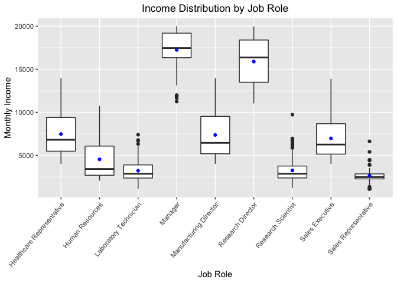

# Summary

TODO 

# Introduction

The purpose of this analysis is to explore what variables are most associated with attrition levels in Fortune 1000 companies. Exploratory analytics will be used to determine these variables as well as other general trends associated with specific jobs. Finally, we will create a model that will predict whether or not an employee will leave the company voluntarily.

# Analysis

### Exploratory Data Analysis


```r
# Read in training data
dfTrain <- read.csv("CaseStudy2-data.csv")
```

If a variable did not have a significant impact on turnover, we would expect that the attrition percentage within a group is the same as the attrition percentage in the entire dataset. As we see below, in the whole training set 83.9% of employees stayed while 16.1% left. So, as we view the relative percentages for turnover for each categorical variable, those groups with high attrition percentages appear to have a strong impact on turnover. 

TODO Explanation of our varaible selection and which ones we left out.


```r
# Percentage of retained/lost employees
kable(table(dfTrain$Attrition) / nrow(dfTrain), 
      col.names=c("Attrition", "Percent")) %>% 
      kable_styling(full_width=FALSE)
```

<table class="table" style="width: auto !important; margin-left: auto; margin-right: auto;">
 <thead>
  <tr>
   <th style="text-align:left;"> Attrition </th>
   <th style="text-align:right;"> Percent </th>
  </tr>
 </thead>
<tbody>
  <tr>
   <td style="text-align:left;"> No </td>
   <td style="text-align:right;"> 0.8393162 </td>
  </tr>
  <tr>
   <td style="text-align:left;"> Yes </td>
   <td style="text-align:right;"> 0.1606838 </td>
  </tr>
</tbody>
</table>

```r
# Define variables for analysis
variables <- c("BusinessTravel", "Department", "Education", 
              "EducationField", "EnvironmentSatisfaction",
              "Gender", "JobInvolvement", "JobLevel",
              "JobRole", "JobSatisfaction", "MaritalStatus",
              "OverTime", "PerformanceRating", 
              "RelationshipSatisfaction", "StockOptionLevel", 
              "WorkLifeBalance", "Age", "DailyRate", "DistanceFromHome", 
              "HourlyRate", "MonthlyIncome", "MonthlyRate", 
              "NumCompaniesWorked", "PercentSalaryHike",
              "TotalWorkingYears", "TrainingTimesLastYear", 
              "YearsAtCompany", "YearsInCurrentRole", 
              "YearsSinceLastPromotion", "YearsWithCurrManager")

# Turn numerical values into categorical
dfTrain$Age <- cut(dfTrain$Age, breaks=c(-Inf,30,40,50,Inf),labels=c(1,2,3,4))
dfTrain$DailyRate <- cut(dfTrain$DailyRate, breaks=c(-Inf,500,1000,Inf),labels=c(1,2,3))
dfTrain$DistanceFromHome <- cut(dfTrain$DistanceFromHome, breaks=c(-Inf,10,Inf),labels=c(1,2))
dfTrain$HourlyRate <- cut(dfTrain$HourlyRate, breaks=c(-Inf,65,Inf),labels=c(1,2))
dfTrain$MonthlyIncome <- cut(dfTrain$MonthlyIncome, breaks=c(-Inf,5000,10000,15000,Inf),labels=c(1,2,3,4))
dfTrain$MonthlyRate <- cut(dfTrain$MonthlyRate, breaks=c(-Inf,5000,10000,15000,20000,Inf),labels=c(1,2,3,4,5))
dfTrain$NumCompaniesWorked <- cut(dfTrain$NumCompaniesWorked, breaks=c(-Inf,4,Inf),labels=c(1,2))
dfTrain$PercentSalaryHike <- cut(dfTrain$PercentSalaryHike, breaks=c(-Inf, 13, 17, Inf), labels=c(1, 2, 3))
dfTrain$TotalWorkingYears <- cut(dfTrain$TotalWorkingYears, breaks=c(-Inf, 10, 20, Inf), labels=c(1, 2, 3))
dfTrain$TrainingTimesLastYear <- cut(dfTrain$TrainingTimesLastYear, breaks=c(-Inf, 1, 4, Inf), labels=c(1, 2, 3))
dfTrain$YearsAtCompany <- cut(dfTrain$YearsAtCompany, breaks=c(-Inf, 5, 15, 25, Inf), labels=c(1, 2, 3, 4))
dfTrain$YearsInCurrentRole <- cut(dfTrain$YearsInCurrentRole, breaks=c(-Inf, 5, 10, Inf), labels=c(1, 2, 3))
dfTrain$YearsSinceLastPromotion <- cut(dfTrain$YearsSinceLastPromotion, breaks=c(-Inf, 2, 7, Inf), labels=c(1, 2, 3))
dfTrain$YearsWithCurrManager <- cut(dfTrain$YearsWithCurrManager, breaks=c(-Inf, 5, 10, Inf), labels=c(1, 2, 3))
```

TODO discuss metric


```r
# Make relative frequency tables for categorical variables
AbsDiff <- data.frame(Variable=character(), AvgDistance=numeric())
for (var in variables) {
  print(var)
  freqtable <- table(dfTrain[[var]], dfTrain$Attrition)
  count <- plyr::count(dfTrain[[var]])
  RelFreq <- freqtable / count$freq
  print(kable(RelFreq,row.names=TRUE) %>% kable_styling(full_width=FALSE))
  Sum <- sum(abs(RelFreq[,2]-0.1606838))/nrow(RelFreq)
  AbsDiff <- rbind(AbsDiff, data.frame(Variable=var, AverageDistance=Sum))
}
```

[1] "BusinessTravel"
<table class="table" style="width: auto !important; margin-left: auto; margin-right: auto;">
 <thead>
  <tr>
   <th style="text-align:left;">   </th>
   <th style="text-align:right;"> No </th>
   <th style="text-align:right;"> Yes </th>
  </tr>
 </thead>
<tbody>
  <tr>
   <td style="text-align:left;"> Non-Travel </td>
   <td style="text-align:right;"> 0.9090909 </td>
   <td style="text-align:right;"> 0.0909091 </td>
  </tr>
  <tr>
   <td style="text-align:left;"> Travel_Frequently </td>
   <td style="text-align:right;"> 0.7511111 </td>
   <td style="text-align:right;"> 0.2488889 </td>
  </tr>
  <tr>
   <td style="text-align:left;"> Travel_Rarely </td>
   <td style="text-align:right;"> 0.8538922 </td>
   <td style="text-align:right;"> 0.1461078 </td>
  </tr>
</tbody>
</table>
[1] "Department"
<table class="table" style="width: auto !important; margin-left: auto; margin-right: auto;">
 <thead>
  <tr>
   <th style="text-align:left;">   </th>
   <th style="text-align:right;"> No </th>
   <th style="text-align:right;"> Yes </th>
  </tr>
 </thead>
<tbody>
  <tr>
   <td style="text-align:left;"> Human Resources </td>
   <td style="text-align:right;"> 0.8695652 </td>
   <td style="text-align:right;"> 0.1304348 </td>
  </tr>
  <tr>
   <td style="text-align:left;"> Research &amp; Development </td>
   <td style="text-align:right;"> 0.8602846 </td>
   <td style="text-align:right;"> 0.1397154 </td>
  </tr>
  <tr>
   <td style="text-align:left;"> Sales </td>
   <td style="text-align:right;"> 0.7891738 </td>
   <td style="text-align:right;"> 0.2108262 </td>
  </tr>
</tbody>
</table>
[1] "Education"
<table class="table" style="width: auto !important; margin-left: auto; margin-right: auto;">
 <thead>
  <tr>
   <th style="text-align:left;">   </th>
   <th style="text-align:right;"> No </th>
   <th style="text-align:right;"> Yes </th>
  </tr>
 </thead>
<tbody>
  <tr>
   <td style="text-align:left;"> 1 </td>
   <td style="text-align:right;"> 0.8129496 </td>
   <td style="text-align:right;"> 0.1870504 </td>
  </tr>
  <tr>
   <td style="text-align:left;"> 2 </td>
   <td style="text-align:right;"> 0.8468085 </td>
   <td style="text-align:right;"> 0.1531915 </td>
  </tr>
  <tr>
   <td style="text-align:left;"> 3 </td>
   <td style="text-align:right;"> 0.8337079 </td>
   <td style="text-align:right;"> 0.1662921 </td>
  </tr>
  <tr>
   <td style="text-align:left;"> 4 </td>
   <td style="text-align:right;"> 0.8512658 </td>
   <td style="text-align:right;"> 0.1487342 </td>
  </tr>
  <tr>
   <td style="text-align:left;"> 5 </td>
   <td style="text-align:right;"> 0.8571429 </td>
   <td style="text-align:right;"> 0.1428571 </td>
  </tr>
</tbody>
</table>
[1] "EducationField"
<table class="table" style="width: auto !important; margin-left: auto; margin-right: auto;">
 <thead>
  <tr>
   <th style="text-align:left;">   </th>
   <th style="text-align:right;"> No </th>
   <th style="text-align:right;"> Yes </th>
  </tr>
 </thead>
<tbody>
  <tr>
   <td style="text-align:left;"> Human Resources </td>
   <td style="text-align:right;"> 0.8750000 </td>
   <td style="text-align:right;"> 0.1250000 </td>
  </tr>
  <tr>
   <td style="text-align:left;"> Life Sciences </td>
   <td style="text-align:right;"> 0.8456914 </td>
   <td style="text-align:right;"> 0.1543086 </td>
  </tr>
  <tr>
   <td style="text-align:left;"> Marketing </td>
   <td style="text-align:right;"> 0.7851240 </td>
   <td style="text-align:right;"> 0.2148760 </td>
  </tr>
  <tr>
   <td style="text-align:left;"> Medical </td>
   <td style="text-align:right;"> 0.8633880 </td>
   <td style="text-align:right;"> 0.1366120 </td>
  </tr>
  <tr>
   <td style="text-align:left;"> Other </td>
   <td style="text-align:right;"> 0.8888889 </td>
   <td style="text-align:right;"> 0.1111111 </td>
  </tr>
  <tr>
   <td style="text-align:left;"> Technical Degree </td>
   <td style="text-align:right;"> 0.7523810 </td>
   <td style="text-align:right;"> 0.2476190 </td>
  </tr>
</tbody>
</table>
[1] "EnvironmentSatisfaction"
<table class="table" style="width: auto !important; margin-left: auto; margin-right: auto;">
 <thead>
  <tr>
   <th style="text-align:left;">   </th>
   <th style="text-align:right;"> No </th>
   <th style="text-align:right;"> Yes </th>
  </tr>
 </thead>
<tbody>
  <tr>
   <td style="text-align:left;"> 1 </td>
   <td style="text-align:right;"> 0.7389381 </td>
   <td style="text-align:right;"> 0.2610619 </td>
  </tr>
  <tr>
   <td style="text-align:left;"> 2 </td>
   <td style="text-align:right;"> 0.8441558 </td>
   <td style="text-align:right;"> 0.1558442 </td>
  </tr>
  <tr>
   <td style="text-align:left;"> 3 </td>
   <td style="text-align:right;"> 0.8583106 </td>
   <td style="text-align:right;"> 0.1416894 </td>
  </tr>
  <tr>
   <td style="text-align:left;"> 4 </td>
   <td style="text-align:right;"> 0.8815029 </td>
   <td style="text-align:right;"> 0.1184971 </td>
  </tr>
</tbody>
</table>
[1] "Gender"
<table class="table" style="width: auto !important; margin-left: auto; margin-right: auto;">
 <thead>
  <tr>
   <th style="text-align:left;">   </th>
   <th style="text-align:right;"> No </th>
   <th style="text-align:right;"> Yes </th>
  </tr>
 </thead>
<tbody>
  <tr>
   <td style="text-align:left;"> Female </td>
   <td style="text-align:right;"> 0.8639309 </td>
   <td style="text-align:right;"> 0.1360691 </td>
  </tr>
  <tr>
   <td style="text-align:left;"> Male </td>
   <td style="text-align:right;"> 0.8231966 </td>
   <td style="text-align:right;"> 0.1768034 </td>
  </tr>
</tbody>
</table>
[1] "JobInvolvement"
<table class="table" style="width: auto !important; margin-left: auto; margin-right: auto;">
 <thead>
  <tr>
   <th style="text-align:left;">   </th>
   <th style="text-align:right;"> No </th>
   <th style="text-align:right;"> Yes </th>
  </tr>
 </thead>
<tbody>
  <tr>
   <td style="text-align:left;"> 1 </td>
   <td style="text-align:right;"> 0.6307692 </td>
   <td style="text-align:right;"> 0.3692308 </td>
  </tr>
  <tr>
   <td style="text-align:left;"> 2 </td>
   <td style="text-align:right;"> 0.8047945 </td>
   <td style="text-align:right;"> 0.1952055 </td>
  </tr>
  <tr>
   <td style="text-align:left;"> 3 </td>
   <td style="text-align:right;"> 0.8608696 </td>
   <td style="text-align:right;"> 0.1391304 </td>
  </tr>
  <tr>
   <td style="text-align:left;"> 4 </td>
   <td style="text-align:right;"> 0.9105691 </td>
   <td style="text-align:right;"> 0.0894309 </td>
  </tr>
</tbody>
</table>
[1] "JobLevel"
<table class="table" style="width: auto !important; margin-left: auto; margin-right: auto;">
 <thead>
  <tr>
   <th style="text-align:left;">   </th>
   <th style="text-align:right;"> No </th>
   <th style="text-align:right;"> Yes </th>
  </tr>
 </thead>
<tbody>
  <tr>
   <td style="text-align:left;"> 1 </td>
   <td style="text-align:right;"> 0.7488584 </td>
   <td style="text-align:right;"> 0.2511416 </td>
  </tr>
  <tr>
   <td style="text-align:left;"> 2 </td>
   <td style="text-align:right;"> 0.9030733 </td>
   <td style="text-align:right;"> 0.0969267 </td>
  </tr>
  <tr>
   <td style="text-align:left;"> 3 </td>
   <td style="text-align:right;"> 0.8304094 </td>
   <td style="text-align:right;"> 0.1695906 </td>
  </tr>
  <tr>
   <td style="text-align:left;"> 4 </td>
   <td style="text-align:right;"> 0.9425287 </td>
   <td style="text-align:right;"> 0.0574713 </td>
  </tr>
  <tr>
   <td style="text-align:left;"> 5 </td>
   <td style="text-align:right;"> 0.9411765 </td>
   <td style="text-align:right;"> 0.0588235 </td>
  </tr>
</tbody>
</table>
[1] "JobRole"
<table class="table" style="width: auto !important; margin-left: auto; margin-right: auto;">
 <thead>
  <tr>
   <th style="text-align:left;">   </th>
   <th style="text-align:right;"> No </th>
   <th style="text-align:right;"> Yes </th>
  </tr>
 </thead>
<tbody>
  <tr>
   <td style="text-align:left;"> Healthcare Representative </td>
   <td style="text-align:right;"> 0.9108911 </td>
   <td style="text-align:right;"> 0.0891089 </td>
  </tr>
  <tr>
   <td style="text-align:left;"> Human Resources </td>
   <td style="text-align:right;"> 0.8378378 </td>
   <td style="text-align:right;"> 0.1621622 </td>
  </tr>
  <tr>
   <td style="text-align:left;"> Laboratory Technician </td>
   <td style="text-align:right;"> 0.7558685 </td>
   <td style="text-align:right;"> 0.2441315 </td>
  </tr>
  <tr>
   <td style="text-align:left;"> Manager </td>
   <td style="text-align:right;"> 0.9487179 </td>
   <td style="text-align:right;"> 0.0512821 </td>
  </tr>
  <tr>
   <td style="text-align:left;"> Manufacturing Director </td>
   <td style="text-align:right;"> 0.9310345 </td>
   <td style="text-align:right;"> 0.0689655 </td>
  </tr>
  <tr>
   <td style="text-align:left;"> Research Director </td>
   <td style="text-align:right;"> 0.9843750 </td>
   <td style="text-align:right;"> 0.0156250 </td>
  </tr>
  <tr>
   <td style="text-align:left;"> Research Scientist </td>
   <td style="text-align:right;"> 0.8529412 </td>
   <td style="text-align:right;"> 0.1470588 </td>
  </tr>
  <tr>
   <td style="text-align:left;"> Sales Executive </td>
   <td style="text-align:right;"> 0.8178295 </td>
   <td style="text-align:right;"> 0.1821705 </td>
  </tr>
  <tr>
   <td style="text-align:left;"> Sales Representative </td>
   <td style="text-align:right;"> 0.6000000 </td>
   <td style="text-align:right;"> 0.4000000 </td>
  </tr>
</tbody>
</table>
[1] "JobSatisfaction"
<table class="table" style="width: auto !important; margin-left: auto; margin-right: auto;">
 <thead>
  <tr>
   <th style="text-align:left;">   </th>
   <th style="text-align:right;"> No </th>
   <th style="text-align:right;"> Yes </th>
  </tr>
 </thead>
<tbody>
  <tr>
   <td style="text-align:left;"> 1 </td>
   <td style="text-align:right;"> 0.7672414 </td>
   <td style="text-align:right;"> 0.2327586 </td>
  </tr>
  <tr>
   <td style="text-align:left;"> 2 </td>
   <td style="text-align:right;"> 0.8425926 </td>
   <td style="text-align:right;"> 0.1574074 </td>
  </tr>
  <tr>
   <td style="text-align:left;"> 3 </td>
   <td style="text-align:right;"> 0.8510029 </td>
   <td style="text-align:right;"> 0.1489971 </td>
  </tr>
  <tr>
   <td style="text-align:left;"> 4 </td>
   <td style="text-align:right;"> 0.8713137 </td>
   <td style="text-align:right;"> 0.1286863 </td>
  </tr>
</tbody>
</table>
[1] "MaritalStatus"
<table class="table" style="width: auto !important; margin-left: auto; margin-right: auto;">
 <thead>
  <tr>
   <th style="text-align:left;">   </th>
   <th style="text-align:right;"> No </th>
   <th style="text-align:right;"> Yes </th>
  </tr>
 </thead>
<tbody>
  <tr>
   <td style="text-align:left;"> Divorced </td>
   <td style="text-align:right;"> 0.9204545 </td>
   <td style="text-align:right;"> 0.0795455 </td>
  </tr>
  <tr>
   <td style="text-align:left;"> Married </td>
   <td style="text-align:right;"> 0.8662900 </td>
   <td style="text-align:right;"> 0.1337100 </td>
  </tr>
  <tr>
   <td style="text-align:left;"> Single </td>
   <td style="text-align:right;"> 0.7440000 </td>
   <td style="text-align:right;"> 0.2560000 </td>
  </tr>
</tbody>
</table>
[1] "OverTime"
<table class="table" style="width: auto !important; margin-left: auto; margin-right: auto;">
 <thead>
  <tr>
   <th style="text-align:left;">   </th>
   <th style="text-align:right;"> No </th>
   <th style="text-align:right;"> Yes </th>
  </tr>
 </thead>
<tbody>
  <tr>
   <td style="text-align:left;"> No </td>
   <td style="text-align:right;"> 0.8946108 </td>
   <td style="text-align:right;"> 0.1053892 </td>
  </tr>
  <tr>
   <td style="text-align:left;"> Yes </td>
   <td style="text-align:right;"> 0.7014925 </td>
   <td style="text-align:right;"> 0.2985075 </td>
  </tr>
</tbody>
</table>
[1] "PerformanceRating"
<table class="table" style="width: auto !important; margin-left: auto; margin-right: auto;">
 <thead>
  <tr>
   <th style="text-align:left;">   </th>
   <th style="text-align:right;"> No </th>
   <th style="text-align:right;"> Yes </th>
  </tr>
 </thead>
<tbody>
  <tr>
   <td style="text-align:left;"> 3 </td>
   <td style="text-align:right;"> 0.8405651 </td>
   <td style="text-align:right;"> 0.1594349 </td>
  </tr>
  <tr>
   <td style="text-align:left;"> 4 </td>
   <td style="text-align:right;"> 0.8324022 </td>
   <td style="text-align:right;"> 0.1675978 </td>
  </tr>
</tbody>
</table>
[1] "RelationshipSatisfaction"
<table class="table" style="width: auto !important; margin-left: auto; margin-right: auto;">
 <thead>
  <tr>
   <th style="text-align:left;">   </th>
   <th style="text-align:right;"> No </th>
   <th style="text-align:right;"> Yes </th>
  </tr>
 </thead>
<tbody>
  <tr>
   <td style="text-align:left;"> 1 </td>
   <td style="text-align:right;"> 0.8090909 </td>
   <td style="text-align:right;"> 0.1909091 </td>
  </tr>
  <tr>
   <td style="text-align:left;"> 2 </td>
   <td style="text-align:right;"> 0.8410042 </td>
   <td style="text-align:right;"> 0.1589958 </td>
  </tr>
  <tr>
   <td style="text-align:left;"> 3 </td>
   <td style="text-align:right;"> 0.8457300 </td>
   <td style="text-align:right;"> 0.1542700 </td>
  </tr>
  <tr>
   <td style="text-align:left;"> 4 </td>
   <td style="text-align:right;"> 0.8505747 </td>
   <td style="text-align:right;"> 0.1494253 </td>
  </tr>
</tbody>
</table>
[1] "StockOptionLevel"
<table class="table" style="width: auto !important; margin-left: auto; margin-right: auto;">
 <thead>
  <tr>
   <th style="text-align:left;">   </th>
   <th style="text-align:right;"> No </th>
   <th style="text-align:right;"> Yes </th>
  </tr>
 </thead>
<tbody>
  <tr>
   <td style="text-align:left;"> 0 </td>
   <td style="text-align:right;"> 0.7524752 </td>
   <td style="text-align:right;"> 0.2475248 </td>
  </tr>
  <tr>
   <td style="text-align:left;"> 1 </td>
   <td style="text-align:right;"> 0.9122056 </td>
   <td style="text-align:right;"> 0.0877944 </td>
  </tr>
  <tr>
   <td style="text-align:left;"> 2 </td>
   <td style="text-align:right;"> 0.9280000 </td>
   <td style="text-align:right;"> 0.0720000 </td>
  </tr>
  <tr>
   <td style="text-align:left;"> 3 </td>
   <td style="text-align:right;"> 0.8219178 </td>
   <td style="text-align:right;"> 0.1780822 </td>
  </tr>
</tbody>
</table>
[1] "WorkLifeBalance"
<table class="table" style="width: auto !important; margin-left: auto; margin-right: auto;">
 <thead>
  <tr>
   <th style="text-align:left;">   </th>
   <th style="text-align:right;"> No </th>
   <th style="text-align:right;"> Yes </th>
  </tr>
 </thead>
<tbody>
  <tr>
   <td style="text-align:left;"> 1 </td>
   <td style="text-align:right;"> 0.6406250 </td>
   <td style="text-align:right;"> 0.3593750 </td>
  </tr>
  <tr>
   <td style="text-align:left;"> 2 </td>
   <td style="text-align:right;"> 0.8284672 </td>
   <td style="text-align:right;"> 0.1715328 </td>
  </tr>
  <tr>
   <td style="text-align:left;"> 3 </td>
   <td style="text-align:right;"> 0.8628006 </td>
   <td style="text-align:right;"> 0.1371994 </td>
  </tr>
  <tr>
   <td style="text-align:left;"> 4 </td>
   <td style="text-align:right;"> 0.8320000 </td>
   <td style="text-align:right;"> 0.1680000 </td>
  </tr>
</tbody>
</table>
[1] "Age"
<table class="table" style="width: auto !important; margin-left: auto; margin-right: auto;">
 <thead>
  <tr>
   <th style="text-align:left;">   </th>
   <th style="text-align:right;"> No </th>
   <th style="text-align:right;"> Yes </th>
  </tr>
 </thead>
<tbody>
  <tr>
   <td style="text-align:left;"> 1 </td>
   <td style="text-align:right;"> 0.7631579 </td>
   <td style="text-align:right;"> 0.2368421 </td>
  </tr>
  <tr>
   <td style="text-align:left;"> 2 </td>
   <td style="text-align:right;"> 0.8568548 </td>
   <td style="text-align:right;"> 0.1431452 </td>
  </tr>
  <tr>
   <td style="text-align:left;"> 3 </td>
   <td style="text-align:right;"> 0.8893281 </td>
   <td style="text-align:right;"> 0.1106719 </td>
  </tr>
  <tr>
   <td style="text-align:left;"> 4 </td>
   <td style="text-align:right;"> 0.8547009 </td>
   <td style="text-align:right;"> 0.1452991 </td>
  </tr>
</tbody>
</table>
[1] "DailyRate"
<table class="table" style="width: auto !important; margin-left: auto; margin-right: auto;">
 <thead>
  <tr>
   <th style="text-align:left;">   </th>
   <th style="text-align:right;"> No </th>
   <th style="text-align:right;"> Yes </th>
  </tr>
 </thead>
<tbody>
  <tr>
   <td style="text-align:left;"> 1 </td>
   <td style="text-align:right;"> 0.8069620 </td>
   <td style="text-align:right;"> 0.1930380 </td>
  </tr>
  <tr>
   <td style="text-align:left;"> 2 </td>
   <td style="text-align:right;"> 0.8360277 </td>
   <td style="text-align:right;"> 0.1639723 </td>
  </tr>
  <tr>
   <td style="text-align:left;"> 3 </td>
   <td style="text-align:right;"> 0.8669834 </td>
   <td style="text-align:right;"> 0.1330166 </td>
  </tr>
</tbody>
</table>
[1] "DistanceFromHome"
<table class="table" style="width: auto !important; margin-left: auto; margin-right: auto;">
 <thead>
  <tr>
   <th style="text-align:left;">   </th>
   <th style="text-align:right;"> No </th>
   <th style="text-align:right;"> Yes </th>
  </tr>
 </thead>
<tbody>
  <tr>
   <td style="text-align:left;"> 1 </td>
   <td style="text-align:right;"> 0.8566176 </td>
   <td style="text-align:right;"> 0.1433824 </td>
  </tr>
  <tr>
   <td style="text-align:left;"> 2 </td>
   <td style="text-align:right;"> 0.7994350 </td>
   <td style="text-align:right;"> 0.2005650 </td>
  </tr>
</tbody>
</table>
[1] "HourlyRate"
<table class="table" style="width: auto !important; margin-left: auto; margin-right: auto;">
 <thead>
  <tr>
   <th style="text-align:left;">   </th>
   <th style="text-align:right;"> No </th>
   <th style="text-align:right;"> Yes </th>
  </tr>
 </thead>
<tbody>
  <tr>
   <td style="text-align:left;"> 1 </td>
   <td style="text-align:right;"> 0.8489583 </td>
   <td style="text-align:right;"> 0.1510417 </td>
  </tr>
  <tr>
   <td style="text-align:left;"> 2 </td>
   <td style="text-align:right;"> 0.8299663 </td>
   <td style="text-align:right;"> 0.1700337 </td>
  </tr>
</tbody>
</table>
[1] "MonthlyIncome"
<table class="table" style="width: auto !important; margin-left: auto; margin-right: auto;">
 <thead>
  <tr>
   <th style="text-align:left;">   </th>
   <th style="text-align:right;"> No </th>
   <th style="text-align:right;"> Yes </th>
  </tr>
 </thead>
<tbody>
  <tr>
   <td style="text-align:left;"> 1 </td>
   <td style="text-align:right;"> 0.7912458 </td>
   <td style="text-align:right;"> 0.2087542 </td>
  </tr>
  <tr>
   <td style="text-align:left;"> 2 </td>
   <td style="text-align:right;"> 0.8808864 </td>
   <td style="text-align:right;"> 0.1191136 </td>
  </tr>
  <tr>
   <td style="text-align:left;"> 3 </td>
   <td style="text-align:right;"> 0.8378378 </td>
   <td style="text-align:right;"> 0.1621622 </td>
  </tr>
  <tr>
   <td style="text-align:left;"> 4 </td>
   <td style="text-align:right;"> 0.9711538 </td>
   <td style="text-align:right;"> 0.0288462 </td>
  </tr>
</tbody>
</table>
[1] "MonthlyRate"
<table class="table" style="width: auto !important; margin-left: auto; margin-right: auto;">
 <thead>
  <tr>
   <th style="text-align:left;">   </th>
   <th style="text-align:right;"> No </th>
   <th style="text-align:right;"> Yes </th>
  </tr>
 </thead>
<tbody>
  <tr>
   <td style="text-align:left;"> 1 </td>
   <td style="text-align:right;"> 0.8057554 </td>
   <td style="text-align:right;"> 0.1942446 </td>
  </tr>
  <tr>
   <td style="text-align:left;"> 2 </td>
   <td style="text-align:right;"> 0.8638132 </td>
   <td style="text-align:right;"> 0.1361868 </td>
  </tr>
  <tr>
   <td style="text-align:left;"> 3 </td>
   <td style="text-align:right;"> 0.8097345 </td>
   <td style="text-align:right;"> 0.1902655 </td>
  </tr>
  <tr>
   <td style="text-align:left;"> 4 </td>
   <td style="text-align:right;"> 0.8512397 </td>
   <td style="text-align:right;"> 0.1487603 </td>
  </tr>
  <tr>
   <td style="text-align:left;"> 5 </td>
   <td style="text-align:right;"> 0.8464052 </td>
   <td style="text-align:right;"> 0.1535948 </td>
  </tr>
</tbody>
</table>
[1] "NumCompaniesWorked"
<table class="table" style="width: auto !important; margin-left: auto; margin-right: auto;">
 <thead>
  <tr>
   <th style="text-align:left;">   </th>
   <th style="text-align:right;"> No </th>
   <th style="text-align:right;"> Yes </th>
  </tr>
 </thead>
<tbody>
  <tr>
   <td style="text-align:left;"> 1 </td>
   <td style="text-align:right;"> 0.8572973 </td>
   <td style="text-align:right;"> 0.1427027 </td>
  </tr>
  <tr>
   <td style="text-align:left;"> 2 </td>
   <td style="text-align:right;"> 0.7714286 </td>
   <td style="text-align:right;"> 0.2285714 </td>
  </tr>
</tbody>
</table>
[1] "PercentSalaryHike"
<table class="table" style="width: auto !important; margin-left: auto; margin-right: auto;">
 <thead>
  <tr>
   <th style="text-align:left;">   </th>
   <th style="text-align:right;"> No </th>
   <th style="text-align:right;"> Yes </th>
  </tr>
 </thead>
<tbody>
  <tr>
   <td style="text-align:left;"> 1 </td>
   <td style="text-align:right;"> 0.8247012 </td>
   <td style="text-align:right;"> 0.1752988 </td>
  </tr>
  <tr>
   <td style="text-align:left;"> 2 </td>
   <td style="text-align:right;"> 0.8491620 </td>
   <td style="text-align:right;"> 0.1508380 </td>
  </tr>
  <tr>
   <td style="text-align:left;"> 3 </td>
   <td style="text-align:right;"> 0.8516129 </td>
   <td style="text-align:right;"> 0.1483871 </td>
  </tr>
</tbody>
</table>
[1] "TotalWorkingYears"
<table class="table" style="width: auto !important; margin-left: auto; margin-right: auto;">
 <thead>
  <tr>
   <th style="text-align:left;">   </th>
   <th style="text-align:right;"> No </th>
   <th style="text-align:right;"> Yes </th>
  </tr>
 </thead>
<tbody>
  <tr>
   <td style="text-align:left;"> 1 </td>
   <td style="text-align:right;"> 0.8099063 </td>
   <td style="text-align:right;"> 0.1900937 </td>
  </tr>
  <tr>
   <td style="text-align:left;"> 2 </td>
   <td style="text-align:right;"> 0.8801498 </td>
   <td style="text-align:right;"> 0.1198502 </td>
  </tr>
  <tr>
   <td style="text-align:left;"> 3 </td>
   <td style="text-align:right;"> 0.9102564 </td>
   <td style="text-align:right;"> 0.0897436 </td>
  </tr>
</tbody>
</table>
[1] "TrainingTimesLastYear"
<table class="table" style="width: auto !important; margin-left: auto; margin-right: auto;">
 <thead>
  <tr>
   <th style="text-align:left;">   </th>
   <th style="text-align:right;"> No </th>
   <th style="text-align:right;"> Yes </th>
  </tr>
 </thead>
<tbody>
  <tr>
   <td style="text-align:left;"> 1 </td>
   <td style="text-align:right;"> 0.8076923 </td>
   <td style="text-align:right;"> 0.1923077 </td>
  </tr>
  <tr>
   <td style="text-align:left;"> 2 </td>
   <td style="text-align:right;"> 0.8322511 </td>
   <td style="text-align:right;"> 0.1677489 </td>
  </tr>
  <tr>
   <td style="text-align:left;"> 3 </td>
   <td style="text-align:right;"> 0.9084507 </td>
   <td style="text-align:right;"> 0.0915493 </td>
  </tr>
</tbody>
</table>
[1] "YearsAtCompany"
<table class="table" style="width: auto !important; margin-left: auto; margin-right: auto;">
 <thead>
  <tr>
   <th style="text-align:left;">   </th>
   <th style="text-align:right;"> No </th>
   <th style="text-align:right;"> Yes </th>
  </tr>
 </thead>
<tbody>
  <tr>
   <td style="text-align:left;"> 1 </td>
   <td style="text-align:right;"> 0.7976974 </td>
   <td style="text-align:right;"> 0.2023026 </td>
  </tr>
  <tr>
   <td style="text-align:left;"> 2 </td>
   <td style="text-align:right;"> 0.8802661 </td>
   <td style="text-align:right;"> 0.1197339 </td>
  </tr>
  <tr>
   <td style="text-align:left;"> 3 </td>
   <td style="text-align:right;"> 0.9130435 </td>
   <td style="text-align:right;"> 0.0869565 </td>
  </tr>
  <tr>
   <td style="text-align:left;"> 4 </td>
   <td style="text-align:right;"> 0.8421053 </td>
   <td style="text-align:right;"> 0.1578947 </td>
  </tr>
</tbody>
</table>
[1] "YearsInCurrentRole"
<table class="table" style="width: auto !important; margin-left: auto; margin-right: auto;">
 <thead>
  <tr>
   <th style="text-align:left;">   </th>
   <th style="text-align:right;"> No </th>
   <th style="text-align:right;"> Yes </th>
  </tr>
 </thead>
<tbody>
  <tr>
   <td style="text-align:left;"> 1 </td>
   <td style="text-align:right;"> 0.8110661 </td>
   <td style="text-align:right;"> 0.1889339 </td>
  </tr>
  <tr>
   <td style="text-align:left;"> 2 </td>
   <td style="text-align:right;"> 0.8797814 </td>
   <td style="text-align:right;"> 0.1202186 </td>
  </tr>
  <tr>
   <td style="text-align:left;"> 3 </td>
   <td style="text-align:right;"> 0.9365079 </td>
   <td style="text-align:right;"> 0.0634921 </td>
  </tr>
</tbody>
</table>
[1] "YearsSinceLastPromotion"
<table class="table" style="width: auto !important; margin-left: auto; margin-right: auto;">
 <thead>
  <tr>
   <th style="text-align:left;">   </th>
   <th style="text-align:right;"> No </th>
   <th style="text-align:right;"> Yes </th>
  </tr>
 </thead>
<tbody>
  <tr>
   <td style="text-align:left;"> 1 </td>
   <td style="text-align:right;"> 0.8369441 </td>
   <td style="text-align:right;"> 0.1630559 </td>
  </tr>
  <tr>
   <td style="text-align:left;"> 2 </td>
   <td style="text-align:right;"> 0.8443396 </td>
   <td style="text-align:right;"> 0.1556604 </td>
  </tr>
  <tr>
   <td style="text-align:left;"> 3 </td>
   <td style="text-align:right;"> 0.8518519 </td>
   <td style="text-align:right;"> 0.1481481 </td>
  </tr>
</tbody>
</table>
[1] "YearsWithCurrManager"
<table class="table" style="width: auto !important; margin-left: auto; margin-right: auto;">
 <thead>
  <tr>
   <th style="text-align:left;">   </th>
   <th style="text-align:right;"> No </th>
   <th style="text-align:right;"> Yes </th>
  </tr>
 </thead>
<tbody>
  <tr>
   <td style="text-align:left;"> 1 </td>
   <td style="text-align:right;"> 0.8160000 </td>
   <td style="text-align:right;"> 0.1840000 </td>
  </tr>
  <tr>
   <td style="text-align:left;"> 2 </td>
   <td style="text-align:right;"> 0.8677686 </td>
   <td style="text-align:right;"> 0.1322314 </td>
  </tr>
  <tr>
   <td style="text-align:left;"> 3 </td>
   <td style="text-align:right;"> 0.9649123 </td>
   <td style="text-align:right;"> 0.0350877 </td>
  </tr>
</tbody>
</table>

```r
# Get average distance metric for all variables
AbsDiff <- AbsDiff[order(-AbsDiff$AverageDistance),]
kable(AbsDiff,row.names=FALSE) %>% kable_styling(full_width=FALSE)
```

<table class="table" style="width: auto !important; margin-left: auto; margin-right: auto;">
 <thead>
  <tr>
   <th style="text-align:left;"> Variable </th>
   <th style="text-align:right;"> AverageDistance </th>
  </tr>
 </thead>
<tbody>
  <tr>
   <td style="text-align:left;"> OverTime </td>
   <td style="text-align:right;"> 0.0965591 </td>
  </tr>
  <tr>
   <td style="text-align:left;"> JobRole </td>
   <td style="text-align:right;"> 0.0863453 </td>
  </tr>
  <tr>
   <td style="text-align:left;"> JobInvolvement </td>
   <td style="text-align:right;"> 0.0839687 </td>
  </tr>
  <tr>
   <td style="text-align:left;"> JobLevel </td>
   <td style="text-align:right;"> 0.0736389 </td>
  </tr>
  <tr>
   <td style="text-align:left;"> MaritalStatus </td>
   <td style="text-align:right;"> 0.0678095 </td>
  </tr>
  <tr>
   <td style="text-align:left;"> StockOptionLevel </td>
   <td style="text-align:right;"> 0.0664531 </td>
  </tr>
  <tr>
   <td style="text-align:left;"> WorkLifeBalance </td>
   <td style="text-align:right;"> 0.0600852 </td>
  </tr>
  <tr>
   <td style="text-align:left;"> YearsWithCurrManager </td>
   <td style="text-align:right;"> 0.0591216 </td>
  </tr>
  <tr>
   <td style="text-align:left;"> BusinessTravel </td>
   <td style="text-align:right;"> 0.0575186 </td>
  </tr>
  <tr>
   <td style="text-align:left;"> MonthlyIncome </td>
   <td style="text-align:right;"> 0.0557392 </td>
  </tr>
  <tr>
   <td style="text-align:left;"> YearsInCurrentRole </td>
   <td style="text-align:right;"> 0.0553023 </td>
  </tr>
  <tr>
   <td style="text-align:left;"> TotalWorkingYears </td>
   <td style="text-align:right;"> 0.0470612 </td>
  </tr>
  <tr>
   <td style="text-align:left;"> NumCompaniesWorked </td>
   <td style="text-align:right;"> 0.0429344 </td>
  </tr>
  <tr>
   <td style="text-align:left;"> EducationField </td>
   <td style="text-align:right;"> 0.0428052 </td>
  </tr>
  <tr>
   <td style="text-align:left;"> EnvironmentSatisfaction </td>
   <td style="text-align:right;"> 0.0415997 </td>
  </tr>
  <tr>
   <td style="text-align:left;"> Age </td>
   <td style="text-align:right;"> 0.0397734 </td>
  </tr>
  <tr>
   <td style="text-align:left;"> YearsAtCompany </td>
   <td style="text-align:right;"> 0.0397713 </td>
  </tr>
  <tr>
   <td style="text-align:left;"> TrainingTimesLastYear </td>
   <td style="text-align:right;"> 0.0359412 </td>
  </tr>
  <tr>
   <td style="text-align:left;"> Department </td>
   <td style="text-align:right;"> 0.0337866 </td>
  </tr>
  <tr>
   <td style="text-align:left;"> JobSatisfaction </td>
   <td style="text-align:right;"> 0.0297588 </td>
  </tr>
  <tr>
   <td style="text-align:left;"> DistanceFromHome </td>
   <td style="text-align:right;"> 0.0285913 </td>
  </tr>
  <tr>
   <td style="text-align:left;"> MonthlyRate </td>
   <td style="text-align:right;"> 0.0213304 </td>
  </tr>
  <tr>
   <td style="text-align:left;"> DailyRate </td>
   <td style="text-align:right;"> 0.0211033 </td>
  </tr>
  <tr>
   <td style="text-align:left;"> Gender </td>
   <td style="text-align:right;"> 0.0203671 </td>
  </tr>
  <tr>
   <td style="text-align:left;"> Education </td>
   <td style="text-align:right;"> 0.0138487 </td>
  </tr>
  <tr>
   <td style="text-align:left;"> RelationshipSatisfaction </td>
   <td style="text-align:right;"> 0.0123964 </td>
  </tr>
  <tr>
   <td style="text-align:left;"> PercentSalaryHike </td>
   <td style="text-align:right;"> 0.0122525 </td>
  </tr>
  <tr>
   <td style="text-align:left;"> HourlyRate </td>
   <td style="text-align:right;"> 0.0094960 </td>
  </tr>
  <tr>
   <td style="text-align:left;"> YearsSinceLastPromotion </td>
   <td style="text-align:right;"> 0.0066437 </td>
  </tr>
  <tr>
   <td style="text-align:left;"> PerformanceRating </td>
   <td style="text-align:right;"> 0.0040814 </td>
  </tr>
</tbody>
</table>

### KNN Classification


```r
# Read in validation data
dfVal <- read.csv("CaseStudy2Validation.csv")

# Identify variables used to make predictions, based on avg dist metric
pred_vars <- c("OverTime", "JobRole", "JobInvolvement", "JobLevel", "MaritalStatus","WorkLifeBalance")

# Convert wanted factors into integers
dfTrain$OverTime <- as.integer(dfTrain$OverTime)
dfTrain$JobRole <- as.integer(dfTrain$JobRole)
dfTrain$MaritalStatus <- as.integer(dfTrain$MaritalStatus)
dfVal$OverTime <- as.integer(dfVal$OverTime)
dfVal$JobRole <- as.integer(dfVal$JobRole)
dfVal$MaritalStatus <- as.integer(dfVal$MaritalStatus)

# Generate attrition predictions based on training data
dfVal$dfPreds3 <- class::knn(dfTrain[,pred_vars], dfVal[,pred_vars], 
                             dfTrain$Attrition, k=3)
dfVal$dfPreds5 <- class::knn(dfTrain[,pred_vars], dfVal[,pred_vars], 
                             dfTrain$Attrition, k=5)

# Get accuracy of predictions
confusionMatrix(table(dfVal$Attrition, dfVal$dfPreds3))
```

```
## Confusion Matrix and Statistics
## 
##      
##        No Yes
##   No  245   6
##   Yes  38  11
##                                           
##                Accuracy : 0.8533          
##                  95% CI : (0.8082, 0.8914)
##     No Information Rate : 0.9433          
##     P-Value [Acc > NIR] : 1               
##                                           
##                   Kappa : 0.2721          
##  Mcnemar's Test P-Value : 2.962e-06       
##                                           
##             Sensitivity : 0.8657          
##             Specificity : 0.6471          
##          Pos Pred Value : 0.9761          
##          Neg Pred Value : 0.2245          
##              Prevalence : 0.9433          
##          Detection Rate : 0.8167          
##    Detection Prevalence : 0.8367          
##       Balanced Accuracy : 0.7564          
##                                           
##        'Positive' Class : No              
## 
```

```r
confusionMatrix(table(dfVal$Attrition, dfVal$dfPreds5))
```

```
## Confusion Matrix and Statistics
## 
##      
##        No Yes
##   No  248   3
##   Yes  40   9
##                                           
##                Accuracy : 0.8567          
##                  95% CI : (0.8118, 0.8943)
##     No Information Rate : 0.96            
##     P-Value [Acc > NIR] : 1               
##                                           
##                   Kappa : 0.2467          
##  Mcnemar's Test P-Value : 4.021e-08       
##                                           
##             Sensitivity : 0.8611          
##             Specificity : 0.7500          
##          Pos Pred Value : 0.9880          
##          Neg Pred Value : 0.1837          
##              Prevalence : 0.9600          
##          Detection Rate : 0.8267          
##    Detection Prevalence : 0.8367          
##       Balanced Accuracy : 0.8056          
##                                           
##        'Positive' Class : No              
## 
```

```r
dfPreds <- select(dfVal, ID, dfPreds3)

# Write predictions to csv file
write.csv(dfPreds, "CaseStudy2Predictions_Ludlow_Rollins.csv")
```

### Employee Trends


```r
# Re-load original data
dfTrain <- read.csv("CaseStudy2-data.csv")
# Job satisfaction by group
Jobs <- group_by(dfTrain, JobRole) %>% summarise(Avg=mean(JobSatisfaction, na.rm=TRUE))
print(Jobs)
```

```
## # A tibble: 9 x 2
##   JobRole                     Avg
##   <fct>                     <dbl>
## 1 Healthcare Representative  2.80
## 2 Human Resources            2.57
## 3 Laboratory Technician      2.69
## 4 Manager                    2.69
## 5 Manufacturing Director     2.75
## 6 Research Director          2.62
## 7 Research Scientist         2.80
## 8 Sales Executive            2.76
## 9 Sales Representative       2.74
```

```r
ggplot(data=Jobs, aes(x=JobRole, y=Avg, fill=JobRole)) + 
  geom_bar(stat='identity', colour = 'black') + 
  coord_flip() + 
  labs(title="Mean Job Satisfaction by Role", x="Job Role", y="Mean Job Satisfaction") +
  theme(legend.position="none") + 
  theme(plot.title = element_text(hjust = 0.5))
```


We wanted to see how various factors would effect job satisfaction. The average job satisfaction for each position is fairly close together. The lowest is Human Resources at 2.57 and the highest is Research Scientist and Healthcare Representative at 2.80. 


```r
ggplot(dfTrain, aes(x=JobSatisfaction, y=MonthlyIncome)) + 
  geom_point(pch = 21, size = 2, color="green") +
  theme(plot.title = element_text(hjust = 0.5))
```



```r
ggplot(dfTrain, aes(x=JobSatisfaction, y=MonthlyIncome, group=JobSatisfaction)) +
  geom_boxplot() +
  stat_summary(fun.y=mean, geom="point", colour="lightgreen") +
  theme(plot.title = element_text(hjust = 0.5))
```


Income does not appear to have an effect on job satisfaction, as every level of satisfaction has a similar distribution of income.

# Conclusion

TODO

# Presentation

This write-up is supplemented by video presentations from both Meredith and Kristen. The links are provided below.

Meredith: 

Kristen: 
